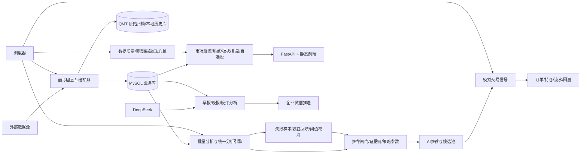

# ProBigA 项目知识库

> 版本：Project A / current-workspace snapshot  
> 盘点日期：2026-07-16  
> 证据范围：当前工作区源码、配置示例、测试、项目文档；未读取 `.env` 的实际值，未连接数据库做现场查询。  
> 重要说明：当前工作区存在大量未提交和未跟踪改动。本知识库描述的是当前文件系统快照，不等同于 `main` 分支最近提交 `d00dd09`。

## 0. 证据与阅读规则

证据优先级：

1. 当前源码、DDL、测试：确认“已实现/代码行为”。
2. `.env.example`、README、执行清单：确认“设计意图/运行约定”。
3. 验收报告：确认“某次环境、某个日期的运行结果”，不自动代表当前状态。

主要证据入口：

- [README.md](../README.md)：项目定位、启动方式、常用命令、核心页面。
- [统一分析引擎说明](../server/engine/README.md)：四层分析模型和评分体系。
- [策略落地规则](./stock_strategy_rules.md)：推荐闸门、证据链、阈值与策略规则。
- [执行清单](./执行清单.md)：脚本和日常任务索引。
- [QMT 执行清单](./国金QMT执行清单.md)：QMT 接入、审计、补数和验收状态。
- [系统验收报告](./验收测试报告_2026-07-04.md)、[生产验收报告](./生产环境验收测试报告_2026-07-04.md)：历史环境的运行证据与问题。

## 1. 项目介绍

| 项目项 | 内容 |
|---|---|
| 项目名称 | ProBigA |
| 项目定位 | 面向 A 股本地研究的综合数据分析与投研辅助平台 |
| 解决问题 | 将股票基础信息、行情、资金、板块、热榜、龙虎榜、公告、舆情、财务、QMT/聚宽数据统一入库，并转化为可追踪、可复盘、可验证的研究与模拟交易结果 |
| 目标用户 | 个人研究者、策略研究员、盘中观察者、系统运维人员 |
| 核心业务 | 数据同步、市场监控、热点/板块分析、股票筛选、统一分析、AI 推荐、复盘、组合管理、模拟交易与回测 |
| 非目标 | 不向真实证券账户下单；不构成投资建议；当前不能直接宣称为稳定的盘中全自动交易系统 |
| 主数据库 | MySQL，业务库通常为 `probiga` |
| 服务入口 | FastAPI `server.api.main:app`，静态前端由同一服务提供 |
| 前端形态 | 单页工作台 `server/static/index.html` + `app.js`，另有监控、板块异动、资金流和部署页 |
| 运行平台 | Windows 本地开发/运维环境；生产部署脚本面向 Linux ECS/systemd；QMT 运行依赖 Windows 客户端/SDK |

### 核心价值

- 多源数据统一到同一交易日、股票代码和业务表体系。
- 推荐结果不只输出分数，还保留风险闸门、证据链、买入区间、止损、止盈、仓位和失效条件。
- 研究结论可以进入模拟交易，再回填 1/3/5/10 日表现、失败标签和阈值校准。
- 调度、数据质量、QMT 能力、实时链路状态被暴露到管理和决策页面。

## 2. 整体架构



### 代码分层

| 层 | 目录 | 职责 |
|---|---|---|
| 业务任务 | `biz/` | 股票信息、行情、财务、舆情、公告、新闻、分析、复盘、早报、晚报、模拟交易任务 |
| API | `server/api/` | FastAPI 生命周期、中间件、鉴权、健康、热点、组合、调度、数据源、模拟交易、股评接口 |
| 分析引擎 | `server/engine/` | 数据加载、长线、短线、事件风险、推荐闸门、评分、模拟交易引擎 |
| 通用基础设施 | `server/common/` | 数据库连接、读写路由、分钟/K线读库、配置、缓存、调度、质量校验、技术风险 |
| 集成适配 | `integrations/` | QMT、聚宽、AkShare、企业微信和数据源注册表 |
| 运维工具 | `tools/`、`deploy/`、`scripts/` | 补数、爬取、调度、质量门禁、QMT运维、发布、远程支持 |
| 前端 | `server/static/` | 20 个主工作台页面和若干独立 HTML 页面 |
| 测试 | `tests/` | 引擎、数据同步、API、调度、QMT、模拟交易、质量门禁和运维回归 |

## 3. 端到端业务流程

### 3.1 日线研究与推荐

```text
交易日历/股票池同步
  -> 日K、财务、资金流、板块、热榜、公告、新闻、龙虎榜同步
  -> 数据质量与日期新鲜度检查
  -> load_* 特征批量加载
  -> 长线/短线/事件/市场环境/板块闸门计算
  -> 生成 stock_analysis_result
  -> 生成 st_recommended_stocks
  -> 计算买入区间、止损止盈、仓位、策略和证据链
  -> 进入 AI 推荐页、模拟交易候选池和复盘反馈
```

### 3.2 AI 推荐到模拟交易

```text
上一交易日推荐
  -> 盘前严格检查日期、K线覆盖、推荐状态
  -> 生成 st_sim_signal 信号池
  -> 盘中实时/分钟行情刷新
  -> 交易时间窗 + T+1 + 涨跌停/停牌 + 风险预算
  -> 策略级买入判断
  -> st_sim_order 委托/成交
  -> st_sim_position 持仓
  -> st_trade_flow / st_sim_event 记录流水与事件
  -> 盘后快照与策略统计
```

### 3.3 复盘与学习闭环

```text
指数、涨跌停、成交额、市场宽度、板块、热榜、资金流
  -> st_daily_review / st_daily_review_pro
  -> 主线、情绪周期、市场温度、仓位建议、执行计划
推荐记录 + 后续K线
  -> 1/3/5/10日收益回填
  -> st_ai_failure_samples
  -> st_strategy_threshold_calibration
  -> 稳定条件满足后发布 st_strategy_runtime_params
```

## 4. 功能模块总表

详细、可引用的功能记录见 [FEATURE_INVENTORY.md](./FEATURE_INVENTORY.md)。

| 一级模块 | 二级模块 | 核心能力 | 主要页面/入口 | 核心数据 |
|---|---|---|---|---|
| 市场研究 | 市场监控 | 市场温度、宽度、指数、主线、系统可信度 | `monitor` | `sm_market_overview_daily`、`sm_stock_kline`、`st_daily_review` |
| 市场研究 | 盘中作战 | 实时行情、板块轮动、候选、持仓、QMT健康 | `intraday-battle` | `sm_stock_current`、分钟表、推荐表、组合表 |
| 热点分析 | 热榜融合 | 同花顺/东财/新浪/雪球热榜与融合榜 | `fused` | `st_hot_rank_*`、`st_hot_rank_fused` |
| 热点分析 | 板块/概念 | 板块涨跌、资金、热度、成分股、轮动 | `sector`、`concept` | `si_concept_*`、`sm_concept_*`、`st_hot_concept_*` |
| 市场行为 | 龙虎榜/主力 | 龙虎榜、机构席位、资金流、盘口、主力行为 | `alist`、`capital`、`mainforce` | `st_a_list_*`、`sm_stock_capital_flow*`、`sm_stock_five_level` |
| 选股 | 规则选股/聚宽 | 趋势、低位、放量、聚宽策略与分钟数据 | `screen`、`jq-picks` | K线、资金、`jq_strategy_*`、`sm_stock_minute_gml` |
| AI投研 | 推荐 | 批量分析、推荐池、推荐闸门、买点/卖点 | `recommended` | `stock_analysis_result`、`st_recommended_stocks` |
| AI投研 | 研究雷达/股评 | 研报主题、股评分析、技术风险、决策雷达 | `research-radar`、`commentary` | `st_news_flash`、主题/配置表 |
| 复盘资讯 | 新闻/公告 | 快讯、重要新闻、历史新闻、个股公告 | `news`、`notice` | `st_news_flash`、`si_notice_eastmoney` |
| 复盘资讯 | 日报 | 基础复盘、专业复盘、早报、晚报和企微推送 | `review`/命令行/调度 | `st_daily_review`、`st_daily_review_pro` |
| 组合管理 | 自选股 | 自选列表、排序、成本、交易、实时盈亏、个股分析 | `portfolio` | `st_user_portfolio`、`st_portfolio_trans_log` |
| 模拟交易 | 信号/执行 | 多策略、T+1、风险预算、委托、成交、事件 | `sim-trade` | `st_sim_signal`、`st_sim_order`、`st_sim_position` |
| 模拟交易 | 回测/前向 | 历史回测、前向模拟、收益/回撤/夏普等统计 | `sim-trade` | 模拟交易表族 |
| 平台运维 | 数据源 | 数据源分组、运行、日志、历史、必需健康 | `datasource` | `st_scheduled_tasks`、任务历史 |
| 平台运维 | 调度 | 任务列表、启停、改Cron、手动执行、停止、质量 | `scheduler` | `st_scheduled_tasks`、`st_scheduler_runtime` |
| 平台运维 | 健康/部署 | API、schema、安全、QMT、部署状态和运行记录 | `health`、`deploy` | `sys_*`、部署运行记录 |

## 5. 页面结构

| 页面ID | 页面名称 | 主要操作 | 主要接口组 |
|---|---|---|---|
| `intraday-battle` | 盘中作战 | 看盘、实时刷新、候选、持仓、板块轮动 | `/api/monitor/data`、`/api/sim-trade/*`、`/api/portfolio/*` |
| `monitor` | 市场监控 | 市场温度、情绪、指数、主线、复盘、可信度 | `/api/monitor/data`、`/api/hot-data/command-monitor`、健康接口 |
| `fused` | 热股排行 | 查看融合榜、按日期/Top筛选 | `/api/hot-data/fused`、`fused-live` |
| `sector` | 板块分析 | 板块轮动、热度矩阵、异动 | `/api/hot-data/sector-rotation`、`/api/sector/movement` |
| `strong` | 强势股 | 强势个股、趋势与涨幅筛选 | `/api/hot-data/screen-stocks` |
| `concept` | 概念/行业 | 概念热度、板块成分、实时概念 | `/api/hot-data/concept-*` |
| `alist` | 龙虎榜 | 日期、股票、机构席位和净买卖 | `/api/hot-data/a-list-daily`、`a-list-info` |
| `capital` | 个股资金 | 日资金、实时资金、股票过滤 | `/api/hot-data/capital-flow*` |
| `mainforce` | 主力行为 | 个股主力分析、全市场扫描 | `/api/hot-data/mainforce-*` |
| `screen` | 选股策略 | 趋势、低位、换手、量能、涨停等参数筛选 | `/api/hot-data/screen-stocks` |
| `jq-picks` | 聚宽策略 | 策略列表、选股结果、分钟同步/自动化 | `/api/strategy/picks/*`、`/api/jq/minute/*` |
| `recommended` | AI推荐 | 推荐池、闸门、运行、进度、运行历史、参数 | `/api/hot-data/recommended-stocks*` |
| `portfolio` | 自选股 | 添加、删除、排序、成本、交易、实时盈亏、分析 | `/api/portfolio/*` |
| `sim-trade` | 模拟交易 | 候选、看板、订单、持仓、事件、回测、前向 | `/api/sim-trade/*` |
| `news` | 快讯 | 新闻流、重要新闻、历史新闻 | `/api/hot-data/news-*` |
| `research-radar` | 研报雷达 | 主题、证据标的、验证点和风险 | `/api/hot-data/research-radar` |
| `notice` | 个股公告 | 按股票、日期和未来公告查看 | `/api/hot-data/stock-notices` |
| `commentary` | 股评监控 | 股评画像、评估、启停、立即运行、推送 | `/api/commentary/*` |
| `datasource` | 数据源管理 | 分组、统计、健康、运行、启停、日志 | `/api/datasource/*` |
| `scheduler` | 调度管理 | 任务状态、Cron、日期参数、手动运行、停止 | `/api/scheduler/*` |
| `stock-list` | 全市场股票 | 搜索、排序、分页、打开个股详情 | `/api/hot-data/stock-list`、`stock-detail` |

## 6. 业务流程字段模板

| 功能 | 入口 | 输入 | 处理流程 | 接口/数据库 | 缓存/外部能力 | 输出 | 异常处理 |
|---|---|---|---|---|---|---|---|
| AI 推荐生成 | 推荐页运行按钮、`analysis_fast` 调度任务 | 交易日、最低分、TopN、严格日期、覆盖率 | 解析交易日→检查/补K线→批量加载特征→评分→闸门→写分析/推荐→收益回填/校准 | `/api/hot-data/recommended-stocks/run`；`stock_analysis_result`、`st_recommended_stocks` | QMT/行情源补数；运行进度缓存 | 推荐池、证据链、状态、运行历史 | 缺核心数据失败；旧字段兼容；进度可查询 |
| 模拟交易Tick | `sim_trade` 调度、模拟交易页 | 交易模式、信号日期、实时价格 | 读推荐→策略判断→时间窗/T+1/风险预算→价格匹配→订单/持仓/事件 | `/api/sim-trade/scan`；`st_sim_*`、`st_trade_flow` | 新浪/QMT/分钟源；价格快照兜底 | BUY/SELL/WAIT、订单、持仓 | 非交易时间快速跳过；无分钟价不伪造成交；超时/停牌/涨跌停拦截 |
| 日复盘 | `biz.review.generate`、复盘页 | 交易日 | 市场概览→温度→情绪周期→板块→指数→宽度→主线纯正性→仓位建议→写库 | `/api/hot-data/daily-review*`；`st_daily_review*` | Matplotlib 图表；可接 DeepSeek | Markdown/结构化复盘、图表、执行计划 | 表字段自修复；无数据时降级或记录失败 |
| 数据质量 | 盘前/盘后/盘中任务、调度页 | 目标交易日、实时开关 | 表存在性→日期新鲜度→覆盖率→结构→推荐/复盘→调度→实时准备度 | `/api/scheduler/quality`、`tools/data_quality_check.py`；`sys_*` | QMT reconciliation、任务心跳 | PASS/WARN/FAIL、缺口和建议 | WARN不一定使任务失败；FAIL阻止依赖链路 |

## 7. 接口总览

完整端点和参数见 [API_INVENTORY.md](./API_INVENTORY.md)。所有路由在 FastAPI 中挂载于 `/api`，除主页快捷路由外，管理/写接口受 `X-ProBigA-Admin-Token` 或 Bearer Token 保护（是否启用由配置控制）。

| 路由器 | 端点数量级 | 责任 |
|---|---:|---|
| `hot_data.py` | 约 80 | 监控、热点、板块、新闻、公告、分析、推荐、组合、选股、策略 |
| `sim_trade.py` | 约 20 | 模拟交易查询、扫描、前向、回测和关闭持仓 |
| `health.py` | 8 | API、运行时、schema、安全、盘中、QMT健康 |
| `scheduler.py` | 8 | 任务列表、质量、启停、Cron、日期参数、运行、停止 |
| `datasource.py` | 7 | 数据源列表、统计、健康、历史、日志、运行、启停 |
| `jq_minute.py` | 5 | 聚宽分钟表、状态、同步和自动化 |
| `commentary.py` | 6 | 股评画像、评估、运行和任务 |
| `deploy.py` | 3 | 部署状态、部署运行、运行详情 |
| `notify.py` | 1 | 企业微信测试 |

## 8. 数据库知识库

详细表名、职责、关键字段、写入者和消费者见 [DATABASE_INVENTORY.md](./DATABASE_INVENTORY.md)。代码中识别到的表主要分为：

| 表族 | 代表表 | 作用 |
|---|---|---|
| `si_*` | `si_all_code`、`si_stock_finance`、`si_trade_calendar` | 股票/指数/概念/行业/股本/财务/交易日历等基础与参考数据 |
| `sm_*` | `sm_stock_kline`、`sm_stock_current`、`sm_stock_capital_flow_daily` | 日K、分钟、实时快照、盘口、资金流、指数/概念行情 |
| `st_*` 市场资讯 | `st_a_list_*`、`st_hot_*`、`st_news_flash` | 龙虎榜、热榜、新闻、公告补充和市场热点 |
| `st_*` 分析推荐 | `stock_analysis_result`、`st_recommended_stocks` | 统一分析、推荐池、买点、风险、证据和失败归因 |
| `st_*` 交易 | `st_sim_signal`、`st_sim_order`、`st_sim_position`、`st_trade_flow` | 信号、订单、持仓、流水、风险预算和策略快照 |
| `st_*` 复盘组合 | `st_daily_review*`、`st_user_portfolio`、`st_portfolio_*` | 复盘、专业复盘、自选、持仓分析和组合流水 |
| `st_*` 学习 | `st_ai_failure_samples`、`st_strategy_threshold_calibration`、`st_strategy_runtime_params` | 失败样本、阈值校准和运行时参数发布 |
| `sys_*` 质量 | `sys_data_sync_run`、`sys_data_coverage`、`sys_data_gap`、`sys_data_quality_result` | 同步批次、覆盖率、缺口、质量结果 |
| `qmt_*` 审计/参考 | `qmt_raw_manifest`、`qmt_api_registry`、`qmt_api_capability` | 原始归档、接口台账、能力探测、参考数据和本地历史 |

数据库注意事项：

- 大型分钟/K线数据可通过 `MINUTE_MYSQL_URL`、`KLINE_MYSQL_URL`、`QMT_HISTORY_MYSQL_URL` 分离读库。
- QMT 本地历史库默认不允许静默回退到生产 `MYSQL_URL`。
- 模拟交易和分析代码包含幂等建表/补列逻辑，但运行时 DDL 与正式迁移仍需统一治理。
- 未做现场 `SHOW COLUMNS`，数据库清单中的字段以源码 SQL、查询和兼容列逻辑为依据。

## 9. AI 能力

| 能力 | 实现方式 | 输入 | 输出/落库 |
|---|---|---|---|
| AI推荐 | 规则/评分批量引擎，非单次LLM决定 | 行情、财务、资金、板块、宏观、热度、事件、技术、质量 | 推荐池、状态、理由、策略、证据链 |
| AI个股分析 | `StockAnalysisEngine` 四层分析 | 个股全量/轻量数据 | 统一结构化分析结果 |
| AI复盘 | DeepSeek 可选调用 + 模板降级 | 市场数据、新闻、板块、龙虎榜、涨跌停 | 早报、晚报、专业复盘文本 |
| AI评分/买点 | `quality_score`、`entry_score`、`final_trade_score` 等 | 多维特征与风险门禁 | 买入就绪、观察、等待、卖出预警 |
| AI风险 | 事件关键词、技术风险、黑天鹅/机会雷达 | 公告、新闻、组合、候选池、板块 | `event_risk_level`、风险标签、决策雷达 |
| 失败归因 | 1/3/5/10日收益回填 | 推荐记录与后续日K | 失败标签、失败样本表、校准建议 |

AI边界：DeepSeek 主要用于早报/晚报/文本分析；核心推荐逻辑由可解释的批量规则和评分完成，不能把“AI推荐”理解为仅由大模型自由生成。

## 10. 算法与规则

### 10.1 基础统一引擎

| 层 | 默认职责 | 关键分项 |
|---|---|---|
| 长线 | 6个月至3年投资价值 | 基本面40%、成长30%、估值20%、风险10% |
| 短线 | 3至20个交易日机会 | 资金35%、技术25%、情绪15%、市场情绪15%、事件10% |
| 事件风险 | 公告/新闻/解禁/扫雷/股东人数 | LOW/MEDIUM/HIGH/CRITICAL |
| 推荐闸门 | 最终允许/暂停/禁止 | `ALLOW`、`SUSPENDED`、`BLOCK` |

### 10.2 批量推荐特征

源码已覆盖或兼容加载：

- K线、均线、EMA/SMA、MACD、KDJ、RSI、BOLL、DMI、BIAS、MTM、LWR、BBI。
- 趋势时钟、MA5回调、成交密集区、支撑/压力、经典顶底形态、日线和分钟缠论结构。
- 主力资金 3/5/10/20日趋势、龙虎榜机构席位、两融、北向、股东人数、质押、解禁、减持、商誉、扫雷。
- 板块资金、宽度、轮动、题材延续性、板块内龙头/前排/跟风位置。
- 宏观政策、PMI/GDP/CPI/PPI/社融等宏观硬数据、ETF资金、散户情绪和机构/北向反向验证。
- 流动性、成交额、换手率、盘口五档深度、量能温度、流通市值。
- PEG/PE/PB/PS、行业相对估值、250日历史估值分位、市场风格适配。
- 公告/新闻正负面、利好兑现、主营纯正性、行业景气、机构画像、投资者互动问答。

### 10.3 主要硬门禁

- 非 `0/3/6` 主代码或 `688` 前缀：过滤/阻断。
- ST、退市、重大违法、立案、造假等：`BLOCK`。
- 经营/自由现金流、EBIT利润率、业绩亏损或收入利润同步恶化：阻断。
- 未来大额解禁、扫雷高风险、连续资金流出、明显下降趋势：阻断。
- 小额解禁、质押/减持/商誉/股东扩散、数据缺失、价格双源偏差：通常 `SUSPENDED`。
- 板块资金与延续性不合格：板块先行闸门 `WATCH/BLOCK`。
- 预期收益/止损小于 3:1：模拟交易不可执行。
- 低流动性、盘口浅、天量/高位放量、宏观压力、机构/北向走弱：降级或暂停。

### 10.4 模拟交易策略

| 策略 | 最大持仓数 | 最大持仓天数 | 止盈 | 止损 | 主要门槛 |
|---|---:|---:|---:|---:|---|
| 超短 | 3 | 3 | 5% | -3% | AI≥70、短线≥75、资金≥70、LOW风险 |
| 短线 | 3 | 10 | 10% | -5% | AI≥70、短线≥65、技术≥65、风险≤MEDIUM |
| 波段 | 2 | 30 | 20% | -8% | AI≥70、长线≥60、基本面≥60、LOW风险 |
| 主升浪 | 2 | 60 | 80% | -10% | AI≥74、主升浪≥74、趋势持有≥58、LOW风险 |

全局风险预算：总仓位80%、现金缓冲20%、单票10%、单笔风险约1.2%、最低订单金额8000元、买卖滑点各0.05%、自动买入按100股整手向下取整。

## 11. 配置项与运行开关

| 配置组 | 关键项 |
|---|---|
| 数据库 | `MYSQL_URL`、`DATABASE_URL`、`KLINE_MYSQL_URL`、`MINUTE_MYSQL_URL`、`QMT_HISTORY_MYSQL_URL` |
| API资源 | `API_MYSQL_POOL_SIZE`、`API_MYSQL_MAX_OVERFLOW`、`API_MYSQL_POOL_RECYCLE`、`API_SLOW_REQUEST_MS`、`API_SLOW_SQL_MS`、`API_CACHE_MAX_ENTRIES` |
| 调度 | `API_EMBEDDED_SCHEDULER_ENABLED`、`API_SCHEDULER_MAX_CONCURRENT_TASKS`、`API_SCHEDULER_POLL_SECONDS` |
| 盘中 | `API_QMT_LIVE_RUNTIME_ENABLED`、`QMT_LIVE_POLL_ENABLED`、`QMT_LIVE_POLL_SECONDS`、`QMT_LIVE_IDLE_SLEEP_SECONDS`、`QMT_LIVE_TRADING_HOURS_ONLY`、`QMT_LIVE_CANDIDATE_LIMIT` |
| 管理鉴权 | `PROBIGA_ADMIN_AUTH_ENABLED`、`PROBIGA_ADMIN_TOKEN`；请求头 `X-ProBigA-Admin-Token` 或 `Authorization: Bearer` |
| QMT | `GJ_QMT_HOME`、`GJ_QMT_EXE`、`GJ_QMT_PROVIDER_ID`、`QMT_PYTHON`、`QMT_SITE_PACKAGES`、`XTQUANT_PATH`、`QMT_TIMEOUT`、各批大小/复权/网关参数 |
| 数据源路由 | `DATA_SOURCE_*`、`SI_*_SOURCE`、`SM_*_SOURCE`、`MINUTE_DATA_SOURCE`、`MINUTE_STOCK_TABLE` |
| 股票基础同步 | `SI_REQUEST_SLEEP`、`SI_HTTP_RETRIES`、`SI_HTTP_BACKOFF`、`SI_YEAR_START/END`、`SI_MAX_STOCKS`、`SI_SKIP_DDL`、指数回退/分页参数 |
| 行情同步 | `SM_MAX_STOCKS`、`SM_MAX_WORKERS`、`SM_REQUEST_SLEEP`、`SM_HTTP_RETRIES`、`SM_STOCK_KLINE_ENGINE`、K线起止日期/引擎/镜像参数 |
| 聚宽 | `JQ_PHONE`、`JQ_PASSWORD`、分钟数据批量、覆盖率、自动化间隔和交易日开关 |
| AI | `DEEPSEEK_API_KEY`、`DEEPSEEK_MODEL` |
| 推送 | `WECOM_WEBHOOK_URL`、`WECOM_NEWS_WEBHOOK_URL`、`WECOM_BRIEFING_WEBHOOK_URL` |
| 运行时学习 | `st_strategy_runtime_params` 中的最低盈亏比、板块资金阈值、板块轮动阈值、价格双源偏差阈值 |

## 12. 调度任务

调度器支持：Cron、分钟间隔、启动补漏、交易日/交易时段判断、超时清理、并发信号量、数据库抢占、运行状态、心跳和结果校验。核心任务类型包括：

- 基础参考数据：股票代码、指数代码、指数成分、概念目录、概念成分、股票行业/概念归属。
- 热点资讯：板块热度、同花顺热门概念、同花顺/东财/新浪热股、融合榜、龙虎榜、概念资金流。
- 行情与资金：日K、分钟K、分钟资金流、实时快照、盘后批量资金流、市场概览、股票快照。
- 分析交易：盘前严格AI推荐、盘后快速分析、信号池准备、盘中模拟交易Tick、前向/回测。
- 质量与QMT：盘前/盘中/盘后质量体检、QMT能力台账刷新、凌晨对账、历史补数、缺口扫描/修复。
- 报告推送：早报、晚报、新闻同步、周前瞻、股评画像任务。

重要默认：内嵌调度默认关闭；推荐使用独立调度进程并用 `st_scheduler_runtime` 心跳判断 API 重启是否安全。具体当前任务定义以数据库 `st_scheduled_tasks` 和 [ensure_quality_gate.py](../tools/ensure_quality_gate.py) 为准。

## 13. 依赖与第三方

### 软件依赖

- Python + FastAPI/Uvicorn/Pydantic Settings。
- SQLAlchemy + PyMySQL + MySQL/MariaDB。
- Pandas、NumPy、Requests、HTTPX、FastAVRO。
- 可选：JoinQuant `jqdatasdk`、国金 QMT `xtquant`。
- 新浪日K解码链路额外依赖 Node.js。
- Matplotlib 用于复盘图表。

### 数据/服务第三方

| 第三方 | 用途 | 失败/降级 |
|---|---|---|
| adata | 基础数据、行情、部分龙虎榜/资金等 | 请求重试、单步骤重跑、来源切换 |
| 新浪 | 热榜、实时快照、日K/备用指数列表 | Node解密、备用东财/其他源 |
| 东财 | 热榜、板块、资金流、公告/新闻补充、日K备用 | 镜像轮换、批量接口、覆盖率门禁 |
| 同花顺 | 热榜、热门概念、概念行情、龙虎榜相关 | 任务隔离、失败不阻断原文/其他源 |
| 雪球 | 热股排行 | 作为融合榜旁路来源 |
| 聚宽 | 分钟K线、策略选股 | 状态/额度接口、自动化启停、覆盖率检查 |
| 国金 QMT | 行情、分钟、财务、板块、指数、资金、能力探测 | 常驻网关、子进程回退、原始归档、待写队列、能力台账 |
| DeepSeek | 早报/晚报/AI文本分析 | 模板降级，不阻塞基础数据入库 |
| 企业微信 | 新闻、早报、晚报、测试推送 | webhook 未配置时跳过并记录 |

未确认：当前源码/配置未形成 Redis、MQ、ES 的明确业务运行链路，不应在迁移时默认加入这些依赖。

## 14. 已实现亮点

- 统一分析引擎让 AI 推荐、自选股、全市场和个股详情可以复用同一分析口径。
- 推荐结果包含证据链、技术证据、数据质量、价格双源校验、失败标签、交易计划和失效条件。
- 评分、硬过滤、板块先行和执行买点分层，避免“只按总分排序”。
- 支持历史收益回填、失败样本、阈值校准和运行时参数发布，形成可学习闭环。
- QMT 有客户端/SDK/连接健康检查、API注册表、能力台账、原始审计、断线待写队列、安全Upsert和缺口对账。
- QMT 大体量历史数据可以独立到本地历史库，避免写入生产业务库。
- 调度具备单实例抢占、心跳、并发限制、超时清理、启动补漏和结果校验。
- API 有管理员鉴权、慢请求/慢SQL日志、缓存、数据库异常处理、共享连接池释放。
- 模拟交易包含 T+1、交易时段、涨跌停/停牌、整手、风险预算、滑点、费率、前向模拟和回测。
- 外部数据源支持多源、备用、重试、覆盖率门禁和安全降级。
- 监控页暴露数据源、调度、QMT和推荐新鲜度，形成系统可信度面板。

## 15. 当前问题与风险

以下结论区分了代码事实和历史验收事实；生产状态尚未在本次盘点中重新连接验证。

### P0 / 发布与数据可信度

1. 工作区有大量未提交/未跟踪改动，当前快照缺少可复现发布基线；提交、部署和迁移前必须建立清洁版本。
2. 历史生产验收报告记录过 SSH/HTTP 协议层无响应和“代码未成功同步生产”的状态；需要重新验证生产服务、部署版本、数据库schema和调度状态。
3. 历史验收曾出现日K、快照、资金、新闻、分析结果不同交易日混用；如果日期契约没有统一，推荐和复盘可能产生未来/滞后数据污染。
4. 历史生产数据曾出现未来日期公告；事件风险和公告查询必须严格按分析锚点日期上界过滤，禁止使用无上界 `MAX(notice_date)`。

### P1 / 稳定性与完整性

1. QMT 官方 API/权限/字段台账仍有部分 `PENDING_*` 或 `embedded_only` 能力，不能把 SDK 函数存在等同于数据可用。
2. 盘中分钟全市场覆盖、分钟资金流、历史分钟回放曾是主要短板；即使后续报告称部分日期补齐，当前快照仍需用质量门禁重新确认。
3. 调度任务存在禁用任务、空状态任务和历史失败状态混合的可能；“禁用/未初始化/失败”必须在 UI 和质量门禁中明确区分。
4. 大查询、外部网络和报告生成可能造成慢接口或超时；应将长任务统一异步化并返回 `run_id`，前端轮询进度。
5. 运行时 DDL 分散在分析、模拟交易、复盘、QMT和API代码中，schema漂移仍可能复发；需要集中迁移版本和启动前schema检查。
6. `hot_data.py`、`app.js`、`sync_analysis_fast.py` 体量很大，页面、接口、SQL和业务规则耦合，后续迁移和测试成本高。

### P2 / 体验与维护

1. 历史验收发现部分页面“数据已加载但 loading 残留”、日期提示不一致、移动端不可用；应统一请求状态和响应模型。
2. 当前主前端是单页大脚本，页面/接口/状态没有形成显式模块边界；新增功能容易产生跨页面副作用。
3. 推荐快照、分析结果、复盘和模拟交易缺少统一批次/输入快照标准，跨环境对比时需要人工拼接。
4. 当前知识库此前主要存在于 README、执行清单和验收文档，缺少机器可读 Feature Inventory/API/DB 契约；本次新增三份清单是第一步。

## 16. 优化与迁移建议

### 16.1 先做可信度基础设施

1. 建立统一 `DataContext`：`analysis_date`、`trade_date`、`as_of_time`、`source_date`、`is_realtime`、`freshness`、`fallback`。
2. 所有公告、新闻、资金、热榜、K线查询强制接收同一时间锚点，禁止默认读未来数据。
3. 将 `sys_data_*`、调度心跳、推荐运行批次和数据源能力汇总成决策前置门禁。
4. 生产发布前自动执行 schema diff、质量门禁、API smoke test、关键页面验收和版本哈希记录。

### 16.2 再做可迁移架构

1. 把同步、分析、推荐、复盘、交易统一抽象为 `JobRun`：输入快照、状态、进度、日志、输出、错误、重试和幂等键。
2. 为 `st_recommended_stocks` 和 `stock_analysis_result` 增加批次/模型/参数快照引用，支持项目A与项目B的可重复比较。
3. 将推荐特征、闸门、策略配置和证据链定义成版本化 JSON Schema；接口和前端只消费稳定 DTO。
4. 把数据源适配器、能力检查、限流/重试、覆盖率和降级规则统一到 `DataSourceBackend` 体系。
5. 将大表运行时补列迁移到集中 migration，针对 `sm_stock_kline`/`sm_stock_minute` 设计在线迁移或维护窗口。

### 16.3 最后做体验与性能

1. 拆分 `hot_data.py`、`app.js` 和分析批任务，按领域拆成 monitor/sector/recommendation/portfolio/sim-trade/ops 模块。
2. 长耗时接口统一返回任务ID；前端统一处理 loading/success/empty/error/stale 五态。
3. 对市场监控和盘中作战采用预聚合快照、短TTL缓存和增量刷新，避免页面重复触发重SQL。
4. 增加契约测试：端点参数/响应、DB列、数据日期、调度结果、推荐到模拟交易字段映射。
5. 增加金丝雀数据集和历史固定日期回放，确保阈值优化不会因当前日期变化而改变测试含义。

## 17. 冻结规则

项目 A 冻结时应记录：

- 代码提交哈希、分支、工作区是否干净。
- 数据库schema版本和关键表字段快照。
- 配置键名及是否启用，不保存密钥值。
- 每个功能的 `Feature ID`、接口、表、输入/输出、证据来源。
- 分析模型版本、运行时参数版本、推荐批次和数据日期。
- QMT/聚宽/外部源能力状态与权限状态。
- 已知问题、迁移限制、不可直接迁移的冲突。

## 18. 关联知识库

- [Feature Inventory](./FEATURE_INVENTORY.md)
- [API Inventory](./API_INVENTORY.md)
- [Database Inventory](./DATABASE_INVENTORY.md)
- [策略规则](./stock_strategy_rules.md)
- [QMT执行清单](./国金QMT执行清单.md)
