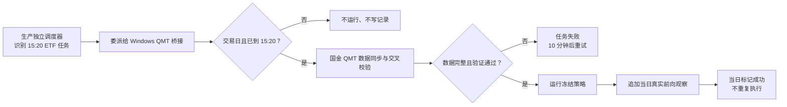

# ProBigA 交易 V2 四项缺陷修复与生产验收报告

- 验收日期：2026-07-26
- 生产目录：`/opt/ProBigA`
- 数据库：MySQL 5.7.38
- 验收结论：四项缺陷均已修复并部署；生产服务正常
- ETF 前向口径：只记录 2026-07-27 及之后真实到达的数据，禁止回填此前记录

## 一、结论

| 项目 | 修复前影响 | 当前结果 | 验收 |
|---|---|---|---|
| 趋势失效且受 T+1 限制 | `VALID -> EXIT_PENDING_T1` 被判为非法迁移，决策报错 | 有效、强势、建仓中、转弱四类持仓均可直接进入 T+1 或流动性等待态；退出承诺不会被价格反弹撤销 | PASS |
| 实盘开关数据库硬约束 | MySQL 5.7 不执行原有 `CHECK`，存在被误改为 1 的可能 | 增加 INSERT、UPDATE 两道数据库触发器；生产实际更新为 1 被 MySQL 拒绝，值保持 0 | PASS |
| ETF 前向策略与调度 | 策略未登记、任务未安装，7 月 27 日不会自动记录 | 冻结策略已登记；每日 15:20 任务已启用；Linux 调度委派给 Windows 国金 QMT 桥接，桥接已加载执行器 | PASS |
| ETF 回测遗留 RUNNING | 外层任务失败后，内层回测记录未收口，长期显示运行中 | 遗留记录已改为 FAILED；以后计算异常会自动同步关闭对应回测；另提供历史孤儿记录修复工具 | PASS |

## 二、已修改内容

### 1. 动态仓位状态机

修改 `server/trading_v2/positions.py`：

- `OPENING`、`VALID_STRONG`、`VALID`、`WEAKENED` 均允许直接进入 `EXIT_PENDING_T1`。
- 上述状态也允许直接进入 `EXIT_PENDING_LIQUIDITY`。
- 趋势失效、硬止损或风险事件出现时，当天不能卖出仍会立即生成退出意图，目标仓位为 0。
- 等待态保持不可逆；后续价格反弹不会把已确认的退出重新变成持有。

生产探针结果：

```text
previous       = VALID
next           = EXIT_PENDING_T1
action         = EXIT
target_quantity= 0
reason_code    = EXIT_BLOCKED_T1
```

### 2. 实盘开关数据库硬闸

新增迁移 `20260726_006_real_trading_hard_guard`：

- `trg_trade_account_v2_real_disabled_bi`：插入账户前拦截。
- `trg_trade_account_v2_real_disabled_bu`：更新账户前拦截。
- 只要 `real_trading_enabled` 不为 0，MySQL 直接抛错并取消写入。

生产破坏性边界测试在事务中执行，结果：

```text
测试前 real_trading_enabled = 0
尝试更新为 1                 = 数据库拒绝
MySQL 错误                   = real trading is disabled by database guard
测试后 real_trading_enabled = 0
```

### 3. 回测失败补偿

修改 `server/trading_v2/job_worker.py`：

- 回测计算或落库任一环节抛出异常时，自动把最新匹配的 `RUNNING` 回测改为 `FAILED`。
- 同步记录异常类型、错误信息和结束时间。
- 外层任务仍保留原异常，不会把失败伪装成成功。

新增 `tools/repair_trading_v2_backtests.py`：

- 只处理已经超时且能匹配到失败任务的孤儿回测。
- 不会把仍在正常计算的回测误判为失败。

生产遗留清理结果：

```text
backtest_uid = 4bbbaebbeda0efb328a9986a595edd22
原状态       = RUNNING
当前状态     = FAILED
原始错误     = MODULENOTFOUNDERROR
当前 RUNNING = 0
```

### 4. ETF 真实前向记录链路

已完成：

- 登记冻结策略 `etf_trend_risk_v2.0.0`。
- 固定配置哈希：
  `c5533703135039d9ccdac49e201e733b9cba804329fcf0b017b02007ca3ebe5a`。
- `forward_start_date` 固定为 `2026-07-27`。
- 模式固定为 `research_paper_read_only`。
- 自动下单保持关闭。
- 安装并启用 `etf_forward_daily`，每日 15:20 执行。
- 服务器调度只负责委派；持有国金 QMT 登录态的 Windows 桥接负责实际执行。
- 失败后每 10 分钟重试，成功后当日不重复执行。
- 非交易日不抓取、不生成观察记录。

当前生产 ETF 数据：

```text
ETF 日K行数       = 82,958
ETF 数量          = 14
最新交易日        = 2026-07-24
验证通过行数      = 82,958
前向策略登记数    = 1
前向观察记录数    = 0
7月27日前记录数   = 0
```

当前 0 条前向记录是正确结果。2026-07-27 之前没有真实运行过冻结后的前向流程，任何补写都会变成回测或事后重放，不能冒充前向验证。

## 三、生产执行流程



## 四、测试与生产证据

### 自动化测试

```text
853 passed
11 subtests passed
耗时 19.09 秒
```

覆盖新增场景：

- 四种活跃持仓状态直接进入 T+1 等待。
- 四种活跃持仓状态直接进入流动性等待。
- 回测异常先补偿回测状态，再向外传播异常。
- 失败补偿只更新匹配的最新 RUNNING 记录。
- ETF 桥接未到时间不执行。
- ETF 桥接当日成功只执行一次。
- ETF 桥接失败后按 10 分钟冷却重试。

### 生产运行状态

```text
probiga           = active
probiga-scheduler = active
GET /api/health   = 200 {"status":"ok"}
登录页            = 200
受保护接口无登录   = 401
```

### QMT 桥接状态

```text
QMT 客户端进程                = 运行中
QMT 内置策略状态              = running
QMT 内置策略错误              = 空
ETF 前向任务识别结果（7月26日）= not_trade_day
```

`not_trade_day` 是预期行为，证明桥接已加载 ETF 执行器，同时没有在周日制造伪数据。

## 五、7 月 27 日首次真实记录的验收标准

2026-07-27 收盘后应同时满足：

1. `sm_etf_kline` 最新日期为 `2026-07-27`，当日数据全部通过质量校验。
2. `etf_forward_daily.last_run_status` 为 `success`。
3. `last_run_output` 中执行器为 `windows_big_qmt_bridge`。
4. `st_etf_forward_observation` 新增且仅新增 2026-07-27 的记录。
5. 不存在任何小于 2026-07-27 的前向观察。
6. `automatic_order_submission` 仍为 `false`。
7. `real_trading_enabled` 仍为 0。

如果 QMT 或原始行情在 15:20 尚未准备好，任务会失败并每 10 分钟重试；只有数据通过校验后才允许追加前向观察，不会拿缺数或异常数据强行生成信号。

## 六、尚需时间形成、但不是当前缺陷的证据

- 2026-07-27 的 ETF 首条真实前向记录，要在当日收盘后才能产生。
- Level-1 连续五个交易日证据，最早要到 2026-07-31 收盘后才能形成完整结论。
- 概念和行业成员的真实历史区间，会从 2026-07-27 起逐交易日自然累积。

这些项目已具备采集链路，但不能提前伪造结果。
