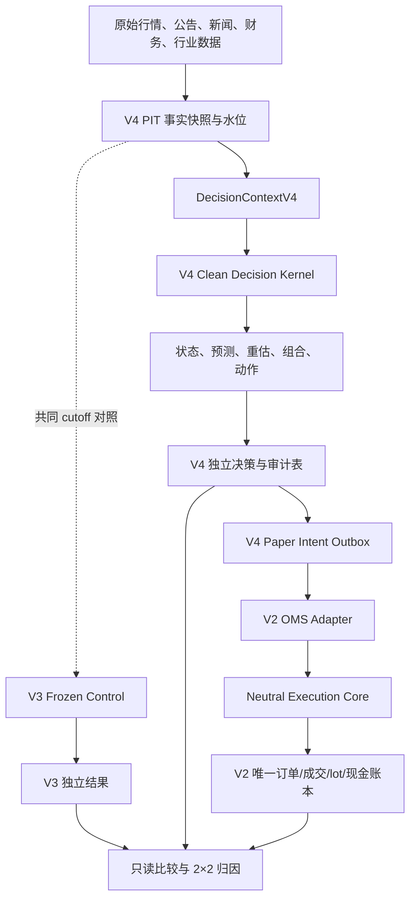

# ProBigA 动态交易决策系统 V4 净室重构与迁移实施方案

**文档版本**：V2.6  
**目标系统**：ProBigA Trading V4 Clean-Room  
**编制日期**：2026-08-03  
**最后修订**：2026-08-04  
**文档状态**：代码改造唯一架构与迁移基线  
**运行边界**：研究、观察、预警和独立模拟盘；真实自动下单继续关闭  

> 本文重新裁决了 V4 与现有 V2/V3 的关系。它取代《ProBigA 动态交易决策系统 V4 需求与实施方案》V1.1 中“在 `server/trading_v3/dynamic_v4/` 增量开发、复用 V3 决策表和决策逻辑”的安排。V1.1 的业务目标、因子目录和风险理念仍可作为需求来源；发生冲突时，以本文为准。架构裁决同时冻结在 [V4 决策净室复用 V2 唯一交易账本 ADR](./ADR_V4_CLEAN_DECISION_CORE_V2_CANONICAL_LEDGER_2026-08-04.md)。

---

## 0. 最终架构裁决

### 0.1 确定结论

直接在 V3 决策链上增加 V4 功能会影响结果，而且很难判断影响来自哪里。V3 的启发式市场状态、旧特征、旧校准、主题评分、贪心组合、日频退出语义和已有模拟持仓都可能渗入 V4，使新系统即使表现改善，也无法证明是新预测真正有效。

因此，本项目不再采用“V3 决策逻辑增量升级为 V4”的方案，改为：

1. **V4 决策科学净室重写**：独立目录、独立领域模型、独立特征、独立标签、独立模型、独立校准、独立结果表；
2. **V3 冻结为外部对照**：V4 不读取 V3 的评分、概率、候选、组合、退出或动作；
3. **V2 只保留唯一机械执行与账本**：账户、费用、订单、成交、现金、持仓 lot、T+1 和涨跌停规则不重复建设；
4. **先净化 V2 执行代码再接入 V4**：策略专属入场条件、V3 状态投影必须移出中立执行内核；
5. **V3/V4 独立双跑，不做决策双写**；
6. **V4 使用独立模拟账户**，但账户仍在 V2 唯一账本中，不建立第二套现金和持仓真相；
7. **当前 OOS 仍为 `BLOCK`，V4 paper buy outbox 保持关闭**。只有冻结候选先通过历史 OOS/PIT/工程门禁后，才可在独立模拟账户开放 paper buy 以累计前向证据；真实买入始终关闭并且不在本文授权范围内。

这里的“V4 决策科学净室重写”是**在现有仓库、V2 交易底座和 V3 对照体系上的增量扩展**，不是另建一套平行交易系统。独立目录、namespace 和决策结果表用于隔离投资观点与实验归因；账户、订单、成交、现金、持仓 lot、费用、风控和 canonical commit 的事实所有权仍唯一属于 V2。011～015 新增的 execution evidence、authority attestation 和 accounting finalization 都是绑定既有 V2 事实的追加式证据层，不得成为第二套账户或账务真相。V3 subscriber 也只能消费 canonical 事件形成只读投影，不得回写或取代 V2 账本。

因此，“增量扩展”与“净室决策”并不冲突：前者描述基础设施和账本边界，后者描述预测、特征、标签、模型、校准与组合决策的隔离边界。任何代码骨架、migration 声明、离线测试或 fake-DB 测试均不等于真实 MySQL 行为验收，更不构成生产或 actionable 授权。

当前硬状态是 `OOS=BLOCK`、`production_activation_allowed=false`、`actionable_output_allowed=false`、`paper_buy_outbox=closed`。任何 TEST/CI capability、migration 参数或运行时配置都不能改变这四项事实。

推荐架构名称：

```text
V4 Clean Decision Core + Neutral Execution Core + V2 Canonical Ledger
```

### 0.2 为什么不是全部推倒重建

全部重建数据采集、交易日历、证券规则、费用、订单、成交、T+1、现金和持仓账本，并不会让预测更准确，反而会形成两套账户真相，增加重复成交、现金不一致和风险规则分叉的概率。

正确边界不是“旧代码一行都不能用”，而是：

> 只共享客观事实、确定性规则和机械执行；不共享任何已经表达投资观点的产物。

### 0.3 本文对旧方案的直接替换

| 旧安排 | 新安排 |
|---|---|
| `server/trading_v3/dynamic_v4/` | 新建 `server/trading_v4/` 净室决策内核 |
| 扩展 `st_decision_run_v3` | 新建 `st_decision_run_v4`，不修改 V3 决策语义 |
| 复用 V3 forecast/hypothesis/portfolio 表 | V4 使用自己的 forecast、state、portfolio、action 和 evidence 表 |
| 复用 V3 模型注册与校准结果 | 只复用治理思想，V4 使用独立模型和校准 namespace |
| V3/V4 共享模拟账户 | 两个独立 paper account，共用 V2 账本结构与执行合同 |
| V4 直接调用现有 V2 execution | 先抽取中立执行内核，再通过幂等 outbox/adapter 接入 |
| A/D 两套结果直接比较 | 增加共同基础设施对照与 2×2 组件归因 |

---

## 1. 结果影响评估

### 1.1 必须区分四种“结果”

| 结果层 | 含义 | 主要污染来源 |
|---|---|---|
| 预测结果 | 次日/未来多日方向、收益、回撤和可成交概率 | 数据时点、Universe、特征、标签、模型、校准 |
| 决策结果 | 观察、买入、持有、减仓、退出、替换及目标仓位 | 预测、风险规则、组合求解、旧持仓状态 |
| 模拟收益 | 订单、成交、费用、滑点、T+1 后的净值 | 成交模型、执行延迟、流动性、账户混用 |
| 生产账户结果 | 真实账户约束下的最终表现 | 历史旧仓、现金、不可卖数量和人工动作 |

不能用生产账户收益直接证明预测模型更好，也不能只看预测命中率证明交易可盈利。四层必须分别验收。

### 1.2 组件复用裁决

| 组件 | 是否影响结果 | 最终裁决 |
|---|---|---|
| 原始日 K、分钟 K、成交、公告、财务原始记录 | 会影响，但属于共同事实 | 通过 PIT 认证后允许共享 |
| 当前覆盖表、回填值、无历史版本行业归属 | 会造成时点泄漏 | 禁止用于 V4 历史训练 |
| V3 特征、总分、候选和主题排名 | 直接影响预测和排序 | 禁止进入 V4 决策上下文 |
| V3 已拟合模型、校准桶、概率 | 直接影响概率含义 | 只能作为冻结 control，禁止复用 |
| V3 market regime、hypothesis | 带有旧观点和手写先验 | 禁止作为 V4 特征或先验 |
| V3 portfolio、exit policy | 改变持仓、换手和收益 | 只用于归因实验，不进入 V4 主链 |
| 交易日历、证券代码、100 股手数、T+1 | 影响可执行性但不表达观点 | 抽成中立公共能力后共享 |
| 费用、涨跌停、停牌、成交状态机 | 影响模拟收益 | 两臂使用同一冻结版本，审计后共享 |
| V2/V3 当前模拟持仓和现金 | 会污染策略比较 | V4 使用独立 paper account |
| V2 订单、fill、lot、cash ledger 表结构 | 只记录机械事实 | 保持唯一账本，不复制 |
| V3 前向证据协议和统计指标实现 | 算法本身可中立 | 通过黄金测试后抽取；不共享 V3 结果记录 |
| 页面、鉴权、任务监控通用组件 | 不直接表达选股观点 | 可复用，但查询必须绑定同一 `run_uid` |

### 1.3 现有代码中已确认的耦合风险

1. `server/trading_v3/regime.py` 使用手写 logit/softmax，只能视为启发式先验；
2. `server/trading_v3/portfolio.py` 的主要组合过程是按旧分数和 sleeve 规则做贪心准入；
3. `server/trading_v3/exit_policy.py` 是完成日 K 后生成下一交易日退出，不是盘中动态退出；
4. `server/trading_v3/context.py` 的新闻逻辑包含关键词和固定来源权重；
5. `server/trading_v2/execution.py` 同时承担机械撮合、V3 投影和旧 `sector_preheat` 入场判断，并非纯中立执行服务；
6. `server/trading_v2/planner.py` 和 `policy.py` 包含旧市场状态、题材暴露、开仓比例和候选准入，不是中立 OMS 风控；
7. `server/trading_v2/position_monitor.py` 会按旧 strategy signal、主题状态和旧仓位策略生成退出或加仓，不能扫描 V4 账户；
8. 当前 V3 决策直接读取 V2 现有账户和持仓，如果 V4 共用该账户，绩效归因必然失真；
9. 当前[股票 OOS 最终验收](./ProBigA_trading_v4_OOS_final_acceptance_2026-08-01.md)结论仍为 `BLOCK`，旧模型没有资格成为 V4 的有效预测底座。

---

## 2. 目标架构



### 2.1 核心所有权

| 能力 | 唯一所有者 |
|---|---|
| V4 市场、行业、事件、个股和持仓判断 | V4 decision kernel |
| V4 特征、标签、模型、校准和验证记录 | V4 research/decision schema |
| 交易日历、证券规则、费用和机械撮合 | neutral execution core |
| paper intent、order、fill、lot、cash | V2 canonical ledger |
| V3 历史口径和冻结基线 | V3 frozen runtime |
| V3/V4 对照、组件归因和升级裁决 | evaluation service |

### 2.2 V4 内核确定性要求

V4 `kernel`：

- 不访问数据库；
- 不访问网络；
- 不读取系统当前时间；
- 不读取环境变量；
- 不调用 V2/V3；
- 只接收不可变 `DecisionInput`；
- 只返回完整 `DecisionBundle`；
- 相同输入、代码、配置和模型必须产生相同 `result_hash`。

任何随机模型都必须显式传入并记录随机种子。

---

## 3. 确定的代码目录与依赖边界

### 3.1 新目录

```text
server/
  trading_core/
    contracts/
    asof/
    math/
    market_rules/
    execution/
    data_quality/

  trading_v4/
    domain/
      contracts.py
      enums.py
      hashes.py
      time.py

    kernel/
      market_state.py
      sector_state.py
      event_impact.py
      stock_forecast.py
      position_revaluation.py
      replacement.py
      portfolio.py
      action_policy.py

    application/
      decision_coordinator.py
      intraday_coordinator.py
      event_coordinator.py
      forward_evidence.py
      run_validator.py

    ports/
      market_data.py
      fundamental_data.py
      event_data.py
      instrument_rules.py
      account_state.py
      execution.py
      decision_store.py
      model_registry.py
      clock.py

    infrastructure/
      repository.py
      feature_store.py
      model_registry.py
      event_repository.py
      worker_lease.py

    workers/
      daily_worker.py
      intraday_worker.py
      event_worker.py
      outbox_worker.py

    api/
      schemas.py
      router.py

    config.py
    audit.py

  integrations/
    canonical_data/
    v2_execution_adapter/
    legacy_snapshot_adapter/

  evaluation/
    shadow_books/
    component_attribution/
    v3_v4_compare/
```

### 3.2 强制依赖规则

以下规则必须通过自动化架构测试和数据库权限实现，不能只写在文档里：

1. `server/trading_v4/domain` 和 `kernel` 只能依赖标准库及 `server/trading_core` 的中立 contracts/math；
2. `trading_v4/kernel`、`factors`、`forecasting`、`policy`、`allocation` 禁止 import `server.trading_v2`、`server.trading_v3`；
3. V4 训练和预测模块禁止直接执行 SQL，只能消费 `AsOfDataset` 或 `DecisionContextV4`；
4. 只有 `server/integrations/v2_execution_adapter` 可以引用 V2 OMS 接口；
5. 只有 `server/evaluation` 可以在 V4 决策提交并冻结后读取 V3 与 V4 两边结果；
6. V4 预测数据库用户不得读取 V3 派生决策表；
7. V3 不得反向 import V4；
8. V4 不得直接写 V2 order、fill、lot 和 cash 表；
9. 模型文件、缓存键、配置和产物必须使用 `v4` 独立 namespace；
10. 公共执行层不得回调 V4 评分或策略函数。

新增测试：

```text
tests/architecture/test_v4_dependency_boundaries.py
tests/architecture/test_v4_sql_allowlist.py
tests/architecture/test_v4_artifact_namespace.py
```

### 3.3 禁止进入 V4 的字段

`DecisionInput` 和 V4 feature schema 中禁止出现：

```text
legacy_score
v3_forecast
v3_regime_probability
v3_theme_rank
v3_candidate_rank
v3_hypothesis
v3_target_weight
v3_exit_action
v3_calibration_bucket
```

V3 结果只能在评估层作为比较标签出现，且比较任务必须晚于 V4 `COMMITTED`。

---

## 4. V4 数据净室与时间点协议

### 4.1 数据记录必须具备的时间

所有可进入决策或训练的数据必须尽量保存：

```text
event_time
source_published_at
first_seen_at
received_at
ingested_at
revised_at
knowledge_time
```

生产和历史回放只能读取：

```text
knowledge_time <= decision_time
```

历史补录时间不能冒充原始发布时间或首次可见时间。无法恢复历史可知时间的数据必须标记 `REPLAY_INELIGIBLE`。

### 4.2 数据能力状态

每个数据源和因子必须记录：

```text
availability_status:
  ACTIVE / DEGRADED / BLOCKED

research_status:
  BACKTEST_READY / FORWARD_ONLY / DISPLAY_ONLY

quality_status:
  PASS / WARN / FAIL
```

缺失数据不允许自动填为中性零分。任何 silent fallback 在 `ACTIONABLE` 链路中均属失败。

### 4.3 原始数据复用准入

旧数据适配器只有通过 `PIT_DATA_CERTIFIED` 后才能被 V4 使用。至少通过：

1. `prefix invariance`：追加未来数据后，历史时点特征完全不变；
2. 截止时间测试：14:30 决策不能读取收盘值；
3. 点时 Universe 测试，包括当时 ST、停牌、退市和新股；
4. 修订值与初始披露值区分测试；
5. 代码规范化、复权和交易日对齐人工样例核对；
6. 分红、送转、配股、除权除息、停复牌等公司行为的点时版本验证；
7. 来源覆盖率、新鲜度和内容哈希验证。

### 4.4 当前数据事实约束

截至本文编制时：

- 日 K 可作为主要历史基础；
- 分钟 K 约 8,000 万行，历史从 2026-04-15 左右开始，不能每 5 分钟全表重扫；
- 五档盘口当前没有可用历史记录，只能 `BLOCKED`，建立追加采样后转 `FORWARD_ONLY`；
- 可靠题材成员点时快照主要从 2026-07-24 左右开始；
- 新闻历史主要从 2026-05-10 左右开始；
- 外围市场上下文持久化历史很短，只能先作前向数据；
- 结构化宏观、ETF 实际申赎和分析师一致预期尚未配置；
- 公告缺少普遍可靠的精确发布时间、正文、修订和撤回链；
- 分钟资金流存在延迟和全市场扫描成本，不得表述成实时、真实的主力净流入。

---

## 5. 决策上下文与因子体系

### 5.1 `DecisionContextV4`

```text
context_id
decision_time
decision_clock
knowledge_cutoff
trade_date
universe_version
raw_data_manifest_hash
source_watermarks
factor_spec_versions
forecast_contract_ids
model_versions
calibration_versions
portfolio_policy_version
execution_contract_version
fee_schedule_version
account_snapshot_id
code_commit_sha
config_hash
random_seed
capability_statuses
```

上下文创建后不可修改。迟到数据只能创建新 context 和 child run，不能覆盖旧结果。

### 5.2 因子角色

```text
GATE          是否允许继续决策
STATE         描述市场/行业/个股当前状态
ALPHA         预测未来收益或方向
RISK          预测尾部损失、回撤和逻辑失效
COST          成交、费用、滑点和冲击
PORTFOLIO     账户、相关性、暴露和机会成本
EXPLANATION   仅用于说明，不得触发动作
```

### 5.3 因子块

首期保留以下因子块，但不是一次性全部激活：

1. 市场环境：指数趋势、宽度、成交、波动、集中度、涨跌停结构；
2. 外围与宏观：指数、利率、汇率、商品、政策事件；
3. 行业与题材：相对强度、宽度、成交占比、扩散、拥挤、退潮速度；
4. 个股趋势：多周期收益、均线、突破、相对市场/行业强度；
5. 量价波动：量比、换手、ATR、跳空、振幅、波动聚集；
6. 盘口与成交：可成交性、价差、封单和深度；无历史时仅前向；
7. 涨停与情绪：连板、开板、晋级失败、炸板、跌停扩散；
8. 基本面和估值：只使用可证明当时已公开的数据；
9. 事件与新闻：来源、类型、严重度、修订、实体关系和价格确认；
10. 公司治理和硬风险：立案、财务证伪、退市、减持和质押；
11. 持仓与组合：可卖数量、T+1、风险贡献、相关性、集中度和替代优势。

每次新增因子块必须单独报告增量 OOS 效果、换手、回撤、稳定性和多重检验影响。不能因为增加了更多数据就默认提高分数。

### 5.4 特征存储

盘中全市场因子不得采用“一行一个股票一个因子”的 EAV 高频表。存储粒度固定为：

```text
run_uid + scope_type + scope_id + feature_set_version
```

完整向量使用版本化 JSON/压缩载荷，并保存 `feature_hash`；常用筛选字段单独列化。MySQL 只保存实际决策使用的向量、持仓、短名单和摘要，高频原始特征按日归档。

---

## 6. 市场、行业、事件与个股预测

### 6.1 市场状态

市场状态拆成：

1. 当前可观察状态：风险偏好、上涨宽度、收益集中度、波动压力、成交变化、拥挤和恶化速度；
2. 独立前瞻概率：未来 1/3/5 日风险扩张、宽度收缩、风格切换和修复概率。

多个风险事件允许同时发生，默认不是总和等于 1 的互斥分类。每个输出必须标记：

```text
probability_kind:
  HEURISTIC_PRIOR
  EMPIRICALLY_CALIBRATED
  MODEL_PREDICTED
```

只有后两类通过独立 OOS 校准后，才能显示为可解释概率。

### 6.2 行业阶段

“潜伏”改为可观察的“低关注积累状态”，不得因后来上涨反推。系统分别输出：

- 当前相对强度、宽度、成交占比、拥挤和恶化速度；
- 未来 3/5 日相对跑赢概率；
- 未来 3/5 日宽度扩张概率；
- 未来 3/5 日退潮回撤概率；
- 状态转换概率及其置信度。

行业和概念题材不得强制互斥，一只股票可以拥有多个题材暴露。

### 6.3 事件引擎

事件采用原始、标准化、影响和触发四层：

```text
raw event
→ canonical event
→ entity/industry impact features
→ affected-scope recalculation outbox
```

事件的方向、严重度、可信度、新颖度和相关度只是特征，不再直接相乘生成交易分数。

- 官方监管、立案、退市和财务证伪可作为硬风险门禁；
- 正面事件必须有该事件类别的历史事件研究和 OOS 证据，才能影响买入；
- 稀有事件样本不足时只能触发风险重估或观察；
- LLM 只能做结构化、实体映射和解释，不能直接生成买卖动作；
- 事件修订和撤回必须追加版本，不能覆盖历史。

### 6.4 `ForecastContract`

每个预测必须绑定：

```text
forecast_contract_id
decision_clock
signal_at
feature_cutoff_at
earliest_order_at
entry_order_policy
entry_fill_model
earliest_exit_at
holding_sessions
exit_policy_id
cost_model_id
benchmark_id
target_rule
protection_rule
tradability_rule_id
label_mature_at
```

至少拆成：

| 合同 | 用途 |
|---|---|
| `FORECAST_ONLY_NEXT_SESSION` | 回答“明天可能怎样”，不直接当可买标签 |
| `ACTIONABLE_ENTRY_VALUE` | 从真实可成交入场开始计算 T+1 后净收益 |
| `HOLDING_VALUE` | 评估现有持仓继续持有、减仓或退出 |

同一个模型不得混用盘后和盘中标签。

### 6.5 T+1 标签规则

- 买入日只记录 MFE/MAE，不允许模拟卖出；
- 最早退出日为下一交易日；
- 日 K 同日同时触及止盈和止损时采用保守顺序或标记 `AMBIGUOUS`；
- 一字涨停未成交必须记录 `P(fill)` 和未成交结果，不能从样本删除；
- 换仓先模拟卖出腿，卖出失败不得假设资金已释放；
- 涨跌幅制度按股票、板块、ST 状态、上市阶段和历史日期确定。

---

## 7. 候选、持仓、退出与组合

### 7.1 候选状态

```text
DATA_BLOCKED
RESEARCH_ONLY
WATCH
CONDITIONAL
PAPER_ACTIONABLE
EXECUTION_BLOCKED
HOLD_ONLY
EXIT_ALERT
```

`PAPER_ACTIONABLE` 只能在数据、预测、风险、组合和执行五类门禁全部通过后产生。生产真实买入状态不在本项目授权范围内。

### 7.2 追高与连板风险门禁

为防止把已经极端演绎的强势股继续显示为普通买入，首期采用保守 `EXTREME_EXTENSION_POLICY_V1`：

1. 当前停牌、一字涨停或没有可验证成交容量：`EXECUTION_BLOCKED`；
2. 连续涨停达到 4 板及以上：新买入固定为 `WATCH`，不得物化 paper buy；
3. 连续 3 板：只能为 `CONDITIONAL`，必须经历开板后的可交易确认、流动性确认和尾部风险重估；
4. 5 日极端涨幅、跳空和拥挤同时触发时，即使连板不足，也进入 `EXTREME_EXTENSION`；
5. 退出该状态至少需要一个完整可交易观察窗口，并重新通过收益下界、CVaR、滑点和无法成交损失门禁；
6. 阈值属于风险政策，不是收益预测；任何降低阈值的修改都必须建立新的 baseline epoch。

因此，九连板股票不会作为普通买入建议进入 paper outbox；系统只能展示事实、风险和后续观察条件。

### 7.3 持有效用

统一使用同一持有期、同一收益率量纲：

```text
action_utility
= E[R_net]
- lambda * CVaR95(loss)
- non_fill_expected_loss
- untradeable_gap_expected_loss
- uncertainty_margin
```

禁止再次把无条件期望乘上涨概率。持仓成本和浮亏不能成为继续持有的理由，只能影响费用、可卖数量和账户风险预算。

### 7.4 换仓优势

```text
replacement_edge
= U(portfolio_after_replacement)
- U(current_portfolio)
```

普通换仓必须同时满足：

- 保守置信下界覆盖双边交易成本；
- 卖出腿真实可执行；
- 优势持续至少两个快照；
- 不处于冷却期；
- 换仓后行业、风格、流动性和尾部风险没有超限。

重大官方事实风险可以绕过持续性要求，但不能绕过 T+1 和不可成交约束。

### 7.5 输出动作必须分两层

```text
desired_action
executable_action
blocked_reason
earliest_execution_time
sellable_quantity
target_quantity
valid_until
```

“应该退出”不等于“现在能卖出”。不可卖持仓不能在组合求解中被视为已经释放现金。

---

## 8. V2 执行层改造方案

### 8.1 为什么不能原样调用当前 `execution.py`

当前文件同时包含：

- 账户、证券规则、费用和机械撮合；
- V3 execution-plan 状态投影；
- `sector_preheat` 专属行业确认；
- `sector_preheat` 专属入场趋势条件；
- paper quote fallback 和配置读取。

另外，当前 `position_monitor.py` 会根据旧信号、主题和仓位策略主动生成退出/加仓。若原样覆盖 V4 账户，V4 的持仓收益仍会被旧策略改写。

`planner.py` 和 `policy.py` 还会根据旧 portfolio policy、market regime、theme exposure 和开仓比例重新裁决数量。V4 已经完成组合求解后，不能再让这套旧策略规划器二次改写目标仓位。

这些职责混在一起会使 V4 成交结果受到旧策略条件影响。因此在 V4 outbox 开启前，必须完成中立化拆分。

### 8.2 确定拆分

| 当前模块 | 目标 | 处理方式 |
|---|---|---|
| `server/trading_v2/calendar.py` | `trading_core/market_rules/calendar.py` | 黄金测试后抽取，V2 保留兼容 facade |
| `server/trading_v2/instrument_registry.py` | `trading_core/market_rules/instruments.py` | 抽取按股票/日期生效规则 |
| `server/trading_v2/ledger.py` | `trading_core/execution/ledger.py` | 抽取纯计算，数据库账本仍为 V2 |
| `server/trading_v2/matcher.py` | `trading_core/execution/matcher.py` | 行为冻结后抽取并补容量/冲击合同 |
| `server/trading_v2/oms.py` | `trading_core/execution/oms.py` | 抽取状态机与幂等键 |
| `server/trading_v2/execution.py` | neutral service + adapters/subscribers | 拆除策略判断和 V3 反向投影 |
| `server/trading_v2/planner.py` / `policy.py` | legacy planner + neutral hard risk envelope | V4 不调用旧 planner；只通过版本化硬安全包络 |
| `_sector_entry_wait_reason` | `LegacySectorPreheatExecutionPolicy` | 只服务旧策略，不进入 neutral core |
| `_entry_trend_wait_reason` | `LegacySectorPreheatExecutionPolicy` | 同上 |
| `_sync_v3_execution_plan_states` | `V3ExecutionProjectionSubscriber` | 通过成交事件订阅，不在核心执行事务中硬编码 |
| `server/trading_v2/position_monitor.py` | legacy position policy + neutral protective supervisor | V4 账户从旧 monitor 排除；中立 supervisor 只执行 V4 已提交的保护指令 |

### 8.3 中立执行合同

```text
ExecutionIntent {
  source_system
  strategy_id
  decision_id
  action_id
  account_id
  instrument
  side
  desired_quantity
  limit_policy
  earliest_at
  valid_until
  execution_contract_version
  idempotency_key
}
```

执行层只判断：账户状态、现金、可卖数量、T+1、证券规则、报价新鲜度、限价、成交容量、费用、数据库真实交易硬闸和状态机。另设版本化 `NeutralExecutionRiskEnvelope` 只执行订单/账户绝对上限，不读取市场状态、题材评分、候选排名或策略收益。行业是否值得买、趋势是否失效、目标仓位和组合暴露等判断全部属于 V4 决策层。

V4 的止损、减仓和退出理由由 V4 生成。中立保护 supervisor 只负责在 V4 已经提交明确保护价/有效期后持续执行，并遵守报价可信度、T+1 和涨跌停；它不得重新计算趋势、主题或买卖价值。V4 paper account 必须在配置和测试中明确排除出 legacy `decision_worker`、`planner` 和 `position_monitor`。

### 8.4 V4 到 V2 的唯一通路

```text
COMMITTED V4 action
→ st_paper_intent_outbox_v4
→ v2_execution_adapter
→ st_trade_intent_v2
→ risk/order/fill/lot/cash
```

V4 不得直接插入或更新 `st_order_v2`、`st_fill_v2`、`st_position_lot_v2`、`st_cash_ledger_v2`。

幂等键固定包含：

```text
sha256(
  "V4"
  + action_id
  + account_id
  + stock_code
  + target_quantity
  + valid_until
  + execution_contract_version
)
```

### 8.5 独立模拟账户

建议账户：

```text
paper-v3-frozen-e{epoch}
paper-v3-common-infra-e{epoch}
paper-v4-shadow-e{epoch}
```

三个账户共用 V2 表结构、费用和执行合同，但现金、订单、成交、lot 和净值按 `account_id` 完全隔离。

---

## 9. 数据库改造方案

### 9.1 原则

- 不给 V3 决策表增加 V4 语义；
- 不把 V4 forecast 写入 V3 forecast 表；
- 不复制 V2 order/fill/lot/cash；
- 运行结果按 `run_uid` 不可变追加；
- current/head 与历史事实分离；
- 所有账户级结果必须有 `account_id`；
- MySQL 采用 expand/contract 前向迁移，不自动 down migration。

### 9.2 新增表及粒度

| 表 | 粒度/职责 | 核心唯一键 |
|---|---|---|
| `schema_migration_v4` | 一条迁移版本 | `version` |
| `st_decision_context_v4` | 一次不可变输入上下文 | `context_id`, `context_hash` |
| `st_source_watermark_v4` | context × source | `(context_id, source_key)` |
| `st_decision_run_v4` | 一次 V4 运行 | `run_uid`, `idempotency_key` |
| `st_job_run_v4` | 一次任务尝试 | `job_id`, `(idempotency_key, attempt)` |
| `st_decision_channel_head_v4` | channel/account 当前已提交 run | `(channel, account_id)` |
| `st_runtime_control_v4` | 当前运行开关 | `control_key` |
| `st_runtime_control_transition_v4` | 开关变化审计 | `transition_id` |
| `st_factor_definition_v4` | 因子定义版本 | `(factor_key, version)` |
| `st_entity_feature_snapshot_v4` | run × scope × entity × feature set | 组合唯一键 |
| `st_forecast_contract_v4` | 标签与执行口径 | `forecast_contract_id` |
| `st_model_registry_v4` | V4 模型版本 | `model_version` |
| `st_model_calibration_v4` | model × contract × calibration epoch | 组合唯一键 |
| `st_experiment_registry_v4` | 一次预注册实验 | `experiment_id` |
| `st_baseline_epoch_v4` | 冻结基线 | `baseline_epoch_id` |
| `st_validation_result_v4` | model/epoch × validation gate | 组合唯一键 |
| `st_market_state_v4` | run × market state key | 组合唯一键 |
| `st_sector_state_v4` | run × sector/type | 组合唯一键 |
| `st_event_raw_v4` | source × source event/version | 组合唯一键 |
| `st_event_canonical_v4` | canonical event × version | 组合唯一键 |
| `st_event_entity_link_v4` | event × entity × version | 组合唯一键 |
| `st_event_impact_v4` | run × event × entity/horizon | 组合唯一键 |
| `st_event_recalc_outbox_v4` | 事件影响重算消息 | `outbox_id`, `idempotency_key` |
| `st_stock_forecast_v4` | run × stock × contract/model | 组合唯一键 |
| `st_position_revaluation_v4` | run × account × lot/stock | 组合唯一键 |
| `st_replacement_candidate_v4` | run × account × held × candidate | 组合唯一键 |
| `st_portfolio_target_v4` | run × account × stock | 组合唯一键 |
| `st_decision_action_v4` | run × account × stock/action | `action_id`, 组合幂等键 |
| `st_alert_state_v4` | 当前告警状态 | `(account_id, alert_key)` |
| `st_alert_transition_v4` | 告警状态变化 | `transition_id` |
| `st_paper_intent_outbox_v4` | V4 action 到 V2 intent | `outbox_id`, `action_id`, `idempotency_key` |
| `st_oms_bridge_v4` | V4 action/outbox 与 V2 intent 映射 | `action_id`, `v2_intent_id` |
| `st_forward_evidence_v4` | 冻结预测/动作成熟后的证据 | 预测/动作 × horizon |
| `st_comparison_result_v4` | V3/V4 只读对照与归因结果 | experiment × epoch × window |

### 9.3 运行状态与原子发布

```text
CREATED
→ RUNNING
→ VALIDATING
→ COMMITTED

失败分支：FAILED
替代分支：SUPERSEDED
```

写入过程：

```text
创建 RUNNING
→ 按 run_uid 写入全部结果
→ 校验数量、哈希、数据门禁和不变量
→ 标记 COMMITTED
→ 原子更新 channel head
```

API、AI 和 outbox 只允许读取 `COMMITTED`。`latest` 必须先解析一次 channel head，后续所有子查询绑定该 `run_uid`，禁止跨 run 拼接。

### 9.4 数据库权限

| 身份 | 权限 |
|---|---|
| `v4_predictor` | 原始/PIT事实只读；V4运行与结果表读写；无 V3 派生表权限 |
| `v4_outbox_worker` | 当前 projection outbox worker + subscriber 实际 SQL 的精确 10 表接口；V2 intent/order 只读，不能写 fill/lot/cash/account/risk/event |
| `v2_executor` | V2 intent/order/fill/lot/cash 按现有边界读写 |
| `v4_evaluator` | V3/V4 结果和影子账本只读；不能产生动作 |
| `v4_api_reader` | V4 committed run 只读 |

---

## 10. API 与任务合同

### 10.1 查询接口

```text
GET /api/v4/readiness
GET /api/v4/head?channel=shadow|paper&account_id=...
GET /api/v4/dashboard?run_uid=...
GET /api/v4/market-state?run_uid=...
GET /api/v4/sector-states?run_uid=...
GET /api/v4/events?run_uid=...&cursor=...
GET /api/v4/candidates?run_uid=...&cursor=...
GET /api/v4/positions/revaluation?run_uid=...&account_id=...
GET /api/v4/actions?run_uid=...&account_id=...
GET /api/v4/alerts?account_id=...&cursor=...
GET /api/v4/jobs/{job_id}
GET /api/v4/audit/{run_uid}
GET /api/v4/comparisons/{experiment_id}
```

所有响应包含：

```text
run_uid
context_id
decision_at
data_quality_status
source_watermarks
model_version
config_version
code_commit_sha
result_hash
```

### 10.2 命令接口

```text
POST /api/v4/decision-runs
POST /api/v4/recalculation-jobs
POST /api/v4/actions/{action_id}/approve-paper
POST /api/v4/actions/{action_id}/cancel
```

禁止公开暴露：

```text
POST /api/v4/paper/execute
```

所有 POST 必须强制 `Idempotency-Key`，返回 `202 Accepted`、`job_id`、`run_uid` 和状态地址。页面不得通过一个按钮同步执行全市场动作。

### 10.3 任务分层

| 路径 | 范围 | 初始频率/SLO |
|---|---|---|
| 热路径 | V4 独立账户持仓、订单、硬风险 | 常驻 worker；报价年龄 p95 ≤15 秒，风险计算 p95 ≤2 秒 |
| 温路径 | 持仓、重点行业和 200～500 只短名单 | 3～5 分钟；短名单重排 ≤60 秒 |
| 冷路径 | 全市场轻扫描 | 15～30 分钟；覆盖 ≥95%，快照年龄 ≤75 秒 |
| 重模型 | 全市场日频、财务、事件研究 | 数据水位通过后的盘后 DAG |
| 事件路径 | 受影响实体与持仓 | 官方关键事件入库到重估 p95 ≤60 秒 |

15 秒任务不得放入当前“每次启动 Python 子进程”的通用 scheduler，必须是有数据库租约、心跳、单活和背压的常驻 worker。

---

## 11. 公平 A/B 与组件归因

### 11.1 两条基线

1. `V3_FROZEN_LEGACY`：完整冻结当前 V3，用于确认历史结果可以复现；
2. `V3_COMMON_INFRA_CONTROL`：冻结 V3 的算法规格、特征公式、超参数和策略规则，使用与 V4 相同的 PIT context、Universe、费用、风险预算和中立成交引擎，从训练窗口重新拟合并独立校准。它是新的对照 epoch，不得直接沿用只对旧数据口径有效的拟合权重和校准桶。

无法在共同 PIT 数据上表达的 V3 特征按预注册规则剔除，不得查看 V4 结果后手工替换。该对照用于回答“在相同事实和执行条件下，新决策方法是否优于旧方法”，不是复刻当前生产 V3。

主比较为：

```text
A = V3_COMMON_INFRA_CONTROL
B = V4_CANDIDATE
```

`V3_FROZEN_LEGACY` 只用于发现基础设施修正造成的差异，不是最终公平对照。

正式报告同时给出两种比较：

- `COMMON_INFORMATION`：两臂只使用共同具备 PIT 资格的数据，测量算法增量；
- `FULL_SYSTEM`：V4 可以使用新增且合格的数据源，测量完整系统增量。

不能只报告表现更好的一种口径。

### 11.2 两臂必须相同

- `decision_context_id`；
- 原始快照哈希和 cutoff；
- 点时 Universe；
- 决策时钟；
- 费用、成交和延迟合同；
- 初始资金；
- 总风险预算和流动性约束；
- 行情缺失处理；
- 公司行为处理。

### 11.3 两臂必须隔离

- 候选、预测、目标仓位和动作；
- 模型、校准和缓存；
- paper account、现金、订单、成交和 lot；
- 退出和换仓状态；
- 前向证据与净值曲线。

V4 弃权时必须按现金收益计入，不能把没有交易的样本删除。

### 11.4 2×2 组件归因

| 实验 | 入场/选股 | 退出/持仓 | 用途 |
|---|---|---|---|
| A | V3 | V3 | 冻结基线 |
| B | V4 | V3 | 测量新选股增量 |
| C | V3 | V4 | 测量新退出增量 |
| D | V4 | V4 | 测量完整系统和交互效应 |

该组合只在 `server/evaluation` 使用冻结的离线输出组装，不能让 V4 运行时读取 V3 决策。

### 11.5 Baseline epoch

每个 epoch 保存：

```text
baseline_epoch_id
git_commit
config_hash
model_hash
calibration_hash
feature_schema_hash
universe_version
forecast_contract_id
exit_policy_id
portfolio_policy_id
execution_policy_id
fee_schedule_version
decision_clocks
raw_data_manifest_hash
cumulative_search_count
```

模型、特征、TopN、阈值、标签、退出、费用、成交、仓位、风险预算或数据源任一实质变化，均创建新 epoch，并重新累计前向样本。

---

## 12. 分阶段改造与 PR 切分

### 阶段 0：冻结和阻断旧增量路线

工作：

- 固化 V3 commit、配置、模型、校准和任务清单；
- 保存 V3 基准回放、schema checksum 和最近 committed 结果；
- 增加 V4 决策代码禁止落入 `server/trading_v3` 的架构测试；
- V3 只接受生产缺陷修复，不再加入新策略能力；
- 创建本文对应 ADR。

验收：V3 可从冻结版本重建；旧结果可复现；V4 目录尚不产生交易动作。

### 阶段 1：执行层行为刻画与中立化

工作：

- 为日历、费用、证券规则、OMS、matcher、ledger 和 T+1 建立黄金样例；
- 拆出 `trading_core`；
- 将旧策略专属入场门禁移入 legacy policy adapter；
- 将 V3 状态投影改成成交事件订阅；
- 将旧 planner/policy 限定为 legacy account/strategy，并建立中立硬风险包络；
- 将旧 `position_monitor` 限定为 legacy account/strategy，并建立中立保护 supervisor；
- 保持 V2 facade 兼容。

验收：同一订单与报价输入的新旧机械执行结果完全一致；任何有意修正必须单独建 epoch 和迁移说明。

### 阶段 2：V4 骨架与架构守卫

工作：

- 创建 `server/trading_v4` 分层目录、domain、ports 和纯 kernel 接口；
- 创建 V4 migration、context、watermark、run、job、head 和 runtime control；
- 建立数据库权限和 SQL allowlist；
- 实现确定性 hash 和原子发布。

验收：相同输入产生相同结果哈希；FAILED/RUNNING 不可被 latest 读取；V4 无 V2/V3 决策依赖。

### 阶段 3：PIT 数据与因子注册

工作：

- 建立数据源水位、因子定义、能力状态和 feature snapshot；
- 对日 K、分钟 K、行业、公告、新闻、财务逐源认证；
- 无历史时点能力的因子降为 `FORWARD_ONLY` 或 `DISPLAY_ONLY`；
- 增加 prefix invariance 和 cutoff 测试。

验收：未来数据泄漏为 0；silent fallback 为 0；同一 context 可重复生成同一特征哈希。

### 阶段 4：事件与行业状态

工作：

- 建立 raw/canonical/entity-link/impact/recalc outbox；
- 建立行业当前状态和前瞻目标；
- 重大负面事实先作为风险门禁；
- 事件 LLM 只输出结构化信息和解释。

验收：重复、修订和撤回可回放；事件不会重复累计；无校准正面事件不能产生买入。

### 阶段 5：预测合同与净室模型

工作：

- 实现三个 ForecastContract；
- 建立 T+1、成交、费用和成熟时间标签；
- 使用 purged walk-forward、embargo 和按日期分组的训练/校准/测试；
- 创建独立 model registry、calibration 和 experiment registry；
- 简单基线优先，复杂模型只有增量 OOS 明显改善才晋级。

验收：旧 V3 权重和校准未被加载；所有预测可追溯到 context、合同、模型和数据哈希。

### 阶段 6：持仓、退出、替换和组合

工作：

- 实现 desired/executable 双层动作；
- 实现 CVaR/无法成交/跳空/不确定性统一效用；
- 实现双边目标仓位和换仓优势；
- 加入连板追高、硬事件、数据故障和换仓冷却门禁。

验收：卖出失败不会释放虚假现金；T+1 不违规；九连板等极端延伸不会产生普通 paper buy。

### 阶段 7：盘后 Shadow 与归因

工作：

- V3/V4 使用相同 cutoff 独立双跑；
- 建立 V3 frozen、V3 common infra、V4 三个实验账户/账本视图；
- 运行 2×2 组件归因；
- 所有 V4 action 固定为 `SHADOW`，不产生 V2 intent。

验收：每个差异可归因为数据、特征、模型、退出、组合或执行；V4 不影响 V3 延迟和可用性。

### 阶段 8：盘中 Shadow

工作：

- 上线常驻持仓 worker、温路径和轻量全市场扫描；
- 增加租约、心跳、合并、背压和故障保护；
- 只对受影响实体进行事件重算。

验收：达到本文 SLO；stale 数据下新买入为 0；worker 重启无重复 action；无无限积压。

### 阶段 9：独立 V4 Paper

前置条件：阶段 0～8 的工程门禁全部通过，且至少一个冻结候选通过无泄漏历史 OOS、累计多重检验和压力测试，获得 `PAPER_CANDIDATE`。当前结论为 `BLOCK` 时不得进入本阶段。

工作：

- 创建 `paper-v4-shadow-e{epoch}`；
- 启用 outbox 和 V2 adapter；
- 先开放 REDUCE/EXIT，再开放满足门禁的 PAPER BUY；
- V3 control 继续使用独立账户。

验收：action:intent 为 1:1 幂等；订单、fill、lot 和现金每日对账差异为 0；真实订单为 0。

### 阶段 10：默认展示与长期验证

工作：

- 工程 burn-in 通过后将默认只读页面切至 V4；
- V3 继续后台对照；
- AI 只解释同一个 committed V4 run；
- 继续累计正式前向量化证据。

注意：默认展示不等于模型通过，不等于真实交易授权。

### 建议 PR 顺序

```text
PR-01  ADR、V3冻结清单、依赖/SQL架构守卫
PR-02  V2执行黄金测试和行为基线
PR-03  trading_core 抽取及 V2兼容 facade
PR-04  V4 context/run/watermark/head/runtime-control
PR-05  PIT source adapters、因子注册和 feature snapshot
PR-06  event ledger 与 sector state
PR-07  ForecastContract、标签和净室研究框架
PR-08  position/exit/replacement/portfolio/action policy
PR-09  shadow accounts、comparison 和 2×2 attribution
PR-10  intraday/event/outbox workers 与 API/UI
```

一个 PR 不得同时改变模型、退出、组合和执行合同，否则无法归因。

---

## 13. 测试与故障演练

### 13.1 单元与性质测试

- PIT cutoff、prefix invariance、修订链；
- T+1、涨跌停、ST/不同板块/IPO 历史规则；
- 费用、最低佣金、100 股取整、部分成交；
- utility、CVaR、替换优势和现金约束；
- 连板追高门禁；
- 事件去重、修订、撤回和衰减；
- 相同 `DecisionInput` 的结果确定性；
- V4 禁止 import V2/V3 决策模块；
- SQL 表级 allowlist；
- 模型、缓存和产物 namespace 隔离。

### 13.2 集成测试

- `RUNNING → VALIDATING → COMMITTED → head` 原子发布；
- 重复 POST、重复 outbox、worker 崩溃后的幂等恢复；
- V4 action 到 V2 intent 的唯一映射；
- V3/V4 独立账户和相同执行合同；
- V4 目标数量不会被 legacy planner/policy 二次改写；
- V4 账户不会被 legacy `position_monitor` 生成加仓或退出；
- 无报价、陈旧报价和数据源冲突时不新增买入；
- 已成交后回滚不反向、不删除；
- 页面所有区块绑定同一个 `run_uid`；
- V4 shadow 资源不影响 V3。

### 13.3 故障演练

- QMT 断线与来源切换；
- 数据延迟、覆盖下降和错误回填；
- DB 超时、死锁和迁移中断；
- 事件重复、修订和撤回；
- worker 崩溃、租约过期和时钟漂移；
- outbox 已物化但状态未更新；
- 卖出腿失败和 T+1 锁定；
- 全市场任务超过周期导致背压；
- UI/API 回退 V3；
- V4 停机后已有 paper lot 继续受 V2 保护。

---

## 14. 验收和切换门槛

### 14.1 工程验收

20 个交易日只用于工程 burn-in：

- 无跨 run 页面；
- 无未来数据；
- 无重复 action/intent/order/fill；
- T+1 违规为 0；
- 账本日对账差异为 0；
- stale 数据下新增买入为 0；
- 给定相同订单时两臂成交结果一致；
- 任务、告警、缓存和回滚稳定。

20 日不得授予量化 PASS。

### 14.2 预测验收

冻结前向样本必须报告：

- Brier Skill 和 Log-loss Skill；
- 校准截距、斜率、ECE/ICI；
- 预期收益误差；
- Top-N 扣费收益；
- 概率分组单调性；
- 下行事件 PR-AUC；
- 数据覆盖率、弃权率和分布漂移；
- 按交易日配对的块自助置信区间。

不能把同一天数千只股票当作数千个独立样本。

### 14.3 交易验收

沿用当前更严格的冻结门槛：

- 至少 120 个未经查看的前向交易日；
- 至少 80 笔成熟组合交易；
- 扣费净期望大于 0；
- Profit Factor ≥ 1.30；
- Payoff Ratio ≥ 1.00；
- 最大回撤 ≤ 12%；
- 至少 4/5 外层窗口为正；
- 累计模型搜索的多重检验通过；
- 1.5/2 倍成本、延迟一日、删除最佳 5 笔、TopN、参数和容量压力测试通过。

当前累计候选搜索为 77，不能在新文档中清零。

### 14.4 相对 V3 切换条件

V4 除绝对门槛外，还必须相对 `V3_COMMON_INFRA_CONTROL` 满足预注册指标：

- 日度扣费主动收益为正，并达到冻结的日期块置信标准；
- 尾部损失和最大回撤不劣于风险预算；
- 超额收益不能仅来自更高仓位、行业集中或 beta；
- 换手、滑点、未成交率和弃权率在预算内；
- 预测改善、退出改善和组合改善能够通过归因实验解释。

结果不足、样本不足或置信区间不支持时，状态为 `INCONCLUSIVE`，不能凭最近几周盈利切换。

### 14.5 切换顺序

```text
V4 只读影子展示
→ V4 独立模拟账户
→ V4 成为默认解释和模拟决策
→ 停止 V3 新增模拟意图
```

真实自动下单仍需未来单独立项和明确授权，不在本文范围内。

---

## 15. 运行开关、上线与回滚

### 15.1 独立开关

```text
v4_compute_enabled
v4_intraday_enabled
v4_event_enabled
v4_publish_head_enabled
v4_paper_outbox_enabled
v4_buy_enabled
v4_reduce_exit_enabled
default_read_version
```

真实交易开关继续由数据库硬约束保持关闭，不能成为普通应用配置。

### 15.2 数据故障

- 关闭 `v4_buy_enabled`；
- 进入 `DATA_FEED_FAIL`；
- 停止新增买入；
- 在可信报价存在时允许风险重估；
- 数据异常本身不自动生成卖单。

### 15.3 计算故障

- 停止发布新 V4 head；
- 保留最后一个 committed run 并标记陈旧；
- 默认读取可切回 V3；
- 不删除失败运行和证据。

### 15.4 模拟交易故障

- 关闭 V4 paper outbox 和新买入；
- 取消未认领 outbox；
- 通过 bridge 取消未成交 V2 订单；
- 不删除 intent；
- 不反向处理 fill；
- V2 继续保护已有 V4 paper lot；
- 当日完成订单、现金和 lot 对账。

### 15.5 Schema 回滚

不自动执行 down migration。每个 MySQL 迁移必须具备：

- 前置检查；
- 单步 checkpoint；
- 幂等重跑；
- 失败恢复说明；
- 备份和恢复演练；
- 延迟清理旧结构。

---

## 16. 进一步优化项

### 16.1 将“不交易”设为正式决策

V4 默认可以弃权。数据不足、概率未校准、收益下界不覆盖成本或极端拥挤时，现金是合法目标仓位。弃权率必须进入验收，而不是被删除。

### 16.2 把不确定性预算纳入组合

除了波动和回撤，组合还应限制：

- 数据质量不确定性；
- 模型分歧；
- 校准样本不足；
- 事件来源不确定性；
- 成交和跳空不确定性。

不确定性上升时应降低风险预算，而不是继续用旧标签持有。

### 16.3 研究搜索必须入账

所有模型、阈值、TopN、标签、特征块、退出和组合变体写入 experiment registry，累计搜索数统一做多重检验。删除失败实验属于审计失败。

### 16.4 先风险后 alpha

流水线顺序固定为：

```text
数据门禁
→ 可交易门禁
→ 官方硬风险门禁
→ 尾部风险预算
→ alpha 预测
→ 组合与机会成本
→ 执行动作
```

这样可以避免“九连板很强”“正面新闻很多”等评分先把高风险股票推到榜首，再在页面末尾补一句风险提示。

### 16.5 盘中只重算变化部分

- 静态因子与动态因子分开缓存；
- 全市场先做低成本筛选；
- 重模型只覆盖持仓和短名单；
- 事件只重算受影响实体；
- 任务超过周期时合并下一轮，禁止无限排队。

### 16.6 解释与统计分离

页面必须分别显示：

- 已观察事实；
- 模型预测；
- 概率类型和校准状态；
- 正向证据；
- 反向证据；
- 失效条件；
- 可执行限制；
- 数据缺口。

AI 只能解释已提交结果，不能替代模型补分，也不能把 `WATCH` 表述为推荐买入。

### 16.7 存储和页面优化

- 高频原始特征按日归档为 Parquet；
- MySQL 保留决策向量、索引字段和审计哈希；
- 首页使用 compact dashboard；
- 事件、证据和候选使用 cursor 分页；
- current state 与 append-only history 分离；
- 每次版本切换保存同时点 V3/V4 归因报告，而不只保存收益汇总。

---

## 17. 首批代码工作的确定范围

在本文批准后，首批代码只能实施：

1. ADR 和架构依赖守卫；
2. V3 冻结清单；
3. V2 执行黄金测试；
4. `trading_core` 中立执行合同和兼容 facade；
5. V4 domain/ports 空骨架；
6. V4 context、watermark、run、head 和 runtime control migration；
7. V4 数据库权限和 SQL allowlist；
8. 确定性 hash、幂等和原子发布测试。

首批代码不得同时加入：

- 新股票模型；
- 新事件打分；
- 新行业阶段模型；
- 自动 paper buy；
- 盘中 15 秒 worker；
- 页面“推荐买入”标签。

只有阶段 0～2 验收通过，后续因子和模型实现才有干净、可归因的基础。

---

## 18. 完成定义

项目只有同时满足以下条件，才可称为 V4 改造完成：

1. V4 决策内核不依赖任何 V2/V3 投资观点产物；
2. V3 为可复现的冻结 control；
3. V2 中立执行内核与策略专属判断已拆分；
4. V4/V3 使用独立 paper account，账本仍保持唯一；
5. 所有特征具备 PIT 状态和 lineage；
6. 三类 ForecastContract、T+1 和成交标签正确；
7. 事件、行业、个股、持仓、组合和动作均可追溯；
8. 依赖、SQL、namespace 和权限防污染测试持续通过；
9. 运行、幂等、故障和回滚验收通过；
10. 正式 OOS、累计多重检验和 120 日/80 笔前向门槛通过。

第 10 项未通过时，工程系统可以完成，但状态必须保持：

```text
PAPER_ONLY
BLOCKED_FOR_ACTIONABLE
```

---

## 19. 最终执行口径

本次裁决不是“继续在旧系统上修修补补”，也不是“再造一套交易所和账户系统”。确定方案是：

> V4 从原始、点时正确的事实重新计算全部特征、标签、概率和决策；V3 只作为冻结对照；V2 经过中立化后只负责唯一的机械执行与账本。任何旧评分、旧模型、旧组合或旧退出都不能进入 V4 主决策链。

这条边界同时解决两类问题：既避免旧逻辑影响新选股结果，也避免重新建设第二套订单、成交、现金和持仓系统造成更大的资金与风控风险。

---

## 20. 当前实现记录及验收状态（2026-08-03）

本节记录已经写入工作区的安全骨架和当前中立执行刻画代码。它不表示阶段 0～2 已全部验收，更不表示 V4 已具备推荐买入或自动交易资格。

### 20.1 已落地代码

1. 新建 `server/trading_v4/domain` 与 `ports`。`DecisionContext`、`DecisionInput`、预测、动作、意图和结果包均为不可变、可确定性哈希的合同；相同输入、版本和随机种子产生相同身份。
2. 新增不可变 `DataManifest`。每个 `FeatureVector` 的 `record_id → record_hash` 必须是 manifest 的精确子集，不能只自报一个互不关联的 manifest hash。
3. 模型和校准版本强制使用 `v4:` namespace；训练截止、历史可用时间、artifact hash 和 calibration hash 全部进入 context hash，并强制 `training_cutoff <= available_at <= knowledge_cutoff`。
4. 动作采用 desired/executable 明确允许矩阵；BUY/ADD 引用的全部预测必须指标完整、非启发式且为 `PAPER_ACTIONABLE`，并至少包含一个同标的预测；同时校验 artifact/预测可用时间、预测期限、证券规则有效期、整手、首次买入下限、卖出零股清仓语义、价格档位、账户、持仓和执行版本。关键聚合边界只接受本模块拥有的精确类型，避免 duck type 或子类绕过不变量。
5. `CommittedExecutionIntent` 必须绑定完整 `DecisionBundle` 和 commit receipt；receipt 的 `result_hash` 必须等于 bundle，intent 必须真实属于该 bundle。V4 paper-intent 持久化 outbox 尚未实现；后述 V3 transition projection outbox 是只读投影候选结构，不能替代它，因此该合同当前不能接通执行端口。
6. 新建策略中立 `server/trading_core` 原型：严格意图/回报幂等、每订单连续回报序列、晚到终态收敛、`LIMIT + DAY` 首版 OMS、T+N、订单级累计费用、总持仓/券商可卖/本地可卖核对，以及绑定证券、交易日、来源、事实时点和最大年龄的价格带/动态笼子校验。OMS 的 `applied_results` 被严格规范化，`OrderState` 保存完整 `execution_history`，每次构造和转换均从历史重放状态、累计量、均价、时序和幂等映射；即使绕过 frozen dataclass 修改旧状态，重试捷径也会先失败关闭。`OrderTransitionReceipt` 只能描述并内部复验一次尚未应用的新事件，事件后状态不得给自身签发重放 receipt；其中哈希不是 canonical OMS repository 的来源证明。
7. 扩展 `server/integrations/v2_execution_adapter` 的纯费用和账务计算适配器。它把冻结 V2 `FeeProfile` 完整映射到中立 `FeeSchedule`，并把费用参数完整指纹、V2 `InstrumentRule` 指纹、市场时区和交易日历结算证据绑定进 fill request。临时 `AccountingState` 每次均从 canonical request 序列重放费用、现金和 FIFO lot 后逐项验真，`reconcile()` 不再固定返回 PASS；费率注册表允许不同订单按版本合法演进，同一订单的部分成交不得换费率版本，同版本不同参数失败关闭。状态、request、settlement evidence 和 schedule 在幂等捷径前重新构造验真。它没有表、repository、engine 或 writer，不得持久化或充当第二套账户事实源。成交额逐笔先按分向下取整，随后累计计费，全部其他费率、固定费、每股费和 V2 聚合舍入口径均有差分黄金测试。当前 rule/calendar hash 仍只能证明传入内容自洽，尚不能证明来自 canonical V2 registry。
8. 新建 V4 control-plane expand-only migration 和 repository。只包含 context、watermark、run、job、head 和 runtime control，不创建第二套账户、订单、成交、现金、持仓或风控账本。
9. migration 在 MySQL 命名锁持有期间复用同一连接；结构验真覆盖列类型、NULL、默认值、主键、索引唯一性/列顺序、外键源列/目标列及 `ON DELETE`。context/watermark 只增不改，commit 与 head 同事务发布，并阻止决策序和发布时间倒退。
10. 新建冻结 `BaselineEpoch` 合同，累计搜索次数不能通过换 namespace 清零；新增依赖、相对/别名导入、动态加载、拆分字符串旧表名、动态 SQL 表名、V4 SQL 表 allowlist、artifact namespace 和公共执行层策略依赖守卫。SQL 守卫采用 deny-first，覆盖 `DROP/TRUNCATE/ALTER/RENAME/REPLACE`、`sa.text`、动态 `text`、raw execute/executemany 和 `exec_driver_sql`；动态代码守卫识别静态字符串拼接及 `getattr(__builtins__, '__' + 'import__')` 类绕过。
11. 新建显式 include-only 的 V3 baseline evidence manifest：绑定真实 Git HEAD，分别冻结 code/config/model/calibration/task/schema 六类证据的逐文件 SHA-256、大小、组哈希和总 manifest hash。每个入选文件必须是指定 HEAD 的 tracked blob，且工作树字节必须与该 blob 完全相等；只检查入选证据，不要求无关文件 clean。路径逃逸、目录、通配符、缺失、规范化重复、内容漂移、HEAD 漂移、重复 JSON key 和非有限数全部失败关闭。当前完成的是冻结能力，尚未生成经人工确认的正式 V3 冻结产物。
12. 新建策略中立的纯函数 Level-1 `LIMIT + DAY` matcher，以及 V2 只读输入映射和黄金差分入口。它覆盖未来/陈旧报价、停牌、涨跌停锁、买卖限价、滑点、冲击、批准量、外部流动性、一档参与率、部分成交、连续回报序号、到期和报价事件幂等；V2 naive 时间明确按 `Asia/Shanghai` 解释，成交事件时间采用实际处理时点且不得让状态时间倒退。
13. 新建显式启用的保守 snapshot matcher，并完成冻结 V2 `PaperSnapshotMatcher` 只读黄金差分。证据明确区分 `EXTERNAL_RECEIPT_REFERENCE` 与仅供 standalone 差分的 synthetic compatibility；内容哈希只检测变更，不认证 provider，也不把兼容数量伪装成来源成交量或质量 PASS。生产规则默认拒绝 synthetic，外部 receipt 必须先由可信集成层验证。等待事件首次即进入幂等集合，同 ID 改内容失败关闭；snapshot 不冒充 Level-1 流动性。adapter 不导入 V2 execution/repository/ledger，不下单、不写账本。
14. 新建只执行显式保护价和有效期的中立 protection supervisor，以及从内部一致的 `OrderTransitionReceipt` 生成 V3 状态事件的确定性 projection。投影唯一身份固定为源 `(order_id, event_id)`；新增不可变 plan/intent/order/创建时间绑定，结果幂等键、transition ID、状态映射和数量关系全部跨字段复验。新增 opt-in、未接生产 worker 的 V3 subscriber：在调用方同一事务连接内锁读 `st_execution_plan_v3` 和 canonical V2 intent/order，核对 account/run/stock/side/quantity/创建时间及 `real_order_allowed=0`，以 binding/head/inbox 保证事件唯一、连续序号、同载荷幂等、异载荷失败和 head CAS，仅更新 V3 read model。追加 V3 migration 新建 binding/head/inbox 及不可变触发器；未连接真实 MySQL，未写 V2 账户、订单、fill、lot 或现金。
15. 新建 opt-in MySQL migration acceptance runner。它显式拒绝普通 `MYSQL_URL`/`DATABASE_URL`，环境变量名只允许 V4 TEST/CI 专用格式，数据库名必须包含 `*_v4_test*`/`*_v4_ci*`，且数据库必须从空库开始，无放宽开关。`serial-replay` 执行一次首次迁移、一次串行重放和若干并发重放；`concurrent-initial` 必须使用另一座独立空库，验证每个 migration 恰好一个 `applied`、其余 `exists`；`partial-recovery` 在第三座空库只执行 DDL 前缀后验证 expand-only 恢复和再次重放。所有模式都不清库。当前机器没有专用测试库变量，因此只完成入口及单元测试，未把真实 MySQL 验收误报为通过。
16. 新建版本化 `NeutralExecutionRiskEnvelope`。它只读取机械账户快照和订单，检查 ACTIVE、对账 PASS、快照未来/陈旧、每单数量/名义金额、单标的数量、总持仓名义、总挂单名义、BUY 现金、SELL 不超持仓及绝对集中度；不允许市场状态、行业、题材、排名、收益、趋势或策略字段进入。全部输入、输出、reason code 和 hash 确定，基础类型子类和 frozen 对象底层篡改失败关闭。
17. 新建显式交易 session 合同。交易日历必须给出 timezone、trade date、显式 trading days、多个不重叠本地 session、PIT `available_at`、内容 hash 和可选外部 receipt；不存在工作日或节假日猜测 fallback。纯函数区分 `NOT_OBSERVABLE/PRE_OPEN/ACTIVE/BREAK/CLOSED`，并为 `LIMIT + DAY` 推导首个可执行时刻和独占式收盘 expiry。外部 receipt hash 仍需集成层验证，尚未接入现有 matcher 调度。
18. 新建同一 snapshot receipt 的 one-shot 多订单共享容量协调器。它只接受 external receipt reference，按 `created_at → earliest_at → order_id` 的机械顺序分配 participation cap，逐单推进 `already_filled_quantity`，总成交永不超过共享容量；规则、来源、snapshot、receipt、时间不一致和 mixed replay + new 全部失败关闭。跨独立批次仍必须由 canonical 上层推进可信已分配量、验证订单创建时间并持久化 request/result hash 去重。
19. 新建 canonical V2 只读 facade，并补齐 session gate 包装与旧策略账户隔离边界。facade 只从 V2 订单、成交、账户、现金、lot、费用、证券规则、报价和交易日历事实构造不可变快照，不创建第二套账户、订单、成交或持仓；旧策略不得通过默认账户、缺失账户或跨账户数据进入新的执行链。该 facade 尚未替换现有运行入口。
20. V2 execution-evidence 采用 011～015 末尾追加 migration，001～010 的事实账本 migration 不回写：`011` 新增 calendar、quote receipt、fill execution、cash binding、order transition 五类证据绑定表；`012` 用 `BEFORE INSERT/UPDATE/DELETE` trigger 补偿 MySQL 5.7 不执行 `CHECK` 的关键不变量并落实 append-only；`013` 为 calendar evidence 增加自然键唯一约束；`014` 增加 authority trust-key registry、signed receipt、key revocation、receipt revocation 和 cryptographic attestation，并把 authority/撤销状态绑定到 evidence 写入；`015` 增加 fill accounting outcome、逐 lot accounting effect 和唯一 `FINAL` finalization marker。所有这些表都引用现有 V2 order/fill/cash/lot/evidence 事实，不拥有账户余额、订单状态、成交状态或持仓真相。
21. V2 evidence writer 仍是 caller-owned、opt-in 且未接生产入口，但外部 authority 已不再是“尚未实现”。对 `EXTERNAL_RECEIPT_VERIFIED` 和 instrument-rule authority，writer 只接受具体的 `MySQLRegistryBackedAuthorityVerifier`：在调用方同一事务中锁读 registry receipt、Ed25519 trust key、key/receipt revocation，再验证 exact claim、nonce、envelope、签名和时点并追加 attestation；低层调用方自行提供的 verifier 不能绕过 registry。历史 attestation 重放仍会复查当前撤销状态和 exact signature，已撤销 key/receipt 不得为新的 evidence 写入提供授权。该实现是 fail-closed 的代码与 DDL 边界，不代表信任源注册流程、密钥运营或真实 MySQL 并发行为已经验收。
22. 新增 caller-owned、opt-in 且未接生产入口的 accounting evidence writer。它锁读现有 V2 order、account、fill、cash、position lot 和嵌套 execution evidence，精确校验 canonical accounting outcome，追加 outcome 与逐 lot effect，并把 finalization 作为同一外层事务中的最后一个强完成标记；只有与 parent outcome、fill evidence、lot-effect 数量/顺序/哈希根和 provenance 全部一致的 `FINAL` 记录才可被 finalized read 查询读取。精确重放返回幂等，异内容自然键、链头或 read-back 冲突失败关闭；数据库异常交给调用方回滚整个事务。三张 `015` 表显式使用 `ROW_FORMAT=DYNAMIC`，所有进入 accounting hash 的时间字段在领域构造时即强制为 V2 `DATETIME` 整秒精度，非零微秒不能先生成 hash 再到 writer 才失败。该证据层不计算或改写 canonical 现金、持仓和 lot，不构成第二套 accounting ledger。
23. 新建 canonical V2 commit coordinator 代码边界：它要求调用方持有活动事务，在现有 V2 order/account 锁序下串行调用 shared-cap reservation、canonical fact mutation、execution/accounting evidence append 和强制 V3 transition outbox callback；facts、evidence、outbox 任一回调没有返回持久化回执或抛出异常，整笔调用都失败并交给唯一的调用方事务回滚，不能形成“V2 facts 已提交但 V3 事件缺失”的分叉。coordinator 自身不拥有 engine、connection、账户或账本。它目前只接受由进程内受信路径签发、HMAC 绑定且最长一小时的 TEST/CI capability；签发环境来自实际进程环境，生效判断只读取系统 UTC，调用方不能自行构造 token 或传入评估时刻。这个 capability 用于阻止普通调用路径误接线，不是抵抗同一受信 Python 进程内恶意代码的安全边界。token、receipt 和返回值都禁止 `production_activation_allowed=true`，且尚未替换现有 V2/V3 运行入口。
24. V3 transition outbox 当前包含四张未迁移的候选表：outbox、worker checkpoint、现有订单审计 baseline 和 dead-letter reconciliation。append 先锁 baseline、再锁同订单尾部，只接受 baseline 之后严格连续的序号，并对 INSERT `rowcount`、自然键和完整持久化回读做精确核验；worker 只有在所有前序已 `PUBLISHED` 时才能租约当前项。既有订单必须先登记包含序号、transition/state/evidence hash、操作者、时间和 audit hash 的审计基线，且不得与同订单既有 outbox 污染共存。dead-letter 只能通过 TEST/CI capability、CAS 和独立 reconciliation 审计记录重入，不能跳过失败前序。V3 subscriber 必须返回精确 `V3ProjectionApplyResult`，其 status、projection/plan/order-sequence/state 任一不匹配或返回空值都会回滚 V3 事务、进入 retry/dead-letter 且绝不确认 outbox。四表 gate 精确检查 InnoDB、`ROW_FORMAT=DYNAMIC`、`utf8mb4_bin`、列/default/`DATETIME(6)` 和索引元数据。worker 默认关闭；短期进程内 HMAC capability 只防普通误接线，不代表敌对同进程隔离。四张 DDL 均未进入 `MIGRATIONS`，未在真实 MySQL 验收，也未接生产 worker。
25. execution-evidence schema gate 已把预期 migration 与 inventory 扩展到 011～015。冻结库存为 15 条编号 migration、150 条 statement、51 张 migration-owned 表和 43 个 trigger；另有 1 张不属于编号 migration、只承载迁移控制状态的 maintenance-fence bootstrap 表，因此 V2 物理表总数为 52。公开/default gate 精确检查 13 张证据相关表和其上的 41 个相关 trigger；其余 2 个 trigger 是 `006` 的真实交易硬禁用保护。检查范围覆盖 engine/row format、column/default/collation、index/unique、FK、trigger body、执行上下文和 `ACTION_ORDER`。25 个隐式 FK 索引合同冻结的是 `table + ordered child columns`，每组必须恰好一个非唯一 BTREE、无 prefix 且 ASC，索引名称不冻结；缺失、重复、额外覆盖、类型或方向漂移均失败关闭。
26. public/default gate 只要观察到任一 `014` 或 `015` 前向对象，就把对应未来层整体提升为精确校验；migration runner 的 `phase_scoped_migration_replay` 仅在恢复较早目标版本时允许忽略残留未来层，并会在每个目标 DDL 后立即验证该目标，不能作为公开降级开关。ledger 已记录但对象缺失、结构漂移或围栏为 `ACTIVE` 都失败关闭。所有 execution/authority/accounting writer 与 canonical coordinator 在同一事务先对固定 fence 行取得共享锁；runner 排空这些锁后以 `FOR UPDATE` 发布并提交 `ACTIVE`，再执行 DDL，任何中断都保持 `ACTIVE`，只有显式 `--allow-execution-evidence` 恢复、完整结构/ledger/持久化行审计通过后才能发布 `INACTIVE`。core、authority、accounting 三层已有互相独立的全量 stored-row auditor，均要求共享锁、数据库 `SHA2` 和 Python canonical 重建；进入三层全局扫描前还强制事务隔离级别为 `REPEATABLE READ` 或 `SERIALIZABLE`，拒绝 `READ COMMITTED`、`READ UNCOMMITTED` 和 `AUTOCOMMIT`，避免跨表审计读取到拼接快照。authority 还复验签名、精确 parent 覆盖与撤销时序，accounting 还复验 parent facts、FIFO effect/root/count 和唯一 `FINAL`。合法空表或合法非空表均可通过，任何漂移都在 ledger 前失败并保持 fence 为 `ACTIVE`。metadata/structure/row-integrity 检查与激活授权继续分离：即使全部通过，`production_activation_allowed` 和 `actionable_output_allowed` 仍无条件为 `false`。
27. V2 execution-evidence 专用 MySQL 验收入口仍要求互相隔离的 TEST/CI URL、外部期望 `@@server_uuid`、目标空 schema、Oracle MySQL Community/Enterprise 5.7.38 和最小权限，并拒绝普通 `MYSQL_URL`/`DATABASE_URL` fallback。其声明、结构门禁和离线/fake 测试不能替代真实数据库行为：当前没有在真实隔离 Oracle MySQL 5.7.38 上对现行 011～015 全量执行 serial replay、并发首次迁移、DDL 中断恢复、authority 注册/撤销/attestation、accounting finalization、负向直接 DML、事务回滚与权限矩阵。因此 011～015 的状态只能写为“代码/DDL 已实现，真实 MySQL 行为验收待完成”。
28. 阶段 2 当前只提供安全默认决策内核 `BlockedDecisionKernel`：版本固定为 `v4:kernel:blocked:v1`，阻断原因固定包含数据不可用、安全联锁、actionable 输出关闭和阶段 3 未授权；对任意合法输入只生成确定性的 `DATA_BLOCKED` bundle，forecast、action 和 execution intent 永远为空。kernel 目录另有 ambient I/O、非确定性、第三方和越界依赖守卫，不能通过构造参数伪装成 ready/artifact 版本。
29. V4 runtime control 已实现 caller-owned transaction 下的 snapshot + append-only transition CAS、精确 event-hash replay、旧命令 `superseded` 显式语义、永久硬门别名归一化拒绝，以及 lock/deadlock/duplicate/stale-version 的有界重试合同。forward-only `20260804_002_v4_job_lease_repair` 已在不改写 `001` 的前提下为 `st_job_run_v4` 增加独立 `lease_token`、持久化 `max_attempts`、due/active-token 索引和状态/租约 trigger；caller-owned `JobStore` 已实现创建、认领、心跳、完成、失败重试和租约耗尽收口。全部 mutation 使用 owner/token/attempt/observed-until/updated-at 的完整 CAS；租约判断和 MySQL due/expiry 选择以数据库 UTC 时钟为准，调用方时钟偏差失败关闭，单次租约最长 900 秒，锁等待/死锁只对明确错误码做有限重试。BI/BU trigger 与全表审计还对 8 个文本字段使用 MySQL 5.7 POSIX 首尾空白检查，与仓储 exact-text 合同保持一致，避免直接 SQL 写入仓储无法读取的行。该实现仍未在真实 MySQL 两线程、DDL 中断恢复和最小权限环境验收；没有常驻 worker、调度入口或 actionable 输出，生产与 paper 硬门保持关闭。worker 将来启用前还必须增加 append-only 的历史 lease-token registry，防止跨历史周期重用 token。

现有 runner 的三组基础入口如下；每一组 URL 与 UUID 都必须来自同一座经独立配置确认的测试库，三种模式不得共用已经迁移过的库。它们是 011～015 全量验收的前置入口，不得把当前五类 execution-evidence `behavioral` 模式误报为已经覆盖 014 authority 与 015 accounting 的完整行为矩阵：

```powershell
$env:V2_EVIDENCE_TEST_MYSQL_URL = '<dedicated empty serial DB URL>'
$env:V2_EVIDENCE_TEST_MYSQL_SERVER_UUID = '<expected @@server_uuid>'
python tools/trading_v2_evidence_mysql_acceptance.py `
  --mode serial-replay `
  --url-env V2_EVIDENCE_TEST_MYSQL_URL `
  --server-uuid-env V2_EVIDENCE_TEST_MYSQL_SERVER_UUID

$env:V2_EVIDENCE_CI_CONCURRENT_MYSQL_URL = '<different empty concurrent DB URL>'
$env:V2_EVIDENCE_CI_CONCURRENT_MYSQL_SERVER_UUID = '<expected @@server_uuid>'
python tools/trading_v2_evidence_mysql_acceptance.py `
  --mode concurrent-initial `
  --concurrency 2 `
  --url-env V2_EVIDENCE_CI_CONCURRENT_MYSQL_URL `
  --server-uuid-env V2_EVIDENCE_CI_CONCURRENT_MYSQL_SERVER_UUID

$env:V2_EVIDENCE_TEST_BEHAVIORAL_MYSQL_URL = '<third empty behavioral DB URL>'
$env:V2_EVIDENCE_TEST_BEHAVIORAL_MYSQL_SERVER_UUID = '<expected @@server_uuid>'
python tools/trading_v2_evidence_mysql_acceptance.py `
  --mode behavioral `
  --url-env V2_EVIDENCE_TEST_BEHAVIORAL_MYSQL_URL `
  --server-uuid-env V2_EVIDENCE_TEST_BEHAVIORAL_MYSQL_SERVER_UUID
```

### 20.2 本轮验证事实

当前可以确认的是代码、DDL 声明和离线测试边界，不能确认真实 MySQL 运行边界：

- 011～015、三套独立 stored-row auditor、authority verifier/writer、accounting evidence/finalization、schema gate 和 canonical coordinator 已有聚焦的纯函数、fake-connection 或离线测试覆盖；这些测试只能证明合同与预期 SQL 交互，不能证明 MySQL trigger、锁、DDL 隐式提交、死锁恢复和权限行为；
- 最终回归使用显式清单 `tests/manifests/trading_v234_regression_62.txt` 和 `tests/manifests/trading_core_compatibility_14.txt`，由 `tools/run_trading_v4_regression.ps1` 校验文件数、重复、必含安全测试、缺失路径和清单原始字节哈希。62 文件矩阵结果为 `1302 passed, 659 warnings`；包含它的 76 文件扩展矩阵结果为 `1576 passed, 659 warnings`，两组不得相加。warning 均来自 Python 3.14.3 运行环境下 SQLite 默认 date/datetime/timestamp adapter 的弃用提示，不是失败。执行时记录的 base Git HEAD 为 `d00dd09caba7ae962b3ce66e85eac34c503b035e`，62 清单 SHA-256 为 `e2fcabf530efab10dd7724a6d742cd2976735c0e6783650219dd5fa1de85024f`，14 文件补充清单 SHA-256 为 `30322345896fccf67c0473cf8d741ba0e41fd3ac79259ea435a88aa18ec73e93`；当前工作树不是 clean artifact，因此 HEAD 只标识基线提交，不能单独证明本轮工作树内容。本地回归不能替代真实 MySQL 验收；真实验收现状由第 21 节覆盖；
- 尚未在真实 Oracle MySQL 5.7.38 隔离空库执行现行 011～015 DDL，也未完成其串行重放、并发、恢复、撤销、finalization、负向 DML 和最小权限行为验收；
- 未连接模拟盘或真实交易接口，未创建 V4 paper account，未发送任何订单，现有 V2/V3 生产入口也没有切换到 canonical coordinator。
- `tests/test_trading_v4_research.py` 实际导入的是 `server.trading_v3.research_v4`，属于既有 V3 探索性研究/兼容回归，不能作为 V4 clean-core、PIT 因子或选股能力已实现的证据。

当前能力状态必须按下表解释：

| 能力 | 当前事实 | 不得推导出的结论 |
|---|---|---|
| V2 canonical account/order/fill/cash/lot/risk ledger | 继续作为唯一事实账本，所有权未迁移 | 不代表新的 commit coordinator 已接管生产 |
| 011～013 execution evidence | 合同、追加表、trigger 与自然键代码已实现 | 不代表真实 MySQL append-only/并发行为通过 |
| 014 authority registry/revocation/attestation | DDL、registry-backed Ed25519 验证、撤销复查、writer 绑定和独立非空 stored-row auditor 已实现 | 不代表密钥运营、信任源登记或真实数据库行为通过 |
| 015 accounting outcome/finalization | outcome、lot effect、最终完成标记、caller-owned writer 和独立非空 stored-row auditor 已实现 | 不代表存在第二套账本，也不代表会计结果已接生产 |
| canonical coordinator | 单事务编排边界已实现，进程绑定的短期 TEST/CI capability 才可调用，facts/evidence/outbox 回执均为强制，并在同事务读取维护围栏，未接现有入口 | capability 只防普通误接线；不代表同进程安全隔离、生产激活或 actionable 输出已开放 |
| V3 transition outbox/worker | 四张候选表、严格 V3 持久化回执、审计 baseline、连续序列屏障和 CAS dead-letter reconciliation 已实现，worker 默认关闭且 TEST/CI capability only | 不代表候选 DDL 已迁移、真实 MySQL 并发已验收或 worker 已接线 |
| V4 决策系统 | 净室 domain/ports、固定身份的 fail-closed blocked kernel、runtime-control CAS/transition、forward-only `002` job-lease schema 与 caller-owned JobStore 已实现 | 不代表 PIT 因子、模型、选股、常驻 job worker 或 paper buy 已通过；真实 MySQL 验收与历史 token registry 仍是 worker 前置 |

### 20.3 阶段状态不得误报

| 阶段 | 当前状态 | 已完成 | 尚未完成的验收项 |
|---|---|---|---|
| 阶段 0 | `PARTIAL` | 正式架构 ADR、BaselineEpoch、累计搜索计数、显式六类 evidence manifest 和净室依赖守卫 | 经人工确认的实际 V3 冻结 manifest、冻结回放、最近 committed 结果与外部保存的可信 manifest hash |
| 阶段 1 | `PARTIAL` | 中立 contracts/OMS/完整历史重放/transition receipt、Level-1 与显式 snapshot matcher、one-shot 多订单共享容量、显式 session window、费用/T+N/证券规则/显式保护 supervisor、绝对机械风险包络；canonical V2 只读 facade、session/旧账户边界；011～013 五类 execution-evidence 绑定、追加保护与自然键；014 authority trust registry、key/receipt revocation、Ed25519 attestation、registry-backed writer 与独立 stored-row auditor；015 accounting outcome、逐 lot effect、唯一 finalization marker、caller-owned writer 与独立 stored-row auditor；maintenance fence、逐阶段 schema/ledger/行审计；TEST/CI-only canonical commit coordinator；V3 source-event projection、严格 subscriber receipt、四表候选 outbox、审计 baseline、连续序列和 dead-letter reconciliation | 在真实隔离 Oracle MySQL Community/Enterprise 5.7.38 空库对现行 011～015 执行完整 serial/concurrent/recovery/behavioral/negative-DML/privilege 验收；验证围栏排空与故障后 `ACTIVE` 恢复、不同内容争抢同一自然键、撤销与 attestation 并发、finalization 中断/重放、direct DML、三套 auditor 的非空扫描和事务整批回滚；完成数据库 canonical hash 的可信验证、registry/key 运维设计和独立最小权限复核；验收后才可把 coordinator、evidence/accounting writers 与 V3 subscriber 接入现有 V2 canonical commit，且不得创建平行账本 |
| 阶段 2 | `CODE_SKELETON` | V4 domain/ports、固定版本与原因的 `BlockedDecisionKernel`、context/run/watermark/head/runtime-control CAS/transition、硬门别名防绕过、精确 replay/`superseded` 语义、确定性 hash、幂等与原子发布测试；forward-only `002` job-lease schema、900 秒租约上限、数据库时钟门禁、完整 CAS 的 caller-owned JobStore；严格空库的 serial replay、并发首次迁移、并发重放和残缺 DDL 恢复验收入口 | 在三座真实专用空 MySQL 测试库执行各模式、job lease 和 runtime-control 两线程同命令/异命令矩阵，并完成连接池 1、故障恢复、head CAS、锁错误有界重试和权限验收；worker 激活前新增历史 token registry；数据库用户权限与部署接线 |

因此，V2 仍是唯一实际账户、订单、成交、lot、现金和风控账本；现有 V2/V3 运行路径没有切换到新 core。这样不会把未完成的中立化误当作已经验收，也不会形成平行交易系统。

### 20.4 Migration 前提

V4 control-plane 当前包含不可改写的 `20260803_001_trading_v4_control_plane` 和只向前追加的 `20260804_002_v4_job_lease_repair`。首次部署前必须查询 `schema_migration_v4` 并核对两条记录的 version、checksum 和精确整数 `statement_count`；同版本任一字段漂移都必须失败关闭：

两条 V4 migration 当前冻结库存为 `2 migrations / 13 statements`：

```text
20260803_001_trading_v4_control_plane (7 statements):
49887b8222632a4770fc53f84d4104d425852bb9ba40267f3fd2f4f12863a0ec

20260804_002_v4_job_lease_repair (6 statements):
d8affcd4f94a14709133b61fc0c87275c55c8067d985412c495f95d466c008a2
```

- 若不存在旧记录，可按 `001`、`002` 顺序做一次性首次部署；
- 若任何环境已经记录过旧 checksum 或错误 statement count，禁止覆盖、修正 ledger 或修改既有 migration，必须停止并人工裁决；
- `002` 采用 schema-only、无修复 DML 的前置检查：无 `002` ledger 时，既有 `st_job_run_v4` 必须为空；MySQL 5.7 部分 DDL 恢复只接受与冻结合同精确一致的前向对象；
- 在真实 MySQL 临时库完成首次迁移、重复迁移、逐前缀恢复、结构漂移拒绝、连接池为 1、并发幂等、job lease 和 head CAS 测试前，不得部署生产库。

V3 subscriber 使用末尾追加 migration，不修改旧 migration：

```text
旧末 migration 20260802_003_news_point_in_time_knowledge:
3885c522999aa32bf4e74d8d2846a36be5672bef9583b4f685610d3a339c470c

新 migration 20260803_001_v3_execution_projection_subscriber:
6ef9383dac24775a8a804517c35b01c180613c4d21a0a29e6bd6cfa1ec4bb6dc
```

新 V3 migration 当前也按“从未在任何环境执行过”管理。首次部署前必须查询 `schema_migration_v3`；若同版本已存在但 checksum 不同，禁止覆盖，必须另增 migration。触发器、`FOR UPDATE`、唯一约束和事务回滚在真实隔离 MySQL 验收前不得接生产 worker。

V2 execution evidence 只采用末尾追加 migration，001～010 的版本、语义和 checksum 保持冻结；当前代码声明的增量链为：

```text
20260803_011_v2_execution_evidence_bindings
20260803_012_v2_execution_evidence_guards
20260803_013_v2_execution_evidence_natural_keys
20260803_014_v2_execution_authority_attestations
20260803_015_v2_accounting_outcome_evidence
```

本文不把开发中间态的 011～015 checksum 固化成生产验收结论。构建验收产物时必须从同一份待部署代码计算每条 migration checksum，先读取目标环境 `schema_migration_v2` 并逐条核对 001～015；不存在才可按顺序执行，已存在且 checksum 不同必须立即停止，禁止覆盖旧记录、改写旧 migration 或跳过到后续版本。`--allow-execution-evidence` 只是隔离库 DDL/验收开关，不是生产授权。

当前冻结库存必须同时核对为 `15 migrations / 150 statements / 51 migration-owned tables / 43 triggers`。`schema_migration_v2_maintenance_fence` 是 runner 在编号 migration 之外创建并严格验证的单行控制表；加入它后物理 V2 表总数为 52，但不得把它误算成第 52 张 migration-owned 业务表。V3 transition outbox 的四张候选表未进入 `MIGRATIONS`，也不计入这组库存。

本轮没有查询任何真实环境的 `schema_migration_v2`，也没有执行现行 011～015 DDL。专用验收入口必须继续核对 URL path、runtime `DATABASE()`、外部期望 UUID 与 `@@server_uuid`、`VERSION()`/`@@version_comment`、Oracle MySQL Community/Enterprise 5.7.38 身份、目标空 schema 和最小权限。即使 schema/behavioral 报告全部通过，报告的 `production_activation_allowed` 和 `actionable_output_allowed` 也必须保持 `false`；解除这些硬门需要后续独立、显式且不在本文授权范围内的生产裁决，不能靠配置覆盖。

MySQL DDL 会隐式提交。011～015 任一中途失败都可能留下部分表、索引或 trigger。runner 会先排空已接线 writer 对固定围栏行的共享锁，再以 CAS 发布并提交 `ACTIVE`；任何 DDL 或审计异常都故意保留 `ACTIVE`，普通运行和 writer 必须失败关闭，只有显式 `--allow-execution-evidence` 才能恢复。恢复会精确跳过已匹配 trigger，只定点重建漂移对象；最终结构、ledger 和 core/authority/accounting 三层持久化行审计全部通过后才以 CAS 发布 `INACTIVE`。围栏不能约束尚未接线代码、拥有越权 DDL/DML 权限的主体或外部进程，因此真实部署仍必须停写或撤销 writer 的 INSERT 权限，并确保全部既有扩展行可由独立 auditor 重建。DELETE trigger 不能阻止 `TRUNCATE`，执行账户必须没有 `DROP` 权限；MySQL 5.7 不执行 `CHECK`，所有关键不变量都必须由 trigger、唯一键、外键和应用层 exact read-back 共同覆盖。SQL trigger 与 auditor 只能重算已明确实现的 canonical preimage；在真实数据库运行前，不能声称所有 hash 已被数据库实际认证。

### 20.5 下一批严格顺序

1. 使用经人工确认的显式文件清单生成正式 V3 baseline manifest，外部保存可信 hash，并冻结回放、最近 committed 结果和 schema 证据；
2. 固化同一待部署 artifact 的 001～015 migration manifest/checksum 和 maintenance-fence DDL checksum，在多座互相独立、全空且最小权限的 Oracle MySQL Community/Enterprise 5.7.38 测试库执行 serial replay、并发首次迁移、逐 migration DDL 中断恢复、ledger 写入前断连、围栏排空/ACTIVE 恢复、结构/trigger/action-order/inventory 漂移和 schema identity 验收；
3. 在真实 MySQL 上完成 011～015 全量行为矩阵：五类 execution evidence 合法写入/精确幂等/异内容自然键并发冲突/负向直接 DML/整批回滚；authority key/receipt 注册、nonce replay、签名失败、key 与 receipt 撤销、历史 attestation 重放复查及并发撤销；accounting outcome/lot effect/finalization 的顺序、中断、幂等、冲突、FIFO、hash/read-back 与仅 FINAL 可见；并由独立人员复核权限和数据库可重算 hash 的实际覆盖范围；
4. 上述验收通过后，才把现有 TEST/CI-only canonical coordinator 接到**现有 V2 canonical commit 的同一事务**，保持统一锁序，依次完成 canonical facts、execution evidence、accounting finalization 和 V3 transition outbox；任何异常回滚整个事务，并从显式 `START_AFTER_UNKNOWN` 切点开始。不得新建账户、订单、成交、现金、lot 或风控账本，也不得让证据表反向成为事实源；
5. 在 V2 canonical commit 之后接入现有 V3 read-model subscriber；先为四张 outbox 候选表新增独立 forward-only migration，再在隔离 MySQL 验证完整 schema gate、严格 subscriber receipt、现有订单 baseline、同订单 append/baseline 并发、租约前序屏障、retry/dead-letter/CAS reconciliation、异常回滚和 worker checkpoint，之后才可启用非生产 worker。对已实现的 V4 `001`/`002` 和 JobStore，分别在独立空 MySQL 测试库完成 control-plane serial replay、并发首次迁移、逐前缀残缺 DDL 恢复、job lease 认领/心跳/过期争抢/耗尽、runtime-control 同命令/异命令并发、连接池 1、结构漂移、锁错误有界重试、故障恢复和 head CAS 验收；启用任何 worker 前新增 append-only 历史 lease-token registry；
6. 阶段 0～2 正式验收后，才进入 PIT source adapter、事件新闻因子、因子注册、模型、校准和组合求解；在独立纸面交易批准之前，`production_activation_allowed=false`、`actionable_output_allowed=false`、paper buy outbox 关闭和真实交易关闭必须同时保持。

当前运行状态继续保持：

```text
OOS=BLOCK
production_activation_allowed=false
actionable_output_allowed=false
paper_buy_outbox=closed
```

---

## 21. 2026-08-04 实施与真实验收增量记录（覆盖第 20 节旧状态）

本节是当前事实源。第 20 节中“未迁移 V3 outbox”“V4 只有 `001`/`002`”“尚未运行真实 MySQL”“现有执行入口未接线”等描述，仅保留为开发过程记录；与本节冲突时一律以本节为准。

### 21.1 最终架构裁决

本轮没有新建第二套账户、订单、成交、现金、持仓或风控账本。V2 继续拥有唯一机械事实；V3 只接收同一 V2 事务提交的 projection outbox；V4 只增加净室决策与控制面。证据、会计终态和投影都不能反向改写或取代 V2 facts。

实际提交顺序固定为：

```text
V2 maintenance fence shared lock
→ V2 order/account 统一锁序
→ V2 canonical mechanical facts
→ execution evidence
→ accounting FINAL finalization（仅 fill）
→ V3 transition outbox
→ 调用方唯一 transaction commit
```

任一步异常都向外冒泡，由 `_execute_one` 的唯一 `engine.begin()` 回滚整笔。prepared adapter 不创建 engine，不调用 `begin/commit/rollback`。默认路径保持原逻辑；只有 TEST/CI 进程内私有 capability、短期 acceptance token，以及调用方提供且逐字段等值的 baseline attestation 同时存在时，才可进入测试 cutover；该进程内合同不证明正式外部冻结已经完成。生产、可交易和常驻 worker 门始终关闭。

### 21.2 已完成的代码改造

1. V2 `011`～`015` 已形成 forward-only migration、逐 DDL 恢复、maintenance fence、结构门、core/authority/accounting 三层 stored-row auditor、registry-backed Ed25519 authority verifier、authority registry writer/CLI、accounting outcome 与唯一 `FINAL` finalization；未修改 `001`～`010`。
2. V3 projection outbox 四表已纳入 V3 forward-only 末尾 migration 声明 `20260804_001_v3_execution_projection_outbox`，V3 migration 总数为 21。runner 采用命名锁、同一物理连接、逐 DDL 提交、progress CAS、ledger checksum/statement count、legacy ledger 安全回填和 partial-DDL 恢复。
3. V4 已按 forward-only 顺序实现 `001` control plane、`002` job lease repair、`003` historical claim-token registry、`004` transition-first runtime guards，共 4 条 migration、33 条 statement、9 张表和 21 个 trigger。runtime control、head CAS、job claim/heartbeat/complete/retry/exhaustion、900 秒租约上限、数据库 UTC 时钟和 historical-token 防重用均已实现。
4. 新增 strict prepared-commit adapter，并接入真实 `server.trading_v2.execution._execute_one` caller。它不伪造 `SessionGatedSnapshotBatchDecision`，而是要求 preparer 提交与本次实际机械 mutation 逐字段一致的 execution evidence、accounting outcome、`OrderTransitionReceipt`、V3 binding 和 projection；adapter 会重建 receipt/projection 后再写入。preparer 只接收不可变 mutation，不接收裸数据库 connection，因此不能经该接口调用 `commit/rollback/begin`；回调返回后 adapter 还会重新核对 acceptance token 仍在有效期内，并核对 connection 与 transaction identity。该边界面向受信 TEST/CI callback，不宣称能沙箱化同进程恶意闭包或底层 DBAPI 绕过。
5. 中立 OMS 新增显式 `WAITING_REASON_CHANGED` 事件。只有 `QUEUED`/`PARTIALLY_FILLED`、零 fill、无 price、非空且确实变化的 reason 才合法；普通 same-state status transition 仍非法。event kind、前后 reason、result fingerprint、state hash、receipt payload、source sequence、幂等表和完整 history 全部可重算。精确重放不重复 outbox；reason 篡改、frozen-object 绕过或 outbox 失败都会整笔回滚。
6. 新增五类 MySQL 5.7 运行身份合同、无密码 DBA grant plan 和只读 audit CLI：`v4_predictor`、`v4_outbox_worker`、`v2_executor`、`v4_evaluator`、`v4_api_reader`。审计覆盖全局、库级、精确表级、manifest 明列的精确列级权限、routine、`IS_GRANTABLE`、物理 `BASE TABLE` 和 MySQL 5.7 `PROXY` 旁路；五个 principal 必须互不相同，任何未声明列权限仍失败关闭。
7. 新增 V3 baseline manifest build/verify CLI：六类 evidence 必须显式列出，绑定预期 Git commit、tracked blob、工作树精确字节、逐文件 hash、分组 hash 和总 hash；输出只能新建 candidate，不能覆盖，也不能自行声称外部可信 hash 已记录。
8. legacy execution guard 已改为扫描整个 `server/**/*.py`，覆盖 definition、from-import alias、名称调用和 module attribute 调用，防止旧 V2/V3 执行写路径与 outbox worker 并存。

### 21.3 Oracle MySQL 5.7.38 真实验收事实

所有真实数据库操作只发生在隔离实例 `127.0.0.1:33578`，`VERSION()=5.7.38`，`@@server_uuid=84190384-8ff1-11f1-ab13-74d4dd7f8500`。业务 MySQL 3306 未访问、未迁移、未写入；验收库和运行用户保留用于复核。

| 范围 | 真实结果 | 最终安全状态 |
|---|---|---|
| V2 serial replay | `15` 条 ledger、`52` 张物理表、`43` 个 trigger；首次全 `applied`，重放全 `exists` | fence=`INACTIVE` |
| V2 concurrent initial | 两个并发 runner 中恰好一个全 `applied`，另一个全 `exists` | 无 migration 交错所有权 |
| V2 interruption recovery | 对 `011`～`015` 共 11 个真实中断点逐一注入；每个场景只中断一次并可恢复到 `52/43` | fence=`INACTIVE` |
| V2 behavioral/negative DML | 合法写、精确幂等、异内容冲突、直接 UPDATE/DELETE/REPLACE/ON DUPLICATE、整批 rollback、最小权限 | production/actionable=`false` |
| Authority registry | trust key、signed receipt、key/receipt revocation、PIT chronology、nonce/signature/conflict、并发 `INSERTED+IDEMPOTENT`、非空 auditor | fence=`INACTIVE` |
| V3 chain | V2 15 条后真实执行 V3 21 条；outbox serial replay、并发首次迁移、第二条 DDL 后中断恢复均通过 | worker=`disabled` |
| V4 control plane | 4 条 ledger；serial、concurrent、partial `004`、transaction recovery、direct-DML trigger、head CAS、job lease/expiry/deadlock/terminal/history-token 矩阵通过 | production/actionable=`false` |
| 五角色最小权限合同（P1 修复） | 测试库 `pb_v4_test_roles_pa081` 的授权表数为 `8/10/37/21/7`；表级 privilege 数为 `15/16/58/21/7`，列级为 `0/20/0/0/0`。`v4_outbox_worker` 只保留实际 SQL 的 10 表；四张 UPDATE 表仅开放 20 个真实 `SET` 列，V2 intent/order 仅 `SELECT` | 新 TEST 五账号以 manifest `9833bac58bcd2d3d991470a5a9641a013d264f5bff9d56a9d9592aef8134c029` 自审计通过；旧验收账号也已重放同一 plan；schema/routine/PROXY 非授权行均为 0 |
| 五角色越权负测 | 额外表、全局 `FILE`、库级 `SELECT`、未声明列 `UPDATE`、`PROXY` 均由 audit 拒绝；真实低权 DML 另测 payload、plan identity、无关 V4 表和 canonical order UPDATE | 四项真实 DML 越权全部被 MySQL 拒绝；outbox/checkpoint/plan/head 的声明列零行 UPDATE 均成功；最终列权限恰为 allowlist 的 20 行 |

prepared runtime seam 还完成了实际 `_execute_one` caller 测试：naive 上海时间与 aware UTC 表示同一瞬间；过期和等待原因变化路径均在 caller transaction 中生成 mutation；fill 则完成了 prepared adapter、证据、账务 finalization 与 outbox 的同事务编排及失败回滚测试，尚未宣称为 `_execute_one` 层端到端 fill 验收；legacy bulk expiry 和 `_sync_v3_execution_plan_states` 在 cutover 下完全禁用；outbox 异常会把机械变更和已写 evidence 一并回滚。由于正式 V3 baseline 尚未由外部确认，这条 seam 只在 TEST/CI capability 下验收，没有在生产或业务库启用。

### 21.4 冻结回归门

当前 CI 不再使用旧的 54/13 清单：

```text
tests/manifests/trading_v234_regression_62.txt
SHA-256 e2fcabf530efab10dd7724a6d742cd2976735c0e6783650219dd5fa1de85024f

tests/manifests/trading_core_compatibility_14.txt
SHA-256 30322345896fccf67c0473cf8d741ba0e41fd3ac79259ea435a88aa18ec73e93
```

- 固定 62 文件主矩阵：`1302 passed, 659 warnings`；
- 包含主矩阵的 76 文件扩展矩阵：`1576 passed, 659 warnings`；
- CI gate 自检：`5 passed`；
- 两组结果不得相加。warning 均为 Python 3.14.3 下 SQLite 默认 date/datetime/timestamp adapter 的弃用提示，不是失败；
- base Git HEAD 仍为 `d00dd09caba7ae962b3ce66e85eac34c503b035e`，但当前工作树包含未跟踪新增实现，因此 HEAD 只标识旧基线，不能证明本轮产物。

### 21.5 当前阶段裁决

| 阶段 | 当前状态 | 裁决 |
|---|---|---|
| 阶段 0：V3 冻结 | `EXTERNAL_CONFIRMATION_REQUIRED` | manifest 工具与严格合同完成；正式冻结产物不能由当前脏且未跟踪的工作树伪造 |
| 阶段 1：唯一 V2 机械账本与同事务证据/outbox | `NON_PRODUCTION_ACCEPTED` | 迁移、证据和 outbox 数据库层已完成隔离 MySQL 验收；runtime seam 完成 focused 测试，fill 尚非 `_execute_one` 端到端验收；TEST/CI cutover 默认关闭 |
| 阶段 2：V4 控制面与运行安全 | `NON_PRODUCTION_ACCEPTED` | `001`～`004`、JobStore、runtime control、历史 token、五角色权限与数据库矩阵完成；无常驻 worker、无 actionable 输出 |
| 阶段 3 及以后：PIT 因子、事件新闻、模型、校准、组合和纸面动作 | `NOT_AUTHORIZED_IN_THIS_INCREMENT` | 必须等阶段 0 的正式外部冻结证据和独立 paper 运行批准；不得由当前代码门自动开启 |

### 21.6 唯一不能由本轮代码代替的人工门

当前仓库中 `server/trading_v3/`、`server/db/migrations_v3.py` 等 V3 证据仍是未跟踪文件；`git ls-files` 无法在当前 HEAD 找到它们。正式 V3 baseline 必须按以下顺序由外部责任人完成：

1. 审核并提交确定的 V3 code/config/model/calibration/task/schema 文件；
2. 对该确定 Git commit 使用六类显式 include spec 构建 candidate manifest；
3. 由独立人员复验 candidate，并把 manifest hash 写入仓库外可信介质；
4. 记录人工确认与冻结回放结果；
5. 另行签署 paper worker/cutover 授权并配置五个最小权限运行账户。

在这五步完成前，任何人都不能仅凭本轮测试报告把系统切到生产、可交易或自动 paper buy。当前最终硬状态为：

```text
production_activation_allowed=false
actionable_output_allowed=false
prepared_commit_runtime_enabled=false
v3_projection_worker=disabled
paper_buy_outbox=closed
real_orders_created_by_this_increment=0
```

---

## 22. 2026-08-04 事实驱动选股、动态退出与旧链路改造（覆盖第 21.5 节阶段裁决）

本节记录用户明确授权后的新增实现与验收事实。第 21.5 节“阶段 3 未获授权”和第 21.3 节“业务 MySQL 未访问”的描述已经过时：本轮已实施非生产 Stage 3 研究能力，并访问业务库完成事实核验。V4 `001`～`007` 没有在业务库迁移，业务订单/成交/持仓数据也没有 DML 写入；但最终模拟盘 schema 验收曾调用当时仍含 DDL 的旧版 `_ensure_tables()`，对四张旧模拟相关表执行了下述加法式 DDL。该事实不能继续表述成“业务库完全只读”。系统没有启用自动买入或真实下单。

### 22.1 是否继续复用 V2/V3 底座的确定结论

继续复用 V2 唯一机械交易底座不会降低 V4 的选股结果质量，前提是决策边界保持净室隔离。当前实现满足这个边界：

```text
原始/时点事实 → V4 PIT 与因子 → 事件/追高/普通成交资格 → 候选与退出判断
                                                        ↓
                                  V2 唯一账户/订单/成交/现金/lot/风险事实
                                                        ↓
                                             撮合前与成交前再次复验
```

V4 不读取 V2/V3 的旧评分、旧候选排名、旧组合权重或旧退出结论来形成预测；V2 只提供证券规则、账户、现金、持仓、T+1、费用、订单和成交等策略中立机械事实。这样不会把旧选股逻辑混入新模型，反而避免第二套账户、订单、现金和持仓造成重复下单、双重资金、账实漂移与风控不一致。因此确定方案仍是“V4 独立决策科学 + V2 唯一交易事实”，而不是另建平行交易系统。

### 22.2 Stage 3 已落地的事实、因子与硬闸门

1. V4 migration 在冻结 `001`～`004` 后 forward-only 追加：`005` 数据源认证/因子定义/因子快照，`006` append-only 与跨表一致性 trigger，`007` source/factor/snapshot 精确 lineage。7 条 migration 共 50 条冻结 statement；`005`、`006`、`007` checksum 分别为 `14b5b8b2eba30739c897b7c4bb9ba33ab44e132604bcda589f4636c63b5c74db`、`2df39d8dc3cda258a582bb45e1a66b770f402affe14b08d4cdf27b6b232818a0`、`c39a1fccb2228d55eded94e08c846229764f9766f0786a97279a3112bbf4e75f`；不得修改旧 migration 或 checksum。
2. 每个数据源认证绑定 source key/version、知识截止、revision policy、回放资格、研究状态、证据哈希和最大年龄；每个因子定义绑定 feature-set/factor version、必需字段、来源版本、缺失策略和最大年龄；每个快照绑定 run/scope、source certification、factor definition、精确输入 record lineage 与快照哈希。缺父记录、跨身份、跨截止时点、过期、内容冲突和异哈希重放均失败关闭。
3. 现有业务源没有一项被冒充为历史 PIT-certified：日线、分钟、新闻和概念成员快照是 `FORWARD_ONLY`；公告和财务是 `DISPLAY_ONLY`。它们可支持截止时点的前向观察或展示，但不能直接用于声称历史回测无未来函数。
4. 没有 acquisition cutoff/revision 证明的 21 个旧当前态因子已中性化并写入 `disabled_factor_inventory`：`dividend`、`research_theme`、`business_purity`、`institutional`、`industry_prosperity`、`investor_interaction`、`confidence_history`、`recommendation_history`、`failure_samples`、`chip_capital`、`stock_north_holding`、`size_liquidity`、`market_margin`、`market_style`、`market_north_flow`、`etf_flow`、`retail_sentiment`、`macro_indicator`、`event_relation_rules`、`minute_chan_enrichment`、`strategy_runtime_params`。它们仍可用于页面展示或未来重构，但当前不能影响截止时点买卖结论。
5. 新买入不再由总分、主升浪、题材热度或历史推荐单独触发。必须同时满足 `recommend_status=ALLOW`、`signal_status∈{CONFIRM, BUY_READY}`、`chase_risk_status=ALLOW`、`ordinary_buy_eligible=true`，并且数据质量、事件源、截止时点、有效期、股票/交易日身份和证据哈希全部有效。缺任意字段默认 `DATA_BLOCKED`。
6. 追高闸门读取截止时点可见的日线/盘中成交事实，检查连续异常拉升、精确涨停、近期极端连板、距峰值回撤、均线/ATR 再基准、尾部不可成交、一字涨停代理、容量状态和最新可成交日。极端延伸后只有经过足够交易日与真实回撤/再基准确认才可能重新开放；“高分”“强趋势”不能覆盖不可成交或九连板风险。
7. 新闻与重大事件已进入两个独立作用面：对新买入，公告/新闻来源水位不健康、超 SLA、缺 association/acquisition 证明或存在高风险事件时失败关闭；对已有持仓，截止时点可见的重大负面事件、价格止损、趋势破坏或止盈规则可优先输出 `REDUCE`/`SELL`，不要求该股票仍在候选池。当前事件能力是风险阻断和退出因子，尚不是经 OOS 校准的正向新闻收益模型。
8. V2 在计划形成时把完整买入 receipt 绑定进现有 intent evidence，并在撮合前、实际 fill 前于同一事务重新锁读当前信号和推荐事实。闸门被撤销时，未成交订单取消；部分成交只取消剩余量；SELL/REDUCE 不经过买入门。没有新建账户、订单、成交或持仓表。
9. 筛选器、策略中心、板块预热、盘中激活、候选中心、模拟盘和页面展示均已改成相同的四门语义。研究预设只输出 `RESEARCH_ONLY/WATCH`；页面不再把高分或主升浪显示成“推荐买入”。旧路径若缺新字段会失败关闭，而不是用默认真值兼容。

### 22.3 业务库只读事实核验

业务数据库为 `localhost:3306/probiga`、MySQL `5.5.20`。V4 migration 和 FactorStore 始终未在该库运行；选股、事件和 603221 核验使用 `SELECT`/metadata。最终验收为使已有模拟盘表满足新代码的 fail-closed schema 合同，在 2026-08-05 01:34:05（Asia/Shanghai）执行了一次当时的旧版 `_ensure_tables()`：

- `st_sim_order` 和 `st_sim_signal` 各新增 `execution_gate_status`、`execution_gate_hash`、`execution_gate_checked_at`、`execution_gate_valid_until`、`execution_gate_evidence`，共 10 个 nullable/additive 列；现存 10 条 order 和 13 条 signal 的 gate 状态均为默认 `DATA_BLOCKED`，没有被放行。
- 当时旧实现的无条件兼容 DDL 还将 `st_sim_position.sell_reason` 与 `st_trade_flow.reason` 保持为 `TEXT`；重复的旧列/索引 ADD 被数据库拒绝后跳过。文件时间核验只有上述四表被触碰。
- 没有 INSERT/UPDATE/DELETE 业务行。互斥锁 SQL 只在事务内插入 `2099-12-31/__EXECUTION_LOCK__` 测试行并立即 rollback；只读复核该行数为 0。没有创建订单、成交、持仓或资金事件，也没有删列、删表或清理历史行。

上述内容是历史操作留证，不是现行运行时行为。现行模拟盘的 import、`SimTradeEngine` 构造和所有 GET 路径只通过 `_ensure_tables()` 调用 `_require_sim_execution_schema()` 读取 metadata 并验证必需列与 InnoDB，绝不自动执行 `CREATE`/`ALTER`。缺表、缺列或存储引擎不符合时必须 fail-close 报错，不得降级到旧 schema 继续运行。唯一运维迁移入口是 `python tools/migrate_sim_trade.py --allow-schema-change`；命令行必须出现该开关，其内部 `migrate_sim_trade_schema` 还必须显式收到 `allow_schema_change=True`。任何 DDL、metadata 或迁移后 schema 复验异常都必须向上抛出，不得记录后吞掉或从构造/GET 路径隐式修表。

除上述明确记录的模拟盘 schema 对齐外，业务事实核验得到：

- `st_recommended_stocks` 当前还没有 `chase_risk_status` 和 `ordinary_buy_eligible`；因此现网旧 schema 下所有新买入口必须保持 `DATA_BLOCKED`，直到经审批的 schema 升级完成，不能用缺字段默认值放行。
- `603221` 在 2026-07-21 至 2026-08-03 形成 9 个连续近涨停交易日；2026-08-04 行为开高低收均 `22.54`、成交量和成交额均为 0、`pre_close=0`，没有可证明的普通成交容量。
- 该股业务库仅有一条 2026-05-26 的旧推荐，状态为 `SUSPENDED/WATCH`，但旧 `main_wave_signal` 为 `BUY_READY`。这正好证明“主升浪/历史信号单独触发买入”会产生错误，新的四门与日期绑定必须覆盖它。
- 以 2026-08-04 15:30 为截止时点，新闻源水位停在 2026-08-02，不满足 180 分钟 SLA；公告源可用。真实 helper 因新闻源不健康对新买入返回 `DATA_BLOCKED`，同时对已有持仓依据截止时点高风险事件返回 `REDUCE`；两次计算均生成稳定 64 位证据哈希。

### 22.4 隔离 MySQL 5.7.38 验收

所有 V4 migration、FactorStore 并发及验收数据 DDL/DML 仅发生在隔离实例 `127.0.0.1:33578`（Oracle MySQL 5.7.38，server UUID `84190384-8ff1-11f1-ab13-74d4dd7f8500`）；上一节列出的四表模拟盘兼容 DDL 是唯一例外，不能与 V4 migration 验收混为一谈：

- 7 条 V4 migration 完成首次应用、全量重放、并发首次迁移、`007` 部分 DDL 恢复、head CAS、事务恢复和 job lease/deadlock/expiry 验收；最终结构为 12 张表、32 个 trigger，lineage 三列合同通过。
- FactorStore 的真实 RR 并发首轮暴露了 missing-row `SELECT FOR UPDATE` gap-lock 死锁，随后改为非锁定首次探测、INSERT 竞争、1062 后 `LOCK IN SHARE MODE` current read，并只允许在全新事务重放 1205/1213。最小权限账户仅有两张目标表的 `SELECT/INSERT`；4 线程 source/factor fresh+replay 连续 5 轮全部通过，每轮 16 个事务，fresh 各恰好一个 `created=true`，0 个 1205/1213。
- 串行、并发、部分恢复、因子压力和权限验收库均保留供复核，没有 drop 或清理，也没有访问生产写路径。

Stage 3 runner 在任何 DDL 前检查数据库版本。业务 MySQL 5.5.20 低于最低 5.7 要求，因此当前生产拓扑是明确部署阻断项；必须先完成数据库升级/迁移、备份、权限、恢复和变更审批，不能用 SQLite、隔离验收或配置开关绕过。

### 22.5 当前能力边界

本轮完成的是非生产的事实、PIT 合同、因子存储、追高/事件硬门、执行时复验和旧路径封堵。六个显式 source adapter 当前为 4 个 `FORWARD_ONLY`、2 个 `DISPLAY_ONLY`、0 个 `PIT_CERTIFIED/BACKTEST_READY`；FactorStore 目前也没有生产调用点，因此只能证明存储、不变量和并发合同，不能声称已经存在真实认证行、可运行因子引擎或生产预测链。模型注册仍只有 Protocol，没有 active model/calibration 的具体实现和迁移表。尚未完成且不得虚报的部分包括：正式 V3 外部冻结、可证明的历史 PIT 数据集、正向事件收益模型、模型训练与独立校准、正式 OOS/多重检验、组合最优性、120 日/80 笔前向门槛、生产数据库升级以及 paper/production 激活审批。

```text
stage3_status=NON_PRODUCTION_RESEARCH_IMPLEMENTED
production_activation_allowed=false
actionable_output_allowed=false
prepared_commit_runtime_enabled=false
v3_projection_worker=disabled
paper_buy_outbox=closed
real_orders_created_by_this_increment=0
```

### 22.6 最终代码验收记录

2026-08-05 在当前工作树完成以下最终验收；测试过程未再访问业务数据库，也未启用任何 paper/production worker：

- 全仓回归：`2696 passed, 1 skipped, 966 warnings, 25 subtests passed`；0 failed。skip 为需要外部环境的验收项，warning 为既有 Python 3.12/SQLite 日期适配弃用提示，不构成买入放行。
- 固定交易门禁通过 `python tools/run_trading_v4_ci_gate.py --suite all` 执行：62 个 base + 14 个 core + 20 个 Stage 3 research，共 96 个测试文件，结果为 `2050 passed, 1 skipped, 926 warnings, 23 subtests passed`；0 failed。
- 三份 manifest 的数量、去重、必含安全测试与原始字节 SHA-256 均通过校验：base `e2fcabf530efab10dd7724a6d742cd2976735c0e6783650219dd5fa1de85024f`，core `30322345896fccf67c0473cf8d741ba0e41fd3ac79259ea435a88aa18ec73e93`，research `52c58824467f6acb04be75bd43792ed6998d2d880da812910895a732271c597c`。
- Python 编译、前端 `server/static/js/app.js` 语法和 `git diff --check` 均通过。CI runner 的 Git 与 pytest 子进程均已有有界 timeout；超时明确失败，不会无限挂起或误报成功。
- 两个旧运维脚本已统一接入共享连接池工厂；V2 migration 的维护栅栏回滚失败会记录异常，原始失败继续抛出，不再 `except Exception: pass`。

这些结果只证明当前代码合同和隔离验收成立，不改变第 22.5 节的生产关闭状态，也不能替代 PIT/OOS、数据库升级和独立激活审批。
