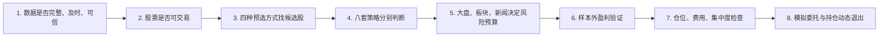

# ProBigA 当前选股逻辑与 V4 状态小白说明书

> 文档日期：2026-08-07  
> 适用范围：最新 Trading V4 架构状态，以及当前实际运行的 Trading V3.6 选股链路  
> 阅读对象：不熟悉量化、技术指标和程序代码的使用者  
> 重要提醒：本文说明的是“系统现在实际上怎么做”，不是宣传稿，也不是收益承诺。

## 版本关系：你说“最新版本是 V4”是对的

这里必须区分三个不同问题：

1. 最新开发的决策系统是哪一版；
2. 现在真正产生选股结果的是哪一版；
3. 账户、订单、持仓和风控账本由哪一版保存。

当前准确关系如下：

| 层次 | 当前版本 | 实际职责 |
|---|---|---|
| 最新决策架构 | **V4，代码版本 `4.0.0-dev`** | 新的净室决策合同、时间点数据、因子存储、控制面、追高风险等 |
| 当前实际选股 | **V3.6，状态 `PAPER_TRIAL`** | 目前真正运行八套策略、产生研究结果和内部模拟发现 |
| 交易底座 | **V2** | 继续作为账户、订单、成交、持仓和风控账本，不另建第二套交易账本 |

因此，下面三句话可以同时成立，并不矛盾：

- **最新开发版本是 V4；**
- **当前实际运行的选股算法仍然是 V3.6；**
- **真正的交易账本底座仍然是 V2。**

### V4 目前为什么没有直接替代 V3.6 选股

V4 现在不是“什么都没写”，已经完成了不少新底座：

- V4 独立领域合同和不可变决策数据结构；
- 时间点正确（PIT）的数据认证边界；
- 因子注册、因子快照和数据血缘存储；
- 运行控制面和任务租约；
- 独立追高风险因子；
- 与 V2 正式交易账本隔离的安全边界。

但当前 V4 唯一获准使用的具体决策内核仍是 `BlockedDecisionKernel`。它对任何输入都会失败关闭，固定结果为：

- 状态：`DATA_BLOCKED`；
- 预测：空；
- 买卖动作：空；
- 订单意图：空；
- `actionable_output_allowed=false`；
- `paper_buy_outbox_open=false`；
- `production_activation_allowed=false`。

也就是说：**V4 是最新版本和未来主系统，但目前还没有获得产生可执行选股结果的权限。**

因此，本文后面详细写出的股票筛选条件和八套策略，是“当前实际运行的 V3.6 逻辑”；V4 已完成的追高风险和安全能力会单独注明，不能把 V4 目标方案误写成已经在线运行的事实。

## 一、先用一句话讲明白

ProBigA 现在的思路，不是看到“热门、涨得快、新闻多”就买，而是：

**先确认数据是真的，再从全市场找出多种不同类型的机会，接着判断股票、板块和大盘是否互相配合，然后用历史样本外结果检验这套信号有没有实际价值，最后再经过仓位、风险、费用和可成交性检查。**

只要其中一道关键门没有通过，结果就不能变成正常买入。

## 二、当前最重要的真实状态

最新决策架构是 **Trading V4**；当前能够实际产生研究选股和内部模拟发现的运行入口是 **Trading V3.6**，配置状态为 `PAPER_TRIAL`。

目前的实际状态如下：

| 项目 | 当前状态 | 小白解释 |
|---|---:|---|
| 最新开发版本 | V4 / `4.0.0-dev` | V4 是最新架构，但当前决策内核仍失败关闭 |
| V4 可执行输出 | 关闭 | 当前不产生预测、买卖动作或订单意图 |
| 生产决策引擎 | V3_ONLY | 选股决策只认 V3，不再让旧 V2 产生新买点 |
| 真实自动下单 | 关闭 | 系统现在不会自动用真金白银下买单 |
| 内部模拟发现仓 | 开启 | 合格信号可以进入内部模拟仓，继续积累真实前向数据 |
| 旧版 V2 新开仓 | 关闭 | V2 继续承担已有账户、订单、持仓和账本底座，但不再决定新买什么 |
| 盘中惊喜自动入场 | 关闭 | 盘中信号可以研究，但目前不是自动买入权威 |
| V4 独立追高风险闸门 | 代码已实现、尚未正式启用 | 九连板等风险规则已经写好，但还要等 V4 数据库和生产门全部通过后，才成为正式独立硬闸门 |
| 有效样本外盈利模型 | 当前没有通过最终生产门 | 所以现在的高分只能作为研究、观察或模拟发现，不能说成“已证明能赚钱” |

这点非常关键：

**研究列表、观察列表、模拟仓和真实买单，是四种完全不同的东西。**

页面上的“高分”也不等于“建议立刻买入”。

## 三、把整个过程想象成过八道门

可以把它理解成招聘：

- 预选名单只是“拿到简历”；
- 策略打分只是“通过业务面试”；
- 市场环境是“今年公司还有多少招聘预算”；
- 样本外验证是“以前招过的同类人，实际工作是否合格”；
- 组合风控是“一个部门不能全招同一种人”；
- 成交检查是“即使想招，也得确认这个人真的能到岗”。

## 四、第一道门：数据必须先可信

系统不会在数据不完整的情况下假装精确。

### 4.1 每只股票至少要有 65 个已收盘交易日的数据

少于 65 天，很多趋势、波动和相对强弱指标都算不稳，因此不能进入正常新开仓选股。

### 4.2 最新日 K 必须到达“应该到的交易日”

例如今天是收盘后，系统预期应该有今天的完整日 K。如果实际只到昨天，整次决策会被阻断，而不是拿旧数据冒充今天的数据。

### 4.3 全市场覆盖要足够

当前硬要求包括：

- 可评估股票数量至少 2000 只；
- 最新行情覆盖率至少 85%；
- 可交易覆盖率至少 85%；
- 概念板块快照最多只能落后 5 天；
- 必须有当前 QMT 日 K 数据证明。

这些要求没有通过时，风险资产上限会直接归零，本次不能正常新增风险敞口。

### 4.4 新闻和财务数据不能“穿越”

系统只能使用在当时已经公布、而且当时已经被系统看到的数据。

举例：

- 7 月 10 日做决策，不能偷看 7 月 20 日才公布的财报；
- 一条新闻虽然写着 9:00 发布，但系统 10:30 才第一次收到，那么 10:00 的回测不能使用它。

这叫“时间点正确”，目的是防止回测看起来很准，实盘却根本做不到。

## 五、第二道门：先排除明显不能买的股票

当前新开仓基础过滤如下：

| 条件 | 当前规则 | 为什么 |
|---|---:|---|
| ST、名称含“退” | 不允许新开仓 | 退市和异常经营风险较高 |
| 最新价 | 至少 2 元 | 过滤极低价股票的额外交易风险 |
| 最新成交额 | 必须大于 0 | 停牌或零成交无法正常买卖 |
| 20 日平均成交额 | 至少 5000 万元 | 太冷门的股票容易买不进、卖不出 |
| 日 K 数量 | 至少 65 天 | 指标计算需要足够历史 |

已经持有的股票不会因为不满足“新买条件”就从系统里消失。它们仍然会被加载进来做风险监控和退出判断。

这一区分很重要：

- **不适合买入**，不等于可以不管；
- **不能正常卖出**，也不等于应该继续持有；
- 系统会把“应该卖”和“当前能不能卖”分开记录。

## 六、第三道门：不是只按涨幅排名，而是四路找候选股

系统不会用一个榜单把全市场从高到低排完，然后只买最上面的股票。它会从四个角度同时找候选：

1. **动量型**：最近一段时间涨势和相对强度较好的股票；
2. **启动型**：位置不高，但成交、板块和个股开始一起转强的股票；
3. **板块龙头型**：所在板块有机会，个股又在板块内部领先；
4. **超跌反转型**：前面跌得比较多，但开始出现止跌、放量和相对转强迹象。

四路综合排序的当前权重为：

| 预选方向 | 权重 |
|---|---:|
| 动量 | 27% |
| 低位启动 | 28% |
| 板块龙头 | 24% |
| 超跌反转 | 21% |

但系统不只是算加权平均。它还会看一只股票在任何一路里是不是特别突出，防止“趋势股太多，把低位启动全部挤掉”，或者“市场大跌时，反转候选一个都进不来”。

在大面积下跌后的市场里，候选池最多会为超跌反转方向预留一半空间。已经进入左侧准备区、且流动性合格的股票，也会被补充进候选池，交给反转策略自己做最终判断。

所以这套逻辑不是死板地把股票永久分成“长线、短线、趋势、反转”。同一只股票每天都可以因为事实变化，被不同策略重新判断。

## 七、第四道门：八个“选股观察员”分别看什么

这里的“策略套筒（sleeve）”，可以理解为八个各自独立的选股观察员。每个观察员只负责一种机会，不强迫所有股票都符合一种模板。

### 7.1 板块扩散：热点是不是从少数龙头扩散到更多股票

策略名：`theme_diffusion`  
观察周期：约 5 个交易日

它主要看：

- 板块里上涨股票是不是越来越多；
- 板块成交额是不是加速；
- 板块是否跑赢大盘；
- 龙头是不是有持续带动作用；
- 这只股票是否处在可买的位置，而不是已经冲得太远；
- 新闻是否支持该题材、题材是否过于拥挤。

它想找的是“板块刚从点火进入扩散”，不是看到全市场都在讨论后才追进去。

如果大盘 20 日收益已经为负，这套普通板块扩散信号只进入弱市观察，不按正常入场处理。

### 7.2 低位启动：板块资金先动，个股刚从低位转强

策略名：`low_base_ignition`  
观察周期：约 5 个交易日

它想找的是：

- 个股前面没有大涨；
- 股价还在 20 日均线附近或略低；
- 当天开始上涨，但没有直接冲到极端位置；
- 成交额明显放大；
- 板块上涨家数、相对强度和资金同时加速；
- 个股之前相对板块并没有过度领先。

这就是系统的“前瞻性”入口之一：不是等趋势完全成熟才看见，而是尝试在低位启动阶段识别。

但“早”不等于“随便猜”。板块和个股必须同时出现证据，否则只是观察。

### 7.3 弱市结构性主线：大盘弱，但某个板块内部很强

策略名：`weak_market_structural_mainline`  
观察周期：约 5 个交易日  
当前生命周期：**影子研究，不允许真实下单**

它只在大盘 20 日收益小于 0、但没有差到低于 -12% 时工作。

它重点看：

- 板块上涨宽度；
- 板块成交额加速；
- 板块相对大盘的超额收益；
- 板块综合强度和前排股票的中位数强度；
- 个股在板块里的领导力；
- 板块是否拥挤、扩散是否已经耗尽。

如果大盘已经进入极端风险区，再强的板块也不能仅凭“相对强”获得放行。

### 7.4 右侧趋势：趋势已经形成，但入场位置不能太热

策略名：`right_side_trend`  
观察周期：约 10 个交易日

它要求：

- 股价在 20 日均线上方；
- 20 日均线在 60 日均线上方；
- 20 日、60 日涨幅处在合理区间；
- 20 日均线正在向上，但不能陡得过头；
- 股价距离 20 日均线不能太远；
- 成交活跃，但不能异常爆量；
- 当天涨幅不能达到 9.5% 或以上；
- 大盘 20 日收益至少为 2%。

它寻找的是“趋势成立、位置仍可承受”的股票，不是“涨得最猛”的股票。

### 7.5 事件后漂移：好消息公布后，影响是否可能继续

策略名：`event_drift`  
观察周期：约 10 个交易日

它会看最近公告中的信息，例如：

- 业绩增长、预增；
- 中标、签订合同；
- 回购、增持；
- 技术突破、获批；
- 减持、亏损、处罚、立案、诉讼、终止、风险提示。

正面事件的评分会考虑：

- 消息有多意外；
- 是不是新消息；
- 来源是否可靠；
- 股价和成交是否确认；
- 消息影响还剩多少时间；
- 是否已经被股价提前反映。

目前这套正面事件特征仍比较基础，而且没有完成独立的样本外盈利证明。因此新闻只能作为因子和上下文，**不能因为标题里出现“中标、突破、增长”就直接买入。**

### 7.6 质量动量：公司质量和价格趋势一起看

策略名：`quality_momentum`  
观察周期：约 20 个交易日

当前评分大致由以下部分组成：

| 因子 | 权重 |
|---|---:|
| 公司质量 | 24% |
| 成长性 | 18% |
| 现金流 | 18% |
| 估值 | 12% |
| 60 日动量 | 20% |
| 低波动 | 8% |

它不是单纯买低估值，也不是单纯买高增长，而是寻找“基本面不差，价格也开始得到市场确认”的股票。

### 7.7 超跌反转：先准备，再确认，不直接接飞刀

策略名：`oversold_reversal`  
观察周期：约 5 个交易日  
当前生命周期：**只用于模拟发现**

它分两步：

第一步是进入“左侧准备区”，大致要求股票过去 20 日已经明显下跌、回撤较深、价格低于 20 日均线，但波动没有失控。

第二步才是“反转触发”，要求：

- 当天出现适度上涨，而不是继续暴跌；
- 成交开始放大；
- 从近期低点出现反弹；
- 相对大盘开始转强；
- 短期价格不能继续明显弱于 5 日均线；
- 所在板块也要有一定确认。

没有触发时，只显示 `LEFT_SIDE_PREPARE`，意思是“值得盯着”，不是“现在买”。

### 7.8 盘中惊喜：盘中突然放量、走强是否可信

策略名：`intraday_surprise`  
观察周期：约 1 个交易日

它会看：

- 当前成交额相对历史是否异常；
- 股价是否站在盘中均价之上；
- 最近一段时间的涨幅；
- 同板块其他股票是否一起走强；
- 预计成交概率；
- 买卖价差和冲击成本。

但当前配置明确关闭了“经过验证的盘中自动入场”。因此它现在可以提供研究线索，不能当作自动买入指令。

## 八、第五道门：大盘不是简单分成牛市和熊市

系统不会只贴一个“上涨趋势”或“下跌趋势”标签，然后一条规则用到底。

它每天会计算五种市场状态各自的概率：

| 市场状态 | 含义 | 基础风险资产上限 |
|---|---|---:|
| TREND_UP | 整体趋势向上 | 75% |
| THEME_ROTATION | 题材轮动活跃 | 65% |
| RANGE | 区间震荡 | 45% |
| PANIC_RECOVERY | 恐慌后的修复 | 30% |
| RISK_OFF | 明显避险 | 10% |

“上限 75%”不是说一定买到 75%，而是说即使机会很多，风险资产也不能超过这个基础预算。

系统会根据以下事实计算各状态概率：

- 大盘 20 日收益；
- 全市场上涨宽度；
- 上涨宽度最近 5 天的变化；
- 20 日实际波动；
- 跌停股票比例。

然后，新闻和外部环境还会继续调整风险预算：

- 政策支持，最多提供一定正向调整；
- 国内重大负面新闻，提高风险折扣；
- 海外市场和宏观风险，提高风险折扣；
- 行情过度集中在少数板块，也要扣分。

所以正确理解是：

**市场变差时，不是所有策略突然永久失效，而是高风险策略权重下降、总仓位收缩、入场门槛变严；如果证据恢复，预算再重新放开。**

## 九、大事件和新闻有没有因子

有，而且不是只看正面新闻。

### 9.1 新闻会影响三个层次

1. **个股事件层**：业绩、回购、增持、合同、减持、处罚、立案、诉讼等；
2. **板块题材层**：某个主题的政策支持、新闻热度和新颖度；
3. **全市场风险层**：国内重大风险、海外市场和宏观风险。

### 9.2 新闻不能单独触发买入

新闻必须和价格、成交、板块扩散、相对强度等事实互相验证。

一条好消息已经让股价连续涨停，说明消息很可能已经被价格充分甚至过度反映。此时“好消息”不是加分理由，反而可能进入“已经计价、过热、无法成交”的风险判断。

### 9.3 重大负面事件优先级更高

负面事件会检查立案、处罚、退市、财务造假、重大亏损、诉讼、解禁等类别。

如果是高风险负面事件，系统应优先阻止新买入；对已持仓，则优先产生风险退出信号。正面消息不能把高优先级风险覆盖掉。

## 十、第六道门：分数高，为什么还不能说“买”

### 10.1 原始分数只表示“形态像不像”

例如一只股票获得 0.85 分，只说明它很像这套策略想找的形态，不代表未来一定上涨。

### 10.2 还要做样本外验证

“样本外”可以简单理解为：

> 规则先定好，再拿它没有见过的新数据考试，不能做完题后再偷改答案。

当前生产放行至少要求：

- 同类成熟样本至少 80 个；
- 扣除交易成本后的预期收益大于 0；
- 盈利因子至少 1.3；
- 平均盈利与平均亏损的比值至少 1.0；
- 当前策略公式、特征、阈值和校准版本必须完全一致。

只要公式改过、阈值改过、特征改过，旧成绩不能自动继承，必须重新验证。

### 10.3 当前为什么仍是模拟试运行

当前没有一套有效的样本外模型通过最终生产激活门。因此：

- 研究高分可以保留；
- 可以进入内部模拟发现仓；
- 可以积累未来真实证据；
- 不能把它描述成“已经验证的赚钱信号”；
- 不能自动提交真实订单。

这不是系统失效，而是系统拒绝在证据不够时装作已经有效。

## 十一、第七道门：即使股票不错，也要检查组合是否安全

选股不是只判断“这只股票好不好”，还要判断“把它放进现在的账户合不合适”。

### 11.1 正常组合约束

| 项目 | 当前配置 |
|---|---:|
| 目标持仓数量 | 4 至 12 只 |
| 首次试探仓 | 5% |
| 普通仓位 | 8% |
| 单只股票最大仓位 | 12% |
| 单一主题最大仓位 | 25% |
| 高相关主题合计最大仓位 | 35% |
| 单笔标准风险 | 账户权益的 0.4% |
| 全部持仓开放风险 | 账户权益的 2% |
| 单笔最低经济金额 | 8000 元 |
| 单日最大换手 | 30% |
| 自动加仓次数 | 0 次 |

当前“自动加仓次数为 0”意味着：即使某些底层状态机具备加仓状态，V3 当前配置也不会自动加仓。

### 11.2 内部模拟发现仓更小

| 项目 | 当前配置 |
|---|---:|
| 单只模拟仓位 | 2.5% |
| 最多持有 | 10 只 |
| 总仓位上限 | 20% |
| 单一主题上限 | 7.5% |
| 同主题最多 | 2 只 |
| 单笔最低金额 | 4500 元 |
| 极小整手兜底金额 | 2500 元 |
| 最大初始止损 | 6% |
| 退出后冷静期 | 5 个交易日 |
| 真实订单 | 禁止 |

模拟发现的主要目的不是证明赚钱，而是用小仓位、真实时间顺序和真实成交约束，积累不能作弊的前向证据。

### 11.3 费用也要算

当前 20 万元账户模型会考虑：

- 佣金万分之一，最低 5 元；
- 过户费十万分之一；
- 卖出印花税万分之五；
- 默认滑点万分之五。

小额交易可能看起来有一点收益，但扣掉最低佣金、滑点和税费后不划算，所以系统还要检查“经济上值不值得下这笔单”。

## 十二、追高风险：为什么九连板不应该被普通推荐

这是对之前错误推荐最直接的说明。

### 12.1 V3 当前已经存在的防追高规则

右侧趋势策略要求：

- 当日涨幅必须小于 9.5%；
- 20 日涨幅只能在 2% 至 22%；
- 60 日涨幅只能在 12% 至 55%；
- 股价距离 20 日均线只能在 0% 至 8%；
- 量能比例只能在 0.9 至 1.8；
- 趋势必须成立，但不能过度拉伸。

一只已经连续多日涨停的股票，通常会同时违反当日涨幅、20 日涨幅、均线距离、量能或可成交性要求，因此不能作为普通右侧趋势新买点。

### 12.2 V4 已实现的独立追高风险闸门

V4 代码中还实现了更明确的追高风险分类：

- 精确连续涨停或保守连续大涨达到 4 天及以上：`EXTREME`，只能观察，不能普通买入；
- 连续 3 天：`CONDITIONAL`，必须有更严格条件；
- 一字板、停牌、零成交或没有可验证成交能力：直接阻止执行；
- 5 日涨幅、跳空、换手和均线乖离过大，也会判为极端拉伸；
- 曾出现极端连板后，原则上冷却 10 个交易日，除非已经回撤或重新筑底至少 12%。

如果缺少交易所精确涨停价数据，系统必须标成“数据不足”，不能擅自把连板数当成 0。

需要诚实说明：这套 V4 独立闸门已经写入代码和测试，但尚未完成数据库升级后的正式生产激活。当前 V3 仍依靠自己的入场资格区间阻止大部分追高。

### 12.3 用“爱丽家居已经九连板”举例

正确处理顺序应该是：

1. 先确认截至决策时间的真实涨停序列，而不是只看旧行情；
2. 如果当天接近涨停，V3 右侧趋势条件直接不成立；
3. 九连板通常会使 20 日涨幅和均线乖离严重超标；
4. 如果是一字板或没有可靠成交能力，执行层直接阻断；
5. V4 追高闸门会把 4 连板及以上列为极端风险，九连板只能进入风险观察；
6. 即使它属于热门板块、新闻正面、过去走势强，也不能覆盖追高和成交风险；
7. 对未持有者，正常结果应是“不新买”；对已经持有者，应转为止盈保护、趋势失效和流动性监控。

因此，“九连板还因为热门或趋势强被普通推荐买入”，不符合现在应执行的完整决策链路。

## 十三、持有以后不是按固定天数死拿

策略中的 1 天、5 天、10 天、20 天，是评估预测结果的大致观察窗口，不是强制持仓天数。

系统的持仓状态判断优先级是：

1. 重大风险事件；
2. 硬止损或保护性止损；
3. 原买入逻辑失效或趋势失效；
4. 板块题材衰退；
5. 趋势仍然有效。

对应动作大致为：

- 重大风险、止损、逻辑失效：退出；
- A 股 T+1 当天不能卖：标记 `EXIT_PENDING_T1`，到可卖时继续执行；
- 想卖但停牌或缺乏流动性：标记 `EXIT_PENDING_LIQUIDITY`；
- 板块明显衰退：减仓一半；
- 趋势仍然有效：继续持有；
- 保护性止损只能上移，不能因为心存幻想再下调。

一旦已经进入待退出状态，后面的小反弹不能把它自动“复活”为继续持有。

### 13.1 趋势股突然不行了怎么办

右侧趋势持仓至少要继续满足：

- 收盘价在 20 日均线上；
- 20 日均线在 60 日均线上；
- 原始买入假设没有失效；
- 没有触发止损或重大风险。

任何关键条件破坏，都可以提前退出，不需要等满 10 天。

左侧反转策略不会生搬硬套右侧均线条件，它使用自己的“准备—触发—失效—止损”生命周期。

## 十四、用“科技股 6 月底该不该跑”解释动态判断

系统不会写死“每年 6 月底卖科技股”，因为日期本身不是理由。

正确的前瞻判断应该持续观察：

- 科技板块上涨股票的比例是否下降；
- 板块宽度是否从扩散转为收缩；
- 成交额加速是否转弱；
- 科技板块相对大盘是否开始落后；
- 龙头是否还在带动，还是只剩少数高位股硬撑；
- 个股是否跌破关键趋势结构；
- 海外科技、政策或重大新闻风险是否上升；
- 组合是否过度集中在同一科技主题。

如果这些事实在 6 月底已经连续恶化，系统应该：

1. 降低科技相关策略权重；
2. 降低整体风险资产预算；
3. 阻止新的科技股追高买入；
4. 对题材衰退持仓减仓；
5. 对趋势失效、止损或风险事件持仓退出；
6. 把资金转向当时数据更强、估值和现金流更稳的其他方向，而不是因为“老登股”这个称呼机械切换。

反过来，如果 6 月底所有证据仍然健康，系统不能为了事后看起来正确而假装自己当时一定知道 7 月会跌。

前瞻性不是算命，而是：**在风险尚未完全反映到亏损之前，识别一组正在恶化的领先证据，并提前减小暴露。**

## 十五、常见状态到底是什么意思

| 状态 | 小白解释 | 能不能当成买入 |
|---|---|---:|
| `RESEARCH_ONLY` | 研究展示，不是订单权威 | 不能 |
| `WATCH` | 值得继续观察，条件还没齐 | 不能 |
| `LEFT_SIDE_PREPARE` | 超跌反转准备区，尚未触发 | 不能 |
| `CONDITIONAL` | 有机会但存在额外风险，需要更严确认 | 不能直接买 |
| `SETUP_NOT_READY` | 像这个策略，但入场条件不完整 | 不能 |
| `DATA_QUALITY_BLOCKED` | 数据质量不过关 | 不能 |
| `EXECUTION_BLOCKED` | 理论上想交易，但实际无法可靠成交 | 不能 |
| `PAPER_DISCOVERY` | 内部模拟发现仓 | 只能模拟 |
| `VALIDATED_POSITIVE` | 完整样本外门通过的正期望区间 | 还要继续过组合和执行门 |
| `EXIT_PENDING_T1` | 已经应该卖，但 T+1 暂时不能卖 | 到可卖时执行 |
| `EXIT_PENDING_LIQUIDITY` | 已经应该卖，但暂时缺乏成交条件 | 持续等待可执行窗口 |

最容易犯的错误是把 `WATCH`、`RESEARCH_ONLY` 或高原始分数显示成“推荐买入”。界面和接口必须保留这些身份差异。

## 十六、你每天看结果时，先看这六件事

不要先看股票名字，按下面顺序看：

1. **数据时间**：行情、板块、新闻是不是截至当前决策时间；
2. **结果身份**：研究、观察、模拟、验证通过，还是执行指令；
3. **为什么入选**：是趋势、低位启动、板块扩散、反转还是事件；
4. **为什么不能买**：追高、数据不足、市场风险、组合超限还是无法成交；
5. **失效条件**：什么事实出现后，这个判断就不成立；
6. **仓位和退出**：即使判断正确，准备承担多大损失，什么时候必须退出。

一个合格的结果不应该只写：

> 某某股票，评分 85，建议关注。

而应该写成类似：

> 低位启动候选，板块宽度和资金加速已通过，个股放量转强；但当前只属于内部模拟发现。若板块相对强度跌破阈值、个股回落至止损位或数据过期，则信号失效。当前非真实买单。

## 十七、目前系统已经做到什么、还没做到什么

### 17.1 已经做到

- 生产新选股只认 V3，避免 V2、V3 多套入口互相打架；
- 不只用趋势一种逻辑，兼顾板块扩散、低位启动、弱市主线、事件、质量动量、超跌反转和盘中异动；
- 大盘用概率和动态风险预算，不是永久贴一个标签；
- 新闻、政策、海外风险和板块拥挤会影响风险；
- 数据过期、覆盖不足和无法成交会阻断新风险；
- 持仓按事实动态退出，不按固定天数死拿；
- 研究结果、模拟结果和真实订单在架构上分开；
- V3 具有基础防追高区间；
- V4 独立追高风险因子和测试已经实现。

### 17.2 还没有完成

- 当前没有通过最终生产门的有效样本外盈利模型；
- 真实自动下单仍然关闭；
- 盘中惊喜策略尚未获得自动入场权；
- 弱市结构性主线仍是影子研究；
- 超跌反转仍是模拟发现；
- 正面新闻模型目前较基础，尚不能证明仅凭新闻具有稳定预测力；
- V4 独立追高闸门还要等 MySQL 8.4、权限、迁移和生产激活门完整通过；
- 数据库升级期间不能把迁移中的半成品环境当作正式生产完成状态。

## 十八、这套系统的正确使用原则

1. **事实优先于故事**：热门题材、名人观点和新闻标题不能覆盖价格、成交和风险事实；
2. **风险优先于机会**：重大负面、止损和无法成交的优先级高于正面分数；
3. **位置和方向同样重要**：方向看对但位置太高，仍然可能是一笔坏交易；
4. **市场会变化**：昨天是趋势，今天可以失效；昨天是观察，今天可以确认；
5. **没有证据就降低权限**：数据不全就阻断，样本外没过就只模拟；
6. **买入和卖出必须对称**：每个买入理由都要有对应的失效条件；
7. **不能保证提前知道未来**：系统的目标是更早识别概率和风险变化，而不是承诺每次抓顶逃底。

## 十九、几个常用词，用人话解释

| 名词 | 人话解释 |
|---|---|
| 因子 | 用来判断股票的一项证据，例如涨幅、成交额、现金流、新闻风险 |
| 均线 MA20 | 最近 20 个交易日平均价格，用来观察中短期趋势 |
| ATR | 最近价格波动有多大，数值越大，通常说明止损和仓位要更谨慎 |
| 市场宽度 | 上涨股票占多少，不只看指数是否被少数大股票拉红 |
| 相对强度 | 这只股票或板块是否跑赢大盘或同类 |
| 回撤 | 从近期高点跌下来多少 |
| 乖离 | 当前价格离均线有多远，太远常代表过热或过弱 |
| OOS / 样本外 | 用规则没见过的新数据考试，检验是否真的有效 |
| Sleeve / 策略套筒 | 一个独立选股观察员，只负责一种机会形态 |
| 风险预算 | 当前市场环境下，账户最多允许放多少资金在风险资产里 |
| 滑点 | 理论价格和实际成交价格之间的差异 |
| 影子研究 | 记录信号和结果，但没有下单权，也不能激活生产模型 |
| 模拟发现 | 按真实时间和成交约束做内部模拟，用来积累证据 |

## 二十、最后总结

当前 ProBigA 的完整逻辑和版本状态可以浓缩成下面九句话：

1. 最新开发版本是 V4，但当前可运行选股仍是 V3.6，交易账本仍是 V2；
2. 数据不对，不选；
3. 不能成交，不买；
4. 不只追趋势，也找低位启动、板块扩散、弱市主线和超跌反转；
5. 个股必须和板块、大盘、新闻环境互相验证；
6. 越热、越拥挤、越接近连续涨停，风险权限越低；
7. 原始高分不是买点，样本外没证明就只能研究或模拟；
8. 买入后条件变坏，该减就减、该卖就卖，不按固定期限死扛；
9. 当前 V4 和 V3 的真实自动下单均未开放，现阶段主要任务是完成 V4 激活条件、积累可靠前向证据并完成生产基础设施验收。

## 附录 A：当前关键规则速查

### A.1 右侧趋势入场资格

| 指标 | 区间 |
|---|---:|
| 20 日收益 | 2% 至 22% |
| 60 日收益 | 12% 至 55% |
| 20 日均线近 5 日斜率 | 0.2% 至 4% |
| 距 20 日均线 | 0% 至 8% |
| 5 日与 20 日成交额比 | 0.9 至 1.8 |
| 最新日涨幅 | 小于 9.5% |
| 大盘 20 日收益 | 至少 2% |
| 均线关系 | 收盘价 > MA20 > MA60 |

### A.2 低位启动主要资格

| 指标 | 区间或下限 |
|---|---:|
| 板块上涨宽度 | 50% 至 78% |
| 板块宽度加速度 | 至少 10% |
| 板块相对收益 | 至少 3% |
| 板块成交额加速度 | 至少 25% |
| 题材机会分 | 至少 0.65 |
| 板块拥挤度 | 不高于 0.82 |
| 个股 5 日收益 | -4% 至 1.5% |
| 个股 20 日收益 | -35% 至 5% |
| 距 20 日均线 | -12% 至 2% |
| 最新日涨幅 | 1.5% 至 5.5% |
| 最新成交额 / 20 日均额 | 1.5 至 4 |

### A.3 弱市结构性主线主要资格

| 指标 | 区间或下限 |
|---|---:|
| 大盘 20 日收益 | 小于 0%，但不低于 -12% |
| 板块上涨宽度 | 至少 52% |
| 板块成交额加速度 | 至少 15% |
| 板块相对收益 | 至少 2% |
| 板块综合分 | 至少 0.62 |
| 板块前排中位分 | 至少 0.58 |
| 板块内部强度 | 至少 0.64 |
| 个股领导力 | 至少 0.45 |
| 个股相对强度 | 至少 6% |
| 最终分 | 至少 0.64 |

### A.4 模拟发现放行线

| 类型 | 最低分 |
|---|---:|
| 主综合分 | 0.82 |
| 板块分 | 0.72 |
| 趋势分 | 0.72 |
| 单策略独立发现 | 0.76 |

这些分数只用于内部模拟发现资格，不代表真实订单已经获批。

## 附录 B：代码事实来源

本文主要依据以下当前代码和配置整理：

- `strategies/trading_v3.json`：生产路由、生命周期、风险预算、组合和模拟仓配置；
- `server/trading_v3/daily_features.py`：日 K、基础过滤、流动性和特征计算；
- `server/trading_v3/theme_features.py`：四路候选池和板块特征；
- `server/trading_v3/sleeves.py`：八套策略的原始信号；
- `server/trading_v3/structural_mainline.py`：弱市结构性主线；
- `server/trading_v3/right_side_policy.py`：右侧趋势冻结资格区间；
- `server/trading_v3/regime.py`：市场状态概率和动态风险资产上限；
- `server/trading_v3/context.py`：新闻、政策、海外风险和题材上下文；
- `server/trading_v3/engine.py`：校准、决策和模拟发现；
- `server/trading_v3/portfolio.py`：仓位、主题集中度、风险和费用；
- `server/trading_v2/positions.py`、`server/trading_v3/positions.py`：持仓状态和动态退出；
- `server/trading_v4/factors/chase_risk.py`：独立追高风险因子；
- `server/trading_v4/kernel/blocked.py`：V4 当前唯一获准的失败关闭决策内核；
- `server/trading_v4/__init__.py`：V4 当前开发版本标识；
- `server/engine/event_risk_engine.py`：重大负面事件风险分类；
- `server/api/routers/screener.py`、`server/api/routers/strategy_center.py`：研究展示与订单权威的边界。

以后只要这些核心公式、阈值、数据源或生产路由发生变化，就应同步更新本文日期和对应章节，不能让说明书继续描述旧逻辑。
