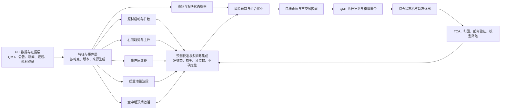

# ProBigA 选股与交易决策 V3 重构调研及可执行方案

> 日期：2026-07-28  
> 状态：方案评审稿，尚未授权按本方案实施  
> 范围：A 股股票选股、市场与题材判断、组合构建、盘中执行、ProBigA 内部模拟盘、研究验证  
> 不在本期范围：自动真实下单、券商账户权限、收益承诺

## 1. 先给结论

当前 V2 的主要问题不是“参数稍微保守”，而是架构上仍然接近：

> 一张推荐表 → 四套相近的加权分 → 固定市场标签 → 固定阈值拦截 → 四个仓位按分数竞争。

这不能算成熟的多策略交易系统。

成熟机构公开的方法并不存在一条神奇公式。共同点是把以下环节分开：

1. 可靠、可追溯、严格按时点的数据；
2. 多个相互独立的收益预测模型；
3. 预测值校准和模型组合；
4. 风险、相关性、流动性与交易成本约束下的组合构建；
5. 根据盘口、成交概率和冲击成本执行；
6. 独立样本外、真实前向与交易后归因；
7. 表现变差时自动降权、暂停和淘汰。

ProBigA V3 应停止以“0 到 100 总分是否过线”作为核心交易逻辑，改为：

> 每个策略独立预测未来净收益分布 → 计算扣除成本后的可信边际 → 按策略相关性与组合风险分配资金 → 盘中确认成交条件 → 持仓期间根据原始逻辑是否仍成立动态加减仓和退出。

### 1.1 第一目标不是功能完整，而是扣费后正收益

V3 的第一验收目标明确为：

```text
扣费后单笔净期望
  = 胜率 × 平均盈利
    - 败率 × 平均亏损
    - 佣金
    - 税费
    - 点差
    - 滑点
    - 冲击
    - 未成交机会成本
  > 0
```

同时要求：

```text
组合平均盈利 / 组合平均亏损绝对值 > 1
目标值 >= 1.50

组合 Profit Factor
  = 总盈利 / 总亏损绝对值
目标值 >= 1.30
```

例如胜率只有 45%，但平均盈利 8%、平均亏损 4%，扣费前期望仍为：

```text
45% × 8% - 55% × 4% = 1.4%
```

这属于可以研究的正期望结构。反过来，即使胜率 70%，如果平均盈利很小、
单次亏损很大，扣费后仍可能亏钱。

因此 V3 不以“选出多少股票”“胜率高不高”作为第一目标，而以：

1. 扣费后净期望是否为正；
2. 平均盈利是否大于平均亏损；
3. 总盈利是否稳定覆盖总亏损；
4. 回撤是否在账户可承受范围；
5. 结果是否来自多个时期和多个机会源；

作为能否继续进入模拟盘的依据。

这不能保证未来每个月赚钱，但可以明确判断历史样本外和真实前向阶段
有没有赚钱能力。达不到这些指标，策略就不能以“功能已经开发完成”为
理由上线。

## 2. 本次真实审计结果

### 2.1 生产最新一轮

本次通过生产数据库只读查询得到：

| 项目 | 2026-07-28 审计值 |
|---|---:|
| 最新推荐数据日 | 2026-07-27 |
| 基础推荐记录 | 59 |
| `recommend_status=SUSPENDED` | 59 |
| `signal_status=WATCH` | 59 |
| 主策略归属：主升浪 | 48 |
| 主策略归属：短线 | 9 |
| 主策略归属：超短 | 2 |
| 最新决策时间 | 2026-07-28 09:20 |
| 市场状态 | `PANIC_RECOVERY` |
| 四套股票策略可参加模拟竞争 | 0 |
| 板块预热可参加模拟竞争 | 3 |
| 当前模拟成交 | 0 |
| 当前模拟持仓 | 0 |

四套股票策略的实际生产结果：

| 策略 | BUY 方向 | 最终可竞争 | 主要结果 |
|---|---:|---:|---|
| 超短确认 | 0 | 0 | 21 条 HOLD |
| 短线多因子 | 0 | 0 | 38 条 HOLD |
| 波段价值质量 | 0 | 0 | 13 条 HOLD |
| 主升浪趋势 | 9 | 0 | 9 条全部低于 `PANIC_RECOVERY` 固定分数线 |
| 板块预热 | 3 | 3 | 成为唯一机会供给通道 |

这说明当前“多策略”没有形成多个独立机会源，最终生产行为几乎退化成一套板块预热策略。

### 2.2 当前实现的结构性问题

#### 问题一：四套策略仍然共用同一张推荐表和同一批基础分

`server/engine/strategy_center.py` 从同一条 `st_recommended_stocks` 记录读取策略分，随后主要按“策略分是否超过确认线”产生 BUY/HOLD。

四套策略虽然权重不同，但仍然复用技术、资金、情绪、事件、基本面等上游总分。它们不是四个独立研究模型，也没有各自独立的标签、训练集、预测期限和样本外表现。

后果：

- 同一条错误数据或错误解释会同时污染多个策略；
- “多策略”只是同一观点的重复表达；
- 无法知道哪个策略真正有收益贡献；
- 无法依据策略相关性分配风险；
- 无法针对创新药、电力、科技、商业航天等不同启动机制进行专业识别。

#### 问题二：市场状态是硬分类，不是概率和风险预算

`server/trading_v2/market_regime.py` 按固定优先级将市场切成单一标签：

- `EXTREME`
- `RISK_OFF`
- `PANIC_RECOVERY`
- `TREND_UP`
- `THEME_ROTATION`
- `RANGE`
- `DATA_BLOCKED`

这种规则可以用于安全门禁，但不应直接决定所有策略能否买入。真实市场经常同时具有：

- 指数震荡；
- 局部题材趋势；
- 少数事件股强势；
- 大部分股票弱势；
- 午后风格切换。

单一标签会把这些共存状态压扁，容易出现“市场被标成某状态，于是所有策略统一提高门槛”的僵硬行为。

#### 问题三：路由器仍然是固定阈值筛选

`server/trading_v2/multi_strategy_router.py` 的核心条件仍是：

- 原始分不低于固定分数；
- 静态盈亏比不低于固定值；
- 数据质量不低于固定值；
- 再用 `原始分 × 状态权重 + 盈亏比奖励` 计算竞争分。

它没有比较：

- 预测收益是否真实高于交易成本；
- 预测不确定性；
- 与现有持仓的相关性；
- 行业、规模、Beta、波动率和题材重复暴露；
- 从当前仓位调整到目标仓位是否值得支付交易成本。

#### 问题四：板块预热的盈亏比存在 P0 数学缺陷

`server/trading_v2/sector_preheat.py` 当前计算为：

```text
risk_reward = max(minimum_risk_reward, calculated_risk_reward)
```

这会把低于门槛的实际值直接抬到门槛，而不是拒绝候选。

生产数据验证了这一点：最新板块预热的 303 条信号，`risk_reward_ratio` 全部恰好为 `3.0`。这不是 303 条信号都具有相同的真实盈亏比，而是公式把最低值写成了结果。

影响：

- 盈亏比门槛失去筛选作用；
- 组合竞争分被污染；
- 页面展示的 3.0 具有误导性；
- 当前 3 条模拟候选不能据此认定为高质量机会。

这项缺陷必须先修复，且要重算受影响信号，不能只改展示。

#### 问题五：盘中模块有大量手工阈值，但没有按时段和股票特征校准

`intraday_activation_v2.json` 中约有 82 个阈值或权重类规则。当前盘中模块覆盖：

- 水下修复；
- 深水反转；
- 突然爆量；
- 极速拉升；
- 龙头递补；
- 板块确认；
- 动态盈亏比。

方向是对的，但规则过多以后会产生：

- 一个边界差 0.01 就从买入变观察；
- 某些条件重复表达同一种风险；
- 上午、下午共用同样的量能尺度；
- 大盘股和小盘股共用同样的爆量定义；
- 阈值修改后难以判断真实改善还是过拟合；
- 无法输出“该报警历史上有多大概率继续涨”。

#### 问题六：组合层不是优化器

`server/trading_v2/planner.py` 当前优先级是：

1. 若存在，先看预期收益下界；
2. 再看竞争分；
3. 再看原始分；
4. 再看静态盈亏比；
5. 最后按代码和版本稳定排序。

当前大部分 `PAPER_TRIAL` 策略没有经过验证的预期收益下界，因此实际上仍按分数排队。固定四仓、单题材数量限制可以控制风险，但不能代替组合优化。

#### 问题七：当前策略晋级门槛不足以防止过拟合

当前股票策略的主要门槛包括每策略至少 30 笔平仓、Profit Factor 1.15、最大回撤 12%。30 笔样本很容易受一两笔交易影响，也没有覆盖：

- 多重尝试造成的回测过拟合；
- 样本外滚动稳定性；
- 分数分层是否单调；
- 交易成本和成交失败；
- 单一月份、题材或个股对利润的集中贡献；
- 策略间相关性；
- 模型概率是否校准。

## 3. 成熟机构公开流程给出的有效借鉴

### 3.1 不是先拍一个总分，而是分层处理

Two Sigma 公开描述的流程包含数据准备、建模、组合构建和执行；其组合构建会形成独立预测的共识观点，并同时结合交易成本和风险形成目标配置，执行层再实时监控风险和调整优化参数：

- https://www.twosigma.com/businesses/investment-management/

BlackRock 的公开系统化投资流程会同时使用基本面、情绪和宏观等信号，但在组合层另外考虑多因子风险模型、交易成本和约束，而不是看到高分就直接买：

- https://www.blackrock.com/sg/en/investment-strategies/systematic-investing

对 ProBigA 的直接启示：

> 信号、组合和执行必须是三层；信号分不能直接等于仓位和订单。

### 3.2 真正的多策略要看相关性和风险贡献

Man Group 的公开材料强调：

- 策略要有不同收益来源；
- 相似策略应先归组；
- 不能因为名称不同就平均分配风险；
- 策略层风险分配应重视相关性、流动性和因子暴露；
- 组合必须持续监控聚合风险。

来源：

- https://www.man.com/insights/building-a-multi-strategy-portfolio

对 ProBigA 的直接启示：

> 超短、短线、波段、主升浪不能只按持有天数区分；必须证明它们的预测对象、收益来源和历史收益序列确实不同。

### 3.3 组合构建方式会实质影响结果

AQR 用价值和动量举例说明：先各自建组合再混合，与先把分数平均后建组合，并不是一回事。组合构建方法本身会显著影响暴露和结果：

- https://www.aqr.com/insights/research/working-paper/portfolio-construction-matters-a-simple-example-using-value-and-momentum-themes

对 ProBigA 的直接启示：

> 不能再把所有信息先压成一个 `ai_score/final_trade_score`，再指望一个总分同时服务所有策略。

### 3.4 交易成本必须进入选股和调仓决策

AQR 使用大规模真实交易数据研究交易成本，结论包括：组合优化能够降低交易成本；价值和动量等较慢信号更容易保留净收益，而短期反转在成本后可能失效：

- https://www.aqr.com/Insights/Research/Working-Paper/Trading-Costs-of-Asset-Pricing-Anomalies

Almgren–Chriss 的经典执行框架将执行问题表示为交易冲击成本与价格波动风险之间的权衡：

- https://doi.org/10.21314/JOR.2001.041

对 ProBigA 的直接启示：

> 万一佣金、最低 5 元、点差、滑点、冲击、未成交机会成本都扣除后没有边际，就不应交易。超短信号的成本要求应显著高于波段信号。

### 3.5 机器学习的价值在非线性交互，不是把模型名写到页面

Gu、Kelly、Xiu 的公开研究显示，树模型和神经网络的改进主要来自对非线性交互的建模，动量、流动性和波动率是多个模型共同识别的重要预测信息：

- https://www.nber.org/papers/w25398

对 ProBigA 的直接启示：

> 第一版应以可解释的线性基线和梯度提升树进行严格样本外对比；只有确实增加净收益和稳定性，模型才可晋级。不能为“AI”而上 AI。

### 3.6 回测选择次数本身会制造虚假好结果

“回测过拟合概率”研究指出，大量尝试模型和参数后，仅保留最好结果会产生选择偏差，普通一次训练/测试切分不足以说明可靠：

- https://papers.ssrn.com/sol3/Papers.cfm?abstract_id=2326253

对 ProBigA 的直接启示：

> 每次参数尝试、失败结果和淘汰原因都必须登记；最终验收要包含滚动样本外、参数扰动、Bootstrap 和 PBO，而不是只展示最优一条曲线。

### 3.7 A 股程序化交易还必须满足当前监管要求

上交所、深交所现行程序化交易实施细则均自 2025-07-07 起施行，覆盖个人投资者，并要求报告、系统安全、风险控制、异常交易监控和资料留存：

- https://www.sse.com.cn/lawandrules/sselawsrules2025/trade/universal/c/c_20250612_10781696.shtml
- https://www.szse.cn/lawrules/rule/allrules/bussiness/t20250403_612770.html

对 ProBigA 的直接启示：

> 实盘阶段不能只做一个“开关”，还要准备策略版本、申报速率、撤单、异常行为、熔断和审计留痕。V3 本期仍保持真实交易关闭。

## 4. V3 的目标和边界

### 4.1 核心目标

1. 组合在交易成本后保持正期望，平均盈利大于平均亏损；
2. 捕获多种不同来源的 A 股机会，而不是只在一个总分上换权重；
3. 每个策略输出可检验的未来净收益预测和不确定性；
4. 组合回撤和单次损失适合 20 万元左右的小账户；
5. 买卖依据逻辑是否仍成立，而不是固定拿满若干天；
6. 能处理题材启动、龙头不可买时的补涨、右侧趋势、事件后漂移和盘中超预期；
7. 所有“为什么买、为什么不买、为什么卖”均可用中文解释并还原当时数据；
8. 策略可降权、暂停、淘汰，旧版本不可悄悄覆盖。

### 4.2 明确不做

1. 不承诺固定收益、胜率或稳赚；
2. 不用事后题材成员回填冒充历史可知数据；
3. 不用收盘后才知道的信息决定当日成交；
4. 不用一个模型处理所有持有周期；
5. 不以“参数更多”代替预测能力；
6. 不在真实前向完成前开放真实交易；
7. 不追求机构的超高频和硬件速度优势。

## 5. V3 总体架构



关键原则：

- 市场状态调整风险预算，不直接替代个股预测；
- 每个策略独立建模、独立验证、独立注册；
- 同一股票可被多个策略看中，但组合层只形成一个净目标仓位；
- 盘中模块既可激活盘前池，也可发现全市场异常，但使用不同风险预算；
- 执行层不得修改预测，只决定是否成交、以什么价格和速度成交。

## 6. 数据与特征方案

### 6.1 数据必须按“当时可见”保存

每条数据至少保存：

| 字段 | 作用 |
|---|---|
| `event_time` | 事件实际发生时间 |
| `available_at` | 系统最早可使用时间 |
| `ingested_at` | 系统采集时间 |
| `source_provider` | 来源 |
| `source_key` | 原始记录键 |
| `revision_no` | 修订版本 |
| `raw_hash` | 原始内容哈希 |
| `quality_status` | PASS/WARN/BLOCK |

训练、回测和生产都只允许读取 `available_at <= decision_at` 的数据。

### 6.2 数据域

#### 市场与个股行情

- 前复权和不复权日 K；
- 1 分钟 K；
- QMT Level-1 快照；
- 买一卖一、价差、可见量；
- 成交额、换手率、量比；
- 涨跌停、停牌、ST、上市天数；
- 复权因子和公司行为；
- 指数、ETF、期货或可获得的风险代理。

#### 横截面与基本面

- 盈利能力；
- 收入和利润增长；
- 现金流质量；
- 应计项；
- 估值；
- 资产负债风险；
- 分析师预期和修正，仅在真实可获得时启用；
- 行业、规模、Beta、波动率、流动性暴露。

#### 题材与行业

- 当日真实概念和行业成员快照；
- 板块上涨宽度；
- 新高比例；
- 涨停、炸板、封板质量；
- 板块成交额占比及一阶、二阶变化；
- 龙头、中军、补涨、低位核心的动态角色；
- 龙头与跟随股收益差；
- 题材共现图和股票重叠度；
- 启动、扩散、加速、高潮、衰退阶段。

#### 新闻、公告和事件

现有 `sentiment_score/event_score` 只能作为旧字段，不能继续直接当成熟事件信号。V3 将事件拆为：

- 事件类型；
- 涉及主体和股票映射；
- 首次发布还是重复转述；
- 来源可靠度；
- 相对市场预期的“惊喜度”；
- 是否已有价格反应；
- 影响方向；
- 影响期限；
- 衰减速度；
- 是否被多个独立来源确认；
- 是否属于强制硬风险。

新闻本身不直接触发买入。它只改变相关策略的预测或硬风险状态。

#### 外围与宏观

- 美股主要指数及行业；
- 港股和中概股；
- 商品：黄金、铜、原油等；
- 人民币汇率、美元指数；
- 利率和流动性代理；
- 监管与产业政策事件。

外围数据不再合成一个“外围好/坏”的总分，而是通过历史滚动敏感度映射到行业和个股。例如铜价变化主要影响铜产业链，不应同等作用于医药和软件。

### 6.3 存储

大体量研究特征不全部塞入 MySQL：

- 原始和研究特征：按交易日分区的 Parquet，包含数据版本和快照哈希；
- 生产预测、组合和订单：MySQL；
- 原始文本和证据：对象文件或压缩归档，MySQL 保存索引与哈希；
- 每个训练集生成不可变 `dataset_hash`。

## 7. 五个真正独立的股票策略袖套

### 7.1 S1：题材启动与扩散

目的：提前发现创新药、电力、科技、商业航天等从少数个股向板块扩散的过程。

预测期限：

- 1 日；
- 3 日；
- 5 日；
- 10 日。

核心特征：

- 板块上涨宽度及其变化率；
- 板块成交额占全市场比例及变化率；
- 新高数量和涨停梯队；
- 龙头、中军、低位补涨之间的强度差；
- 板块相对指数收益；
- 多日连续性；
- 新闻/公告催化的惊喜度、首次性和衰减；
- 题材成员重叠与拥挤度；
- 高潮和退潮风险。

入场类型：

1. 点火探针；
2. 扩散确认；
3. 龙头不可买时的龙二/中军补涨；
4. 首次分歧后的右侧回流。

龙二套利必须同时满足：

- 龙头因为涨停、封单或成交概率低而不可买，不是因为逻辑转弱；
- 龙二与龙一属于同一真实催化链；
- 龙二的相对强度和成交额变化显著；
- 龙二尚未过度延伸；
- 板块仍处于扩散或加速前段；
- 扣除成本后的净收益下界为正；
- 初始仓位低于龙头正常仓位。

退出：

- 板块宽度拐头；
- 龙头开板并出现负向扩散；
- 个股相对板块明显转弱；
- 成交额放大但价格不再推进；
- 催化被证伪；
- 动态保护位触发。

### 7.2 S2：右侧趋势与主升浪

目的：抓已经启动、趋势确认但未明显过热的个股，包括用户提到的“永太科技式右侧启动”。

预测期限：

- 5 日；
- 10 日；
- 20 日；
- 40 日。

核心特征：

- 5/10/20/60 日多周期趋势；
- 均线斜率和价格相对位置；
- 突破、回踩、缩量、再放量；
- 相对行业和指数强度；
- 趋势稳定度；
- 上涨过程中的波动收敛；
- 量价背离和高潮放量；
- 中期筹码、流动性和基本面风险。

入场：

- 平台突破后确认；
- 首次回踩不破；
- 趋势加速前的缩量整理；
- 题材扩散和个股趋势同时成立。

退出不再由固定 60 天决定：

- 趋势假设失效立即进入退出流程；
- T+1 不可卖时进入 `EXIT_PENDING_T1`；
- 若趋势继续有效可继续持有，不因超过固定天数强卖；
- 使用波动率、ATR、近期 MAE 和结构低点生成动态保护位；
- 高位量价背离先减仓，趋势彻底失效再清仓。

### 7.3 S3：事件后漂移

目的：捕获公告或产业事件发布后，价格没有一次性反映完的信息。

事件范围：

- 业绩超预期；
- 订单和合同；
- 产能、产品获批；
- 回购、增持；
- 监管和产业政策；
- 重大资产事项；
- 风险事件。

预测期限：

- 3 日；
- 5 日；
- 10 日；
- 20 日。

核心不是文本“正面/负面”，而是：

- 相对预期的惊喜程度；
- 首次信息还是重复信息；
- 公告时间；
- 次日跳空是否已透支；
- 同行业历史反应；
- 成交量和机构行为代理；
- 事件可信度；
- 事件影响的时间衰减。

硬风险事件只做门禁，不与利好分数相互抵消。

### 7.4 S4：质量动量波段

目的：提供与题材、超短不同的中期收益来源，降低系统完全依赖热点的风险。

预测期限：

- 20 日；
- 40 日；
- 60 日。

核心特征：

- 盈利质量；
- 现金流质量；
- 收入和利润趋势；
- 估值相对历史与行业；
- 中期动量；
- 低波动质量；
- 资产负债和股东行为风险；
- 行业景气度。

执行频率较低，使用更宽的不交易区间，避免最低 5 元佣金和频繁调仓吞噬收益。

### 7.5 S5：盘中超预期激活

目的：处理盘前只观察、盘中却明显超预期的股票，以及全市场突然爆量、深水修复、板块午后回流。

两个独立入口：

1. 盘前池动态激活；
2. 全市场异常雷达。

模型按以下分组校准：

- 交易时段：开盘、上午、午后、尾盘；
- 流动性分组；
- 市值分组；
- 波动率分组；
- 市场和板块状态；
- 异动类型。

核心特征：

- 分钟成交额相对同一股票、同一时段历史分位；
- 价格相对 VWAP；
- 买卖价差；
- 可见盘口不平衡；
- 短时价格推进与成交额是否同步；
- 板块同一时刻的扩散；
- 个股相对板块强度；
- 拉升持续性；
- 成交概率和追价成本；
- 当前到保护位、目标分布的实际距离。

输出的是“后续 15/30/60 分钟和次日的净收益分布”，不是“爆量就买”。

全市场异常探针比盘前池确认仓更小；接近涨停只报警，不以不可成交价格模拟盈利。

## 8. 市场与板块状态：从单标签改为概率

V3 输出：

```text
P(TREND_UP)
P(THEME_ROTATION)
P(RANGE)
P(PANIC_RECOVERY)
P(RISK_OFF)
```

概率总和为 1，并保留：

- 置信度；
- 状态变化速度；
- 结构性断点；
- 滞后确认；
- 冷却期；
- 数据质量。

初期使用可解释的正则化逻辑模型或状态空间模型，不直接上复杂深度模型。只有样本外明显提升才晋级。

市场状态的用途：

- 调整股票总风险预算；
- 调整策略袖套风险预算；
- 调整新仓与加仓比例；
- 调整成交积极度；
- 极端风险时触发硬门禁。

市场状态不得：

- 把个股收益预测直接改成一个人为固定分；
- 因单一标签让所有策略统一失效；
- 用新闻恐慌覆盖真实价格宽度；
- 用当日收盘后信息影响当日成交。

## 9. 每个策略必须输出什么

V3 不再把任意 0–100 分当作主要交易依据。每个股票、策略和预测期限输出：

| 字段 | 含义 |
|---|---|
| `expected_return_gross` | 预期毛收益 |
| `expected_cost` | 佣金、点差、滑点、冲击和机会成本 |
| `expected_return_net` | 预期净收益 |
| `return_q10/q50/q90` | 收益分布分位数 |
| `probability_positive` | 净收益大于 0 的概率 |
| `probability_target_before_stop` | 先到目标、后到保护位的概率 |
| `expected_mae` | 预期最大不利波动 |
| `expected_mfe` | 预期最大有利波动 |
| `confidence` | 预测置信度 |
| `uncertainty` | 模型不确定性 |
| `valid_from/valid_until` | 有效时间 |
| `data_quality` | 数据质量 |
| `dataset_hash/model_version` | 可复现版本 |
| `evidence_json` | 中文证据链 |

“盈亏比”改为由预测分布和保护位计算，不允许使用最低门槛回填结果。

## 10. 多策略组合方法

### 10.1 先校准，再组合

各策略原始预测先进行：

1. 极值处理；
2. 当日横截面标准化；
3. 行业、规模、Beta 和流动性中性化或显式暴露控制；
4. 概率校准；
5. 收益分位数校准；
6. 交易成本扣除。

### 10.2 策略权重

策略权重不按名称平均分配，使用：

- 滚动样本外 Rank IC；
- 滚动净期望；
- 预测校准误差；
- 策略间收益相关性；
- 当前回撤；
- 当前容量和流动性；
- 置信区间宽度。

权重使用收缩和变化上限，避免今天某策略赚了就明天大幅加权。

### 10.3 个股综合预测

概念公式：

```text
consensus_net_edge(i)
  = Σ strategy_weight(s) × calibrated_net_return(i, s)
    - uncertainty_buffer(i)
    - incremental_portfolio_risk(i)
```

只有当：

```text
新目标仓位带来的预期净收益
>
调仓成本 + 风险增加 + 不确定性缓冲
```

才发生交易。

这形成“不交易区间”，避免分数轻微变化就来回买卖。

## 11. 适合 20 万元小账户的组合

不能照搬机构数百只股票的组合，也不能永远固定四只。

建议初始约束：

| 项目 | V3 初始约束 |
|---|---:|
| 持仓数量 | 动态 3–6 只 |
| 全市场异常探针 | 通常 4%–5%，但必须先通过最小经济订单检查 |
| 题材点火探针 | 通常 4%–6%，但必须先通过最小经济订单检查 |
| 正常确认仓 | 账户 6%–10% |
| 单股硬上限 | 12% |
| 单题材上限 | 25% |
| 高相关题材合计 | 35% |
| 单日目标换手上限 | 30%，极端退出除外 |
| 单笔标准风险 | 账户 0.35%–0.50% |
| 组合开放风险 | 账户 1.5%–2.0% |
| 加仓次数 | 最多 1 次 |
| 杠杆 | 0 |
| 做空 | 关闭 |

实际仓位由优化器计算，不机械取上限。

20 万元账户使用买卖均万一、单边最低 5 元佣金时，2% 仓位只有
4,000 元，仅往返佣金就是 10 元，占本金 0.25%，尚未计算税费、点差和
滑点。因此 V3 不允许机械使用“很小的探针仓”：

```text
最小经济订单检查：
预测净边际 >= 3 × 全部预计往返成本
```

若一手或计划探针仓无法满足，正确动作是只报警、不下单，而不是为了
“参与一下”支付不合理成本。

优化目标：

```text
最大化：
预期净收益
- 组合方差惩罚
- 尾部风险惩罚
- 调仓成本
- 题材/行业/风格集中惩罚
```

约束包含：

- 现金；
- 100 股整手；
- T+1；
- 涨跌停；
- 停牌；
- ST；
- 最低 5 元佣金；
- 单股和题材上限；
- 流动性参与率；
- 现有持仓不可卖数量；
- 当日成交概率。

## 12. 动态持仓状态机

每笔持仓按逻辑状态管理：

```text
PROBE
→ CONFIRMED
→ ADD_ALLOWED
→ HOLD_TREND
→ REDUCE
→ EXIT
```

异常状态：

```text
EXIT_PENDING_T1
DATA_BLOCKED
QUOTE_STALE
LIMIT_LOCKED
SUSPENDED
```

持仓每天和盘中重新评估：

- 原始策略是否仍成立；
- 综合净收益是否仍为正；
- 板块是否扩散或衰退；
- 个股是否相对板块转弱；
- 动态保护位；
- 新机会的边际收益是否更高；
- 换仓成本是否值得。

固定持有天数只作为“强制复核点”和最大失效时间，不作为必须拿满或必须卖出的理由。

## 13. 执行和模拟撮合

### 13.1 盘前

为每只候选生成：

- 计划入场区间；
- 不追高价格；
- 最大允许点差；
- 最大参与率；
- 初始探针数量；
- 确认加仓条件；
- 保护位；
- 失效条件；
- 订单有效期。

### 13.2 盘中

执行层根据：

- 到达价；
- 买一卖一；
- 点差；
- 可见量；
- 分钟成交量曲线；
- 价格偏离；
- 成交概率；
- 剩余信号寿命；
- 市场冲击；
- T+1 风险；

选择限价、拆单、撤单和重新报价。

20 万元账户不需要复杂机构算法，但必须记录：

- 决策价格；
- 下单价格；
- 成交价格；
- 未成交原因；
- 实现滑点；
- 延迟成本；
- 机会成本；
- 手续费和税费。

### 13.3 内部模拟盘

模拟撮合不能继续只使用固定滑点。至少分为：

1. 可成交报价模型；
2. 成交量参与模型；
3. 涨跌停与停牌；
4. 部分成交；
5. 排队未成交；
6. 撤单重报；
7. 最低 5 元佣金；
8. T+1；
9. 买卖均万一佣金；
10. 当前有效法定税费；
11. 机会成本。

模型参数使用 QMT Level-1 前向记录按月校准。

## 14. 现有功能怎么处理

### 14.1 保留

- QMT 数据和逐行来源补证；
- 数据质量硬门禁；
- 概念和行业成员日快照；
- ETF 独立防守策略；
- 真实交易硬关闭；
- ProBigA 内部模拟账本；
- T+1 状态机；
- 费用配置；
- 决策、订单、成交和对账审计；
- 中文名称、中文原因和证券详情跳转；
- 历史日期筛选；
- 登录和管理鉴权。

### 14.2 合并

| 当前内容 | V3 合并方向 |
|---|---|
| 情绪分、新闻分、事件分、公告标签 | 事件特征服务 |
| 概念热度、行业热度、板块轮动、题材持续性 | 板块状态服务 |
| 技术分、资金分、盘口分、关注度 | 统一 PIT 特征层 |
| 多处重复的 PASS/REDUCE/BLOCK | 一个数据门禁 + 一个风险门禁 |
| 盘前候选和盘中观察池 | 统一机会生命周期 |
| 推荐状态、信号状态、竞争状态 | 预测 → 组合 → 执行三层状态 |

### 14.3 退出生产决策主链

- `ai_score`；
- `final_trade_score`；
- 以固定确认分数直接产生 BUY 的逻辑；
- `legacy_merge_map` 生产路由；
- 四套同源加权分冒充独立策略；
- 将最低盈亏比写回实际盈亏比；
- 固定四仓按分数排队；
- 固定持有天数决定退出；
- 没有样本外下界的策略自动晋级；
- 固定滑点模拟成交。

旧字段和旧页面可保留只读，支持 V2/V3 对照，不能继续驱动 V3 订单。

## 15. 技术落地

### 15.1 新模块

建议新增：

```text
server/trading_v3/
  feature_store.py
  event_features.py
  sector_state.py
  regime_probability.py
  forecast_schema.py
  calibration.py
  ensemble.py
  risk_model.py
  optimizer.py
  execution.py
  position_state.py
  tca.py
  validation.py
  registry.py
  sleeves/
    theme_diffusion.py
    right_side_trend.py
    event_drift.py
    quality_momentum.py
    intraday_surprise.py
```

V2 不直接删除；V3 先影子运行，便于逐日对照。

### 15.2 新生产表

最小表集：

1. `st_regime_snapshot_v3`
2. `st_sector_state_v3`
3. `st_alpha_forecast_v3`
4. `st_risk_model_snapshot_v3`
5. `st_target_portfolio_v3`
6. `st_execution_plan_v3`
7. `st_tca_v3`
8. `st_model_registry_v3`
9. `st_validation_result_v3`

原则：

- 不再建立一张塞满所有阶段字段的“万能推荐表”；
- 预测、组合、执行各有唯一事实表；
- 使用哈希关联数据集、模型、配置和代码；
- 所有生产写入都有幂等键；
- 所有修改产生新版本。

### 15.3 新接口

```text
GET  /api/v3/market-state
GET  /api/v3/sector-states
GET  /api/v3/opportunities
GET  /api/v3/opportunities/{code}
GET  /api/v3/portfolio-target
GET  /api/v3/positions
GET  /api/v3/orders
GET  /api/v3/tca
GET  /api/v3/validation
POST /api/v3/research/run
POST /api/v3/paper/decision
POST /api/v3/paper/execute
POST /api/v3/paper/reconcile
```

写接口保持登录、CSRF、幂等和审计要求。真实订单接口本期不存在。

### 15.4 页面

普通用户只保留六个主区域：

1. 今日市场与风险预算；
2. 今日机会池；
3. 目标组合与不买原因；
4. 当前持仓与动态退出；
5. 订单、成交与成本；
6. 策略验证与版本。

数据库表名、Schema 完整性等运维信息移到管理员页面，不再占据交易主页面。

每只股票必须显示：

- 中文名和代码；
- 点击跳转；
- 哪些策略看中；
- 每个策略预测期限和净收益分布；
- 当前组合是否买；
- 不买的第一原因和全部约束；
- 保护位和失效逻辑；
- 数据和模型版本；
- 历史同类信号表现。

## 16. 回测与研究验收

### 16.1 数据要求

- 使用当时真实可见的数据；
- 包含退市、停牌、ST 和涨跌停；
- 使用当时的指数、行业和概念成员；
- 处理复权、分红和公司行为；
- 不允许幸存者偏差；
- 不允许用当日收盘后数据决定当日成交；
- 成交使用下一可执行报价；
- 完整扣除费用、税费、点差、滑点和冲击；
- 不可成交必须记录为未成交，不可用理论价强行成交。

若历史概念成员无法取得真实时点数据，题材策略不得使用今日成员回填多年历史。该部分只能：

1. 获取真实历史成员；
2. 缩短为有真实快照的窗口；
3. 保持研究/影子状态。

### 16.2 研究设计

1. 时间滚动 Walk-Forward；
2. 标签期限之间使用 Purge/Embargo，避免重叠泄漏；
3. 模型选择嵌套在训练窗口；
4. 保存全部尝试，不只保存最好结果；
5. 与简单基线比较；
6. 参数上下扰动 10% 和 20%；
7. 分年度、市场状态、题材、行业、市值和流动性报告；
8. Block Bootstrap 置信区间；
9. PBO 和 Deflated Sharpe 检查；
10. 严格区分研究回测、样本外回测、影子前向和模拟成交。

### 16.3 必须比较的基线

- 当前 V2；
- 沪深 300 ETF 或策略适配的市场基准；
- 等权持有；
- 单独题材策略；
- 单独趋势策略；
- 单独事件策略；
- 单独质量动量策略；
- 不含盘中激活的 V3；
- 完整 V3；
- 完整 V3 但不做组合优化；
- 完整 V3 但使用固定滑点。

这样才能知道收益来自预测、组合还是不真实的成交假设。

### 16.4 样本外晋级线

组合级初始硬门槛：

| 指标 | 门槛 |
|---|---:|
| 扣费后净期望 | `> 0` |
| Profit Factor 点估计 | `>= 1.30` |
| Profit Factor 90% Bootstrap 下界 | `> 1.00` |
| 平均盈利/平均亏损绝对值 | `> 1.00`，目标 `>= 1.50` |
| 最大回撤 | `<= 12%` |
| Calmar | `>= 0.80` |
| 单一月份贡献总利润 | `< 30%` |
| 单一题材贡献总利润 | `< 35%` |
| 样本外相对样本内衰减 | `<= 35%` |
| PBO | `< 20%` |
| 数据时点违规 | `0` |

策略级还需满足：

- 每套拟进入模拟盘的策略扣费后净期望必须大于 0；
- 每套策略的总盈利必须覆盖总亏损；
- 盈亏比低于 1 的策略不得用单纯高胜率掩盖尾部大亏，除非经过独立尾部
  风险评审且组合整体盈亏比达到 1.50；
- 预测分层总体单调；
- 平均 Rank IC 为正且具有统计意义；
- 主要滚动窗口不能长期为负；
- 预测概率经过校准；
- 与现有策略不是高度重复的同一风险来源；
- 高换手策略在保守成本下仍为正。

这些是晋级线，不是收益保证。若真实数据表明门槛不合理，必须新建版本并完整重跑，不可在线偷改。

## 17. 生产影子与内部模拟验收

### 17.1 影子期

最低 20 个交易日：

- V2 和 V3 同时计算；
- V3 不下模拟单；
- 对比候选覆盖、预测校准、数据延迟和拒绝原因；
- 检查创新药、电力、科技等真实行情的发现时点；
- 检查盘中异动报警的误报率和漏报率；
- 修复系统缺陷，不根据单日盈亏追参数。

### 17.2 内部模拟期

最低 60 个交易日，且组合至少 80 笔已平仓交易。

晋级线：

| 指标 | 门槛 |
|---|---:|
| 扣费后净期望 | `> 0` |
| Profit Factor | `>= 1.30` |
| 平均盈利/平均亏损绝对值 | `> 1.00`，目标 `>= 1.50` |
| 最大回撤 | `<= 10%` |
| 模拟与 QMT 回放成交价中位偏差 | `<= 15 bps` |
| 模拟与 QMT 回放成交价 P95 偏差 | `<= 50 bps` |
| 预测订单成交率误差 | `<= 10 个百分点` |
| T+1、涨跌停、停牌违规 | `0` |
| 对账差异 | `0` |
| 数据时点违规 | `0` |

60 个交易日或 80 笔交易任一不满足，都不能宣布通过。

真实交易仍保持关闭。是否进入小资金真实验证，必须另开需求和验收。

## 18. 分阶段实施

### P0：先止血，1–2 个工作日

交付：

1. 修复板块预热盈亏比取最低值的错误；
2. 重算所有受影响信号；
3. 将受污染的板块预热版本标记为不可晋级；
4. 冻结 V2，只允许 P0 正确性修复；
5. 输出 V2 基线清单和当前生产候选、订单、持仓快照；
6. 确认真实交易继续为 0。

验收：

- 实际盈亏比低于门槛时必须拒绝；
- 不再出现大批信号盈亏比机械等于 3.0；
- 受影响模拟订单不会沿用旧错误值；
- 单元、集成和生产只读验收通过。

### P1：数据与研究底座，5–7 个工作日

交付：

- PIT 特征存储；
- 数据可用时间和修订版本；
- 多期限标签；
- 成本标签；
- 数据集哈希；
- Walk-Forward 框架；
- 旧 V2 基线可重复运行；
- 历史概念/行业成员可用区间报告。

### P2：五个独立策略袖套，10–15 个工作日

交付：

- 每个袖套独立标签、模型、版本和报告；
- 线性基线与树模型对比；
- 预测净收益、分位数、概率、MAE/MFE；
- 策略相关性矩阵；
- 每个袖套的中文解释模板；
- 不合格袖套保持 `RESEARCH_ONLY`。

### P3：市场概率、组合优化与动态退出，7–10 个工作日

交付：

- 概率市场状态；
- 策略风险预算；
- 多因子风险快照；
- 小账户组合优化；
- 不交易区间；
- 动态持仓状态机；
- T+1 退出待办；
- 组合级回测与归因。

### P4：执行、模拟撮合、TCA 和页面，5–7 个工作日

交付：

- QMT Level-1 成交概率；
- 分时段滑点和成交模型；
- 订单拆分、撤单和重报；
- TCA；
- V3 六区页面；
- 历史日期筛选；
- 中文买卖解释；
- 全链路生产影子运行。

### P5：真实前向

- 20 个交易日影子；
- 60 个交易日内部模拟；
- 每日自动对账和周度策略健康报告；
- 达不到晋级线就继续模拟、降权或淘汰；
- 不以“已经开发很久”为理由放宽门槛。

## 19. 工程验收清单

### 正确性

- [ ] 所有特征有 `available_at`；
- [ ] 所有训练集有 `dataset_hash`；
- [ ] 所有模型有版本、代码哈希和配置哈希；
- [ ] 所有收益预测已扣成本；
- [ ] 实际盈亏比不允许被门槛值覆盖；
- [ ] 同一股票多策略信号只形成一个净目标仓位；
- [ ] 组合考虑相关性、题材重叠和流动性；
- [ ] T+1、涨跌停、停牌、整手和费用全部进入回测及模拟；
- [ ] 任何不可成交订单不计为成交收益。

### 可解释性

- [ ] 中文股票名和代码可点击；
- [ ] 显示每个策略的独立预测；
- [ ] 显示为何进入机会池；
- [ ] 显示为何组合买或不买；
- [ ] 显示为何加仓、减仓或退出；
- [ ] 显示数据、模型和策略版本；
- [ ] 显示历史同类信号样本数和结果；
- [ ] 样本不足显示“不足”，不写 0 或伪造置信度。

### 安全

- [ ] 真实交易数据库硬开关保持 0；
- [ ] V3 没有真实订单提交接口；
- [ ] 登录、CSRF、幂等和审计存在；
- [ ] 数据异常 Fail Closed；
- [ ] 异常申报、频繁撤单和速率上限有监控；
- [ ] 每日现金、持仓、订单、成交和费用对账差异为 0。

## 20. 最终建议

在最终实施前，还必须增加以下九层。它们不是附加功能，而是解决
“为什么行情走出来了，系统仍然没有抓到”的必要能力。

### 20.1 机会召回率与漏选审计

当前系统主要统计选出来的股票后来怎样，但没有系统统计“后来明显上涨
的股票，当时为什么没有选出来”。

V3 每日盘后建立只用于评估、绝不参与当日交易的事后机会集合，例如：

- 次日、3 日、5 日和 10 日最大有利波动；
- 相对行业和指数的超额收益；
- 是否形成板块扩散；
- 是否存在真实可成交入场点；
- 是否因为一字板、涨停或停牌实际上不可参与。

核心指标：

| 指标 | 含义 |
|---|---|
| `Recall@20/50` | 后来形成可交易机会的股票中，系统前 20/50 名覆盖多少 |
| 首次发现提前量 | 系统比明显启动早多久发现 |
| 可交易捕获率 | 排除一字板和不可成交后，真正可参与机会的覆盖率 |
| 误报率 | 报警后没有延续的比例 |
| 漏选归因 | 数据、模型、门禁、组合、执行分别漏掉多少 |

创新药、电力、科技、商业航天等历史阶段都要生成专题召回报告。不能只
挑几个成功案例讲故事。

### 20.2 被拒绝候选的反事实账本

所有被拒绝股票继续以只读方式追踪：

- 当时预测；
- 第一拒绝原因和全部拒绝原因；
- 后续真实可成交收益；
- MAE/MFE；
- 若放宽某一门槛会发生什么；
- 是否被其他策略覆盖。

这样才能区分：

1. 风控正确地避免了亏损；
2. 阈值太死导致错过机会；
3. 数据缺失导致漏判；
4. 组合没位置；
5. 订单没有成交。

没有反事实账本，系统只会不断在已经成交的少量样本上自我证明。

### 20.3 题材与产业链知识图谱

仅有“股票属于某概念”还不够。V3 建立带时点的关系图：

```text
政策/事件
→ 产业链环节
→ 直接受益公司
→ 核心龙头
→ 中军
→ 上下游映射
→ 补涨和替代标的
```

边需要保存：

- 关系类型；
- 来源；
- 首次可见时间；
- 可信度；
- 有效期；
- 是否被价格和成交量确认。

该图用于题材扩散、新闻实体映射和龙二递补，但不能让语言模型直接编造
公司业务关系。

### 20.4 人机协同观察台

小账户不应完全模仿机构。用户本人对个股和题材的观察可以成为合法输入，
但不能绕过风险控制。

用户加入自选时可填写：

- 看多逻辑；
- 预期催化；
- 失效条件；
- 关注期限；
- 期望入场结构。

系统负责：

- 自动补充数据证据；
- 盘中监控是否超预期；
- 反驳不成立的逻辑；
- 达到条件时报警；
- 不满足成本和风险要求时拒绝下单；
- 事后复盘用户判断与模型判断。

人工观点只能产生观察优先级，不能直接产生自动 BUY。

### 20.5 主动现金与 ETF 配置

现金不能只是“没有股票可买后的剩余项”。V3 组合同时比较：

- 股票策略的净边际；
- ETF 防守或趋势策略；
- 现金收益和机会价值；
- 当前市场尾部风险。

股票机会不足时主动保留现金或配置合格 ETF；股票机会明显增强时再释放
风险预算。ETF 继续使用独立数据、独立预测和独立前向成绩，不能与股票
策略混算业绩。

### 20.6 拥挤、容量和退出流动性

即使账户只有 20 万元，也要防范：

- 小票成交额不足；
- 涨停附近买得到但跌停时卖不掉；
- 同题材股票高度同步；
- 热门交易过度拥挤；
- 盘口看起来有量但实际撤单快；
- 事件日隔夜跳空。

风险模型除日常成交额外，还要加入：

- 可退出天数；
- 极端成交量折扣；
- 跌停封单风险；
- 题材相关性上升；
- 近期涨停和炸板结构；
- 隔夜跳空分布。

### 20.7 策略漂移、冠军/挑战者与自动降级

生产只允许一个冠军版本参与模拟仓位；新版本先做挑战者影子预测。

每周检查：

- Rank IC；
- 预测校准；
- 净期望；
- Profit Factor；
- 回撤；
- 换手；
- 成交偏差；
- 特征分布漂移；
- 策略间相关性变化。

出现下列情况自动降权或暂停：

- 连续滚动窗口净期望为负；
- 预测概率明显失准；
- 交易成本超过毛收益；
- 特征分布越出训练范围；
- 与另一策略相关性突然过高；
- 数据源退化；
- 回撤超过版本冻结门槛。

自动降级可以发生，自动放宽和自动晋级不允许。

### 20.8 压力测试和故障注入

正常历史回测之外，必须测试：

- 次日低开 5%–10%；
- 连续跌停无法卖出；
- 板块在午后突然退潮；
- QMT 延迟、断流和重复快照；
- 新闻源延迟或错误映射；
- 行业成员快照缺失；
- 订单部分成交；
- 服务重启和重复任务；
- 数据库短时不可写；
- 市场状态在边界反复切换。

每种场景检查最大损失、状态机、幂等、对账和恢复路径。

### 20.9 决策日志与研究账本

除订单审计外，还要登记：

- 研究假设；
- 使用过的特征；
- 尝试过的参数；
- 失败模型；
- 淘汰理由；
- 数据版本；
- 研究者备注；
- 上线审批；
- 生产降级和恢复记录。

任何人都不能只删除失败实验、保留最优结果。否则回测过拟合无法控制。

不建议继续在 V2 上做以下事情：

- 再加几条消息面规则；
- 再调高或调低几分；
- 再增加一个“某某策略”名称；
- 为了选出用户事后看到的股票而逐只加例外；
- 用一个月回测反复寻找最好参数；
- 用当前题材成员回填过去历史；
- 把观察池数量多当作选股能力强。

建议按以下顺序执行：

1. 先修 P0 数学错误，停止错误盈亏比进入组合；
2. 冻结 V2 为比较基线；
3. 先建设 PIT 数据、标签和成本模型；
4. 建五个独立策略袖套；
5. 用样本外预测和相关性决定策略权重；
6. 用组合优化产生目标仓位；
7. 用 QMT 前向数据校准成交；
8. 通过影子和内部模拟自然积累结果；
9. 达不到门槛就淘汰，不用话术解释。

这条路线比“继续给总分加规则”工程量更大，但它才真正对应用户的目标：不是让页面看起来功能很多，而是让每一笔交易都有可验证的正期望依据，并且知道什么时候不该买、什么时候应该继续拿、什么时候必须跑。
