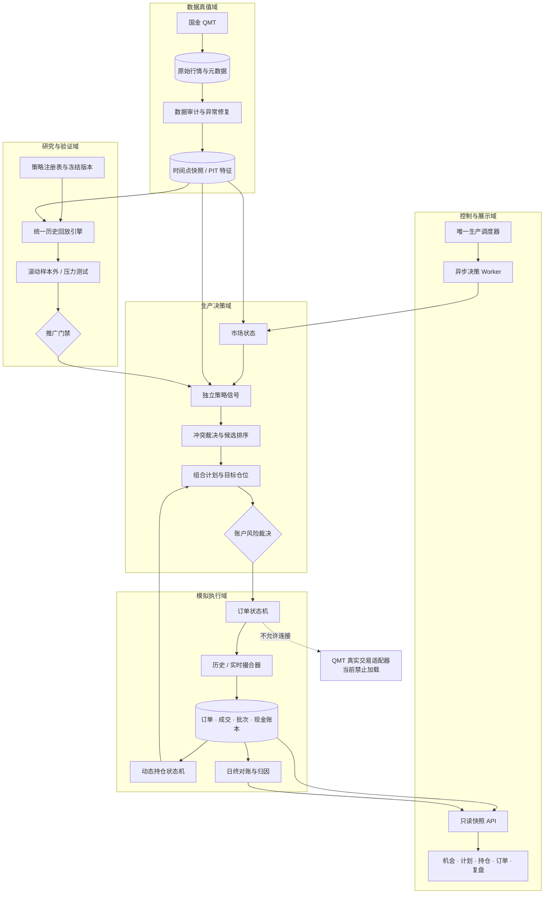

# ProBigA 选股、动态组合与模拟交易 V2 需求规格说明书

> 文档编号：SRS-PROBIGA-TRADE-V2  
> 文档版本：V2.0  
> 基线日期：2026-07-25  
> 适用范围：A 股、场内 ETF、选股、组合决策、历史回放、实时模拟、对账与验收  
> 当前账户：人民币 200,000 元无杠杆模拟账户  
> 当前交易边界：不得发送真实委托  
> 需求状态：正式需求基线；未确认外部事实不得由程序补默认值

---

## 0. 文档使用规则

### 0.1 需求强度

本文使用以下固定术语：

| 术语 | 含义 |
|---|---|
| 必须 | 不实现即为需求不通过 |
| 禁止 | 任何代码路径均不得发生 |
| 仅允许 | 除列明路径外不得存在其他路径 |
| 阻断 | 条件不满足时停止对应动作，不得自动降级成另一个结果 |
| 待外部确认 | 系统无法从现有生产、代码或已审计资料确定，确认前必须阻断，禁止猜默认值 |

本文不使用“差不多”“适当”“智能判断”“必要时”“建议采用”等不可测试表达。

### 0.2 确定性的定义

本系统所说的“确定性”是程序行为确定，不是承诺未来行情确定。

一次决策必须由以下七项唯一确定：

```text
decision_output =
    F(
      code_commit_sha,
      strategy_version,
      portfolio_policy_version,
      data_snapshot_hash,
      instrument_rule_version,
      fee_profile_version,
      account_state_hash
    )
```

七项输入完全相同时：

- 决策 JSON 必须逐字段一致；
- 候选排序必须一致；
- 风控裁决必须一致；
- 订单、成交、持仓和现金流水必须一致；
- 回测净值曲线必须一致；
- 结果哈希必须一致。

如算法需要随机过程，只允许使用运行清单中冻结的 `random_seed`。随机种子缺失时任务必须失败。

### 0.3 收益目标的定义

系统目标是构建“扣除现实交易成本后，经过样本外验证仍为正期望”的交易组合。

系统禁止：

- 把历史正收益表述为未来必赚；
- 为了通过指标修改已看过测试区间的参数；
- 只展示盈利区间，隐藏亏损区间；
- 用无法成交的价格计算盈利；
- 在数据不完整时生成确定性买入结论；
- 用兼容旧系统作为降低交易质量的理由。

策略未达到本文第 17 章推广门槛时，不得进入生产实时模拟主账户。

---

## 1. 需求来源与已确认事实

### 1.1 用户已经明确的业务要求

| 编号 | 已确认要求 |
|---|---|
| U-001 | 数据准确是所有计算的前提；原始数据源异常必须修复 |
| U-002 | 行情主源使用国金 QMT |
| U-003 | 选股不能由孤立、机械的单一策略决定 |
| U-004 | 策略必须根据市场阶段动态变化 |
| U-005 | 主升趋势破坏时必须允许提前退出 |
| U-006 | 超短或短线继续走强时必须允许延长持有 |
| U-007 | 当前必须先进行历史回放和生产模拟 |
| U-008 | 当前不得直接启用真实交易 |
| U-009 | 目标用户是约 20 万元资金、最多四个仓位的个人投资者 |
| U-010 | 达不到最终交易要求的旧逻辑允许重写或删除，不以最低改造风险为目标 |
| U-011 | 需求、程序规则和验收结果不得靠猜测 |

### 1.2 2026-07-25 生产环境事实

以下为生产只读检查结果：

| 编号 | 生产事实 |
|---|---|
| P-001 | Nginx 监听 `:80`，反向代理到 `127.0.0.1:8000` |
| P-002 | `probiga.service` 运行 Uvicorn API |
| P-003 | `probiga-scheduler.service` 为独立调度器 |
| P-004 | 生产业务库为 `127.0.0.1:3306/probiga` |
| P-005 | 日 K、分钟、当前行情通过 `127.0.0.1:13306/probiga` 读取 |
| P-006 | `:13306` 实际为 Windows QMT 行情库的 SSH 反向隧道 |
| P-007 | 生产模式为 `external_windows_collector`；Linux 无 QMT SDK 不属于行情故障 |
| P-008 | QMT Agent 监听 `127.0.0.1:18082`，但不属于当前行情读取必经链路 |
| P-009 | `real_trading_enabled=false` |
| P-010 | 服务器约 3.4 GiB 内存，API RSS 约 0.5 GiB |
| P-011 | 服务器磁盘约 40 GiB，已使用约 91% |
| P-012 | 当前策略中心多个 GET 接口在生产执行同步重计算，20 秒未返回 |
| P-013 | 旧模拟账户使用约 100 万元口径，且表结构没有独立 `account_id` 边界 |
| P-014 | 旧模拟规则仍包含 3、10、30、60 日固定持有和固定止盈止损 |
| P-015 | 当前分钟数据存在按日期覆盖为 0 的记录 |
| P-016 | 当前概念资金流存在日期落后 |
| P-017 | 闭市时当前交易日实时行数为 0 不能直接判定为行情故障 |

### 1.3 已完成研究结果

这些结果是现有策略的基线，不是 V2 的目标值。

#### 近一个月统一选股基线

信号区间为 2026-06-23 至 2026-07-23：

| 持有期 | 扣费后平均收益 | 结论 |
|---|---:|---|
| T+1 | -0.2901% | 负收益 |
| T+3 | -2.2471% | 负收益 |
| T+5 | -4.8113% | 负收益 |
| T+10 | -10.2934% | 负收益 |

因此现有统一候选池不得直接作为自动交易策略。

#### 2026 年主题片段动态策略基线

20 万元独立情景回放：

| 情景 | 收益 | 最大回撤 | PF | 结论 |
|---|---:|---:|---:|---|
| 商业航天 | +0.98% | -6.06% | 1.25 | 收益不足且弱于固定主升基线 |
| 贵金属 | +13.29% | -14.17% | 5.31 | 收益集中于少数股票，回撤过大 |
| 5—6 月科技 | +2.92% | -1.62% | 2.87 | 参与度显著不足 |
| 7 月行情 | -1.52% | -1.57% | 0.00 | 5 个交易段全部亏损 |

该回放使用当前板块快照冻结主题池，存在历史成分幸存者偏差，不得用于策略推广。

#### ETF 冻结策略

`etf_trend_risk_v2.0.0` 已完成 2021-01-04 至 2026-07-24 的历史研究：

- 累计收益：+40.49%；
- 年化收益：+6.57%；
- 最大回撤：-8.92%；
- 月度 PF：1.97；
- 前向开始日期：2026-07-27；
- 运行模式：`research_paper_read_only`；
- 自动下单：`false`；
- 禁止回填 2026-07-27 以前的前向记录。

该策略只允许作为独立 ETF 防守/跨资产模块进行前向研究，不得把历史结果合并成 A 股股票策略已通过。

---

## 2. 产品目标与非目标

### 2.1 产品目标

V2 必须完成以下闭环：

1. 从 QMT 获取可追溯行情。
2. 按时间点还原当时可见的数据。
3. 识别当日市场状态。
4. 在已验证策略中选择可运行策略。
5. 生成跨策略统一候选池。
6. 按 20 万元账户实际可执行条件竞争四个仓位。
7. 生成明确的目标仓位和失效条件。
8. 使用真实交易规则进行历史和实时模拟。
9. 动态判断持仓逻辑是否增强、有效、减弱或破坏。
10. 每日完成订单、成交、持仓、现金和净值对账。
11. 根据样本外和前向表现对策略降级、暂停或淘汰。
12. 每个决定均能还原输入、公式、版本和原因。

### 2.2 当前非目标

以下内容不属于 V2 当前交付：

- 真实委托；
- 融资融券；
- 期权、期货；
- 高频交易；
- Level-2 队列位置仿真；
- 每日自动搜索新公式；
- 大语言模型直接决定买卖；
- 通过增加参数数量追求历史最高收益。

---

## 3. 总体架构要求



架构硬约束：

- API GET 请求禁止执行全市场策略计算。
- 策略计算必须由 Worker 完成并写入不可变快照。
- 历史回放和生产模拟必须调用同一决策、风控和记账组件。
- 旧策略中心和旧模拟引擎不得成为 V2 主链路。
- 旧表只用于历史核对，不得作为 V2 账户真值。
- 行情库只读；交易账本只写入生产业务库。
- 生产业务库禁止重复保存全市场分钟行情。

---

## 4. 时间、数值与排序规则

### 4.1 时间规则

- 交易日、开收盘时间和业务日期使用 `Asia/Shanghai`。
- 数据库存储事件时间必须使用 UTC，并单独存储交易日。
- 历史回放禁止直接调用系统当前时间。
- 所有任务必须由注入的 `Clock` 提供当前时间。
- 日线策略在 T 日收盘数据完整后生成信号，最早 T+1 执行。
- 盘中策略只能读取事件时间之前已经到达的行情。
- 收盘后到达的数据不得回写修改当天早于该数据的决策。

### 4.2 数值规则

- 金额、价格、费用和收益计算必须使用十进制定点数，禁止使用二进制浮点作为账本最终值。
- 现金和费用按人民币分保存。
- 价格按证券规则表中的最小变动单位取整。
- 买入价格向不利方向取整；卖出价格向不利方向取整。
- 风险计算得到的股数必须向下取整到合法交易单位。
- 任何中间计算均不得通过四舍五入创造额外现金或股数。

### 4.3 统一排序规则

候选排序按以下优先级逐项比较，前一项相同才比较后一项：

1. 数据和事件硬门禁是否通过；
2. 动作为风险退出、减仓、已有持仓维护或新开仓；
3. 经样本外验证的扣费后期望收益，下界从高到低；
4. 当前市场状态适配等级，从高到低；
5. 风险收益比，从高到低；
6. 20 日平均成交额，从高到低；
7. 股票代码，从小到大。

禁止在排序相同时依赖数据库未声明顺序。

动作优先级固定为：

```text
RISK_EXIT
> EXIT
> REDUCE
> CANCEL_BUY
> ADD
> OPEN
> HOLD
> WATCH
```

---

## 5. 数据真值系统

### 5.1 数据源职责

| 数据 | 主源 | 交叉验证 | 主源异常处理 |
|---|---|---|---|
| A 股和 ETF 日 K | 国金 QMT | 已批准公开源 | 修复 QMT 链路或标记阻断，不静默替换 |
| 盘中最新价、买一卖一 | 国金 QMT | 无 | 无新鲜报价则不成交 |
| 分钟行情 | 国金 QMT | 已批准分钟源仅作核验 | 依赖分钟的策略阻断 |
| 交易日历 | QMT/交易所日历版本 | 第二日历源 | 不一致则阻断当天新买入 |
| 证券状态与交易规则 | QMT 基础资料 + 版本化规则表 | 交易所规则 | 字段缺失则该证券不可交易 |
| 复权因子 | QMT | 第二复权源 | 不一致则该证券历史研究阻断 |
| 行业、概念、主题成员 | 带生效时间的历史快照 | QMT 当前快照仅核验当前 | 无历史快照不得用于推广回测 |
| 公告和事件 | 公告原文及发布时间 | 第二来源 | 发布时间不明时不得用于历史信号 |
| 券商费率 | 用户实际账户费率或券商确认文件 | 成交单核对 | 未确认则收益推广验收阻断 |

### 5.2 原始数据不可变

原始数据层必须保存：

- 来源；
- 原始证券代码；
- 行情时间；
- 接收时间；
- 交易日；
- 原始负载哈希；
- 采集批次；
- 数据源版本；
- 是否补录；
- 补录原因。

原始记录禁止原地覆盖。修正必须写入新版本并保存前后差异。

### 5.3 时间点数据

每个可用于决策的字段必须具有：

- `effective_at`：数据描述的业务生效时间；
- `available_at`：系统当时能够看到该数据的时间；
- `ingested_at`：实际入库时间；
- `source`;
- `quality_status`;
- `snapshot_version`.

历史回放查询条件必须包含：

```text
available_at <= decision_at
```

缺少 `available_at` 的公告、财务、概念成分和事件数据不得用于样本外推广回测。

### 5.4 数据质量状态

质量状态只允许：

| 状态 | 含义 | 动作 |
|---|---|---|
| `PASS` | 满足当前能力全部要求 | 允许执行 |
| `WARN` | 不影响该动作真值，仅影响非核心展示 | 允许执行并记录 |
| `BLOCK` | 影响该动作价格、时序、规则或特征 | 阻断对应动作 |

禁止把 `BLOCK` 自动转换成 `WARN`。

### 5.5 新鲜度

交易时段：

- 持仓和候选跟踪证券的报价年龄不得超过 15 秒；
- 全市场宽度快照年龄不得超过 120 秒；
- 盘中策略使用的分钟数据必须完整到最近一个已结束分钟；
- 买一卖一缺失时，实时模拟订单不得成交；
- QMT 或隧道断开时，所有新开仓和加仓立即暂停。

闭市时段：

- 使用交易日历确定的最近一个已完成交易日；
- 不要求当天存在实时行；
- 不得把闭市快照用于伪造盘中成交。

### 5.6 能力级门禁

| 能力 | 必需数据 | 缺失后的确定动作 |
|---|---|---|
| 日级选股 | 日 K、复权、交易规则、市场状态 | 阻断新候选 |
| 主题策略 | 上述数据 + 历史主题成员 + 主题强度 | 只阻断主题策略 |
| ETF 策略 | ETF 冻结池、日 K、现金 ETF、规则表 | 阻断 ETF 调仓 |
| 盘中入场 | 新鲜买一卖一、分钟数据、指数同步 | 阻断盘中入场 |
| 持仓风险检查 | 持仓、最新可用行情、规则表 | 标记风险检查失败并报警 |
| 模拟成交 | 可执行报价、订单、规则、费用配置 | 保持待成交，不得假成交 |
| 绩效归因 | 成交账本、收盘价、费用 | 延迟生成报告 |

### 5.7 数据修复

原始源异常必须形成数据事件：

1. 发现异常；
2. 冻结依赖该数据的能力；
3. 定位 QMT、隧道、采集、转换或数据库层；
4. 修复原始链路；
5. 生成新数据版本；
6. 对受影响日期重新审计；
7. 生成前后差异；
8. 重新运行受影响的研究任务；
9. 禁止覆盖旧报告。

---

## 6. 证券规则注册表

禁止把“100 股、T+1、10% 涨跌停”统一硬编码到所有品种。

每只证券在每个生效区间必须具备：

- 证券类型；
- 交易所；
- 上市和退市日期；
- 是否可买；
- 最小首次买入数量；
- 后续买入数量单位；
- 卖出数量规则；
- T+N 规则；
- 价格最小变动单位；
- 涨跌幅规则；
- 特殊处理状态；
- 停牌状态；
- 账户权限要求；
- 费用规则编号。

规则不存在、规则过期或账户权限未知时，该证券必须返回 `INSTRUMENT_RULE_BLOCKED`。

科创板不得因代码前缀全局排除，也不得在权限未知时默认允许。

---

## 7. 策略注册与生命周期

### 7.1 策略不是一个名称

每个策略版本必须提交不可变策略清单：

```text
strategy_id
strategy_version
instrument_scope
universe_definition
required_features
feature_available_time
signal_schedule
entry_formula
add_formula
reduce_formula
exit_formula
initial_stop_formula
position_sizing_policy
market_regime_mapping
fee_profile_version
validation_protocol
code_commit_sha
config_hash
```

任一字段缺失时，策略状态必须为 `DRAFT_BLOCKED`。

### 7.2 生命周期

策略状态只允许：

```text
DRAFT_BLOCKED
-> DRAFT
-> RESEARCH
-> OOS_PASSED
-> SHADOW
-> PAPER_ACTIVE
-> SUSPENDED
-> RETIRED
```

状态转换必须由推广门禁产生审计记录。

`DRAFT_BLOCKED` 只允许在补齐缺失清单并生成审计记录后进入 `DRAFT`。

禁止：

- 从 `DRAFT` 直接进入 `PAPER_ACTIVE`；
- 因策略名称已存在就视为策略可用；
- 无独立公式的策略复制其他策略分数；
- 无已注册模型时用透明度不足的“机器学习基线”冒充模型；
- 修改已发布版本参数；
- 删除亏损版本的历史记录。

### 7.3 V2 初始策略状态

| 策略 | 初始状态 | 原因 |
|---|---|---|
| `etf_trend_risk_v2.0.0` | `SHADOW` | 历史研究通过，前向记录自 2026-07-27 开始 |
| 当前统一 A 股七预设 | `RESEARCH` | 近月组合扣费后为负 |
| 当前主题动态策略 | `RESEARCH` | 7 月为负且历史主题成分不满足 PIT |
| 当前十类策略目录中的占位策略 | `DRAFT` | 目录存在不等于独立策略已实现 |
| 机器学习策略 | `DRAFT_BLOCKED` | 未注册可追溯模型不得运行 |
| 盘中入场策略 | `DRAFT_BLOCKED` | 需要买一卖一和完整分钟能力验收 |

### 7.4 每日动态的边界

每日允许自动变化：

- 市场状态；
- 已推广策略的启用状态；
- 已推广策略在不同市场状态下的冻结权重；
- 候选排序；
- 总仓位上限；
- 单股目标仓位；
- 持仓逻辑状态；
- 保护位；
- 订单状态。

每日禁止自动变化：

- 策略公式；
- 参数搜索空间；
- 费用；
- 市场交易规则；
- 样本外门槛；
- 账户风险硬上限；
- 实盘启停；
- 已完成决策和成交。

策略参数更新只能通过：

```text
新研究任务
-> 新版本
-> 独立样本外验证
-> 推广审批
-> 下一交易日生效
```

---

## 8. 市场状态系统

### 8.1 状态枚举

市场状态只允许：

| 状态 | 新开仓 | 账户最大股票仓位 |
|---|---|---:|
| `TREND_UP` | 允许 | 80% |
| `THEME_ROTATION` | 允许 | 60% |
| `RANGE` | 限制 | 40% |
| `PANIC_RECOVERY` | 仅允许试错仓 | 25% |
| `RISK_OFF` | 禁止普通新开仓 | 10% |
| `EXTREME` | 禁止 | 0% |
| `DATA_BLOCKED` | 禁止 | 仅处理可验证的风险退出 |

ETF 防守仓是否计入“股票仓位”必须由 ETF 策略清单明确。未明确时计入总风险资产仓位。

### 8.2 判定要求

市场状态策略必须是一个独立、版本化策略，必须列出：

- 使用的指数；
- 趋势特征；
- 市场宽度；
- 涨跌停结构；
- 成交额；
- 波动率；
- 主题持续性；
- 事件风险；
- 每个阈值；
- 状态优先级；
- 状态切换冷却规则。

平台不提供隐藏默认阈值。

输入不足时必须输出 `DATA_BLOCKED`，不得默认成震荡、修复或偏多。

状态优先级固定为：

```text
DATA_BLOCKED
> EXTREME
> RISK_OFF
> PANIC_RECOVERY
> TREND_UP
> THEME_ROTATION
> RANGE
```

同一日满足多个状态时，选择优先级更高者。

---

## 9. 多策略融合与候选池

### 9.1 独立信号

每个“策略版本 + 决策批次 + 证券”必须保存独立信号，至少包含：

- 原始特征；
- 原始分数；
- 动作；
- 扣费后期望收益；
- 期望收益置信下界；
- 初始止损；
- 失效条件；
- 风险收益比；
- 有效起止时间；
- 数据快照哈希；
- 模型和配置版本；
- 证据链。

没有扣费后期望收益和样本外来源时，信号只能进入研究展示，不能进入仓位竞争。

### 9.2 冲突裁决

同一证券出现相反信号时：

1. 保留全部原始信号；
2. 数据硬门禁先执行；
3. 风险退出覆盖买入；
4. 已持仓的破坏信号覆盖加仓；
5. 剩余买入策略中，扣费后期望收益置信下界最高者为主策略；
6. 其他同方向策略只作为证据，不重复计算仓位；
7. 多空结论无法确定时输出 `CONFLICT_WATCH`，目标仓位保持不增加。

### 9.3 四仓竞争

所有股票和风险 ETF 共用账户级仓位约束，不按策略额外分配四个仓位。

候选必须同时满足：

- 策略状态为 `PAPER_ACTIVE` 或当前运行模式允许的 `SHADOW`；
- 数据能力为 `PASS`；
- 扣费后期望收益置信下界大于 0；
- 初始止损有效；
- 风险收益比不低于该策略推广清单中的下限；
- 可买数量达到证券最小单位；
- 交易后不突破账户、单股和主题风险限制；
- 报价未超过禁止追价上限。

不满足任一条件即输出明确拒绝代码，不得通过其他高分抵消。

---

## 10. 20 万元组合风控

### 10.1 账户固定参数

| 参数 | V2 固定值 |
|---|---:|
| 初始资金 | 200,000 元 |
| 杠杆 | 0 |
| 融资 | 禁止 |
| 做空 | 禁止 |
| 最大同时持仓 | 4 |
| 单股初始目标上限 | 22% |
| 单股盘中绝对上限 | 25% |
| 单笔标准风险预算 | 账户权益的 0.50% |
| 单笔风险硬上限 | 账户权益的 0.60% |
| 全账户开仓风险上限 | 账户权益的 2.00% |
| 同一主题持仓上限 | 2 只 |
| 同一主题仓位上限 | 44% |
| 现金不得低于 | 0 元 |

以上值属于 `portfolio_policy_v2.0.0`。修改任一值必须发布新版本并重新回测。

### 10.2 股数公式

对多头买入：

```text
standard_risk_budget = equity × 0.005
risk_per_share = planned_entry_price - initial_stop_price

risk_qty =
    floor_to_legal_lot(
        standard_risk_budget / risk_per_share
    )

position_qty =
    floor_to_legal_lot(
        equity × 0.22 / worst_case_buy_price
    )

cash_qty =
    floor_to_legal_lot(
        available_cash /
        (worst_case_buy_price + estimated_fee_per_share)
    )

approved_qty =
    min(risk_qty, position_qty, cash_qty, liquidity_qty)
```

以下任一条件成立时拒单：

- `initial_stop_price <= 0`；
- `initial_stop_price >= planned_entry_price`；
- `approved_qty` 小于证券最小买入数量；
- 以最坏成交价计算的实际风险超过权益 0.60%；
- 买入后现金为负；
- 买入后持仓数量超过 4；
- 买入后同主题股票超过 2；
- 买入后总开仓风险超过权益 2.00%。

### 10.3 回撤总闸门

回撤以账户历史最高日终权益为基准：

| 回撤 | 确定动作 |
|---|---|
| 小于 6% | 按市场状态执行 |
| 大于等于 6% 且小于 8% | 风险资产最大仓位降至 40% |
| 大于等于 8% 且小于 10% | 禁止新开仓和加仓，仅允许持有、减仓和退出 |
| 大于等于 10% | 所有策略转 `SUSPENDED`，仅允许风险退出 |

回撤解除必须同时满足：

- 连续 10 个交易日无新低；
- 日终权益从回撤低点恢复至少 3%；
- 对账全部通过；
- 人工审核解除。

程序不得自行跳过人工审核。

---

## 11. 动态持仓状态机

### 11.1 状态

每个持仓只允许：

```text
OPENING
VALID_STRONG
VALID
WEAKENED
BROKEN
RISK_EXIT
EXIT_PENDING_T1
EXIT_PENDING_LIQUIDITY
CLOSED
```

允许的状态转换：

| 当前状态 | 允许进入 |
|---|---|
| `OPENING` | `VALID_STRONG`、`VALID`、`WEAKENED`、`BROKEN`、`RISK_EXIT` |
| `VALID_STRONG` | `VALID`、`WEAKENED`、`BROKEN`、`RISK_EXIT` |
| `VALID` | `VALID_STRONG`、`WEAKENED`、`BROKEN`、`RISK_EXIT` |
| `WEAKENED` | `VALID_STRONG`、`VALID`、`BROKEN`、`RISK_EXIT` |
| `BROKEN` | `EXIT_PENDING_T1`、`EXIT_PENDING_LIQUIDITY`、`CLOSED` |
| `RISK_EXIT` | `EXIT_PENDING_T1`、`EXIT_PENDING_LIQUIDITY`、`CLOSED` |
| `EXIT_PENDING_T1` | `EXIT_PENDING_LIQUIDITY`、`CLOSED` |
| `EXIT_PENDING_LIQUIDITY` | `CLOSED` |
| `CLOSED` | 无 |

禁止未列明的状态转换。风险事件可以从任意未关闭且未进入退出等待的持仓状态进入 `RISK_EXIT`。

### 11.2 状态对应目标

| 状态 | 目标仓位动作 |
|---|---|
| `OPENING` | 建立批准目标的 50% |
| `VALID_STRONG` | 允许从 50% 加到批准目标的 100% |
| `VALID` | 保持，不机械加仓 |
| `WEAKENED` | 目标降至批准目标的 50% |
| `BROKEN` | 目标为 0 |
| `RISK_EXIT` | 目标为 0，优先级最高 |
| `EXIT_PENDING_T1` | 目标为 0，冻结加仓，等待可卖 |
| `EXIT_PENDING_LIQUIDITY` | 目标为 0，逐日继续尝试卖出 |

每个持仓最多一次加仓。禁止亏损加仓和摊低成本。

### 11.3 退出顺序

退出检查顺序固定为：

1. 账户和市场极端风险；
2. 证券事件硬风险；
3. 初始硬止损；
4. 策略失效条件；
5. 动态保护位；
6. 主题退潮；
7. 组合风险压缩；
8. 资金效率替换。

前一条件触发后，不再使用后面的理由改变动作。

### 11.4 保护位

- 建仓前必须确定初始保护位。
- 多头持仓的保护位只允许上移，禁止下移。
- 除权除息造成的价格基准变化必须通过复权和规则版本调整，不得被识别为策略主动下移止损。
- 跳空跌破保护位时按下一可执行价格卖出，不得按保护位假成交。
- 跌停无法成交时进入 `EXIT_PENDING_LIQUIDITY`。
- T+1 不可卖时进入 `EXIT_PENDING_T1`。

### 11.5 持有天数

持有天数不得单独触发强制卖出。

策略可以定义“资金效率检查日”，但必须重新评估：

- 扣费后剩余期望收益；
- 当前保护位；
- 市场状态；
- 替代候选；
- 换仓成本。

只有替代候选的期望收益置信下界高于当前持仓，且差额大于完整换仓成本时，才允许以资金效率为由换仓。

---

## 12. 交易意图与风险裁决

### 12.1 交易意图

交易意图动作只允许：

```text
OPEN
ADD
HOLD
REDUCE
EXIT
CANCEL
```

每条意图必须包含：

- `intent_id`；
- `account_id`；
- `decision_run_uid`；
- `strategy_version`；
- `stock_code`；
- 当前股数；
- 目标股数；
- 目标仓位；
- 最早执行时间；
- 过期时间；
- 限价；
- 最坏成交价；
- 初始止损；
- 动态保护位；
- 失效条件；
- 原因代码；
- 证据；
- 幂等键。

策略不得直接写订单。

### 12.2 风险裁决

每条意图必须产生一条不可变风险裁决：

```text
APPROVED
REDUCED
REJECTED
```

裁决必须保存：

- 请求股数；
- 批准股数；
- 单笔风险；
- 交易后单股仓位；
- 交易后总仓位；
- 交易后主题暴露；
- 交易后最坏开仓风险；
- 现金余额；
- 所有检查项；
- 首个失败项。

禁止只保存最终“通过/不通过”而不保存计算过程。

---

## 13. 订单与撮合

### 13.1 订单状态机

订单状态只允许以下转换：

```text
CREATED
-> RISK_APPROVED
-> QUEUED
-> PARTIALLY_FILLED
-> FILLED
```

终止状态：

```text
REJECTED
CANCELLED
EXPIRED
```

等待原因不是终止状态，必须单独保存：

```text
WAIT_NO_QUOTE
WAIT_STALE_QUOTE
WAIT_LIMIT_LOCK
WAIT_SUSPENDED
WAIT_T1
WAIT_LIQUIDITY
```

禁止从终止状态回到活动状态。

### 13.2 实时模拟成交

买入必须同时满足：

- 报价年龄不超过 15 秒；
- 卖一价和卖一量存在；
- 卖一价不高于订单限价；
- 证券处于可交易状态；
- 未封涨停；
- 批准现金仍然充足；
- 订单未过期。

卖出必须同时满足：

- 报价年龄不超过 15 秒；
- 买一价和买一量存在；
- 买一价不低于订单限价；
- 可卖数量足够；
- 未封跌停。

无买一卖一时不得使用最新价假成交。

成交基础价：

```text
买入基础价 = 卖一价
卖出基础价 = 买一价
```

市场冲击、滑点、价格取整和费用按冻结执行配置计算。调整后的价格超出订单限价时不成交。

单次成交数量不得超过：

- 订单剩余数量；
- 风控批准剩余数量；
- 对手一档可见数量的 20%；
- 证券流动性模型批准数量。

### 13.3 日线历史撮合

日线策略的默认执行时点为下一交易日开盘。

买入：

- 开盘价达到涨停锁定条件时不成交；
- 开盘价高于限价时不成交；
- 成交价使用开盘价加不利滑点和冲击；
- 调整后高于限价时不成交。

卖出：

- 开盘价达到跌停锁定条件时不成交；
- 开盘价低于限价时不成交；
- 成交价使用开盘价减不利滑点和冲击；
- 调整后低于限价时不成交。

同一根日 K 内同时穿过保护位和目标位但没有分钟数据时，按对多头更不利的保护位事件先发生。

### 13.4 费用

费用引擎必须按生效日期和证券类型读取 `fee_profile_version`。

必须包含：

- 买入佣金；
- 卖出佣金；
- 最低佣金；
- 印花税；
- 过户费；
- ETF 特殊费率；
- 其他实际账户费用。

实际国金账户费率当前属于待外部确认项。

确认前：

- 允许使用明确标记为 `RESEARCH_ASSUMPTION` 的费率做研究；
- 报告必须显示费率并禁止写“实际净收益”；
- 不得通过收益推广门槛；
- 不得进入 `PAPER_ACTIVE` 主账户。

### 13.5 幂等

订单幂等键固定由以下字段计算：

```text
account_id
+ decision_run_uid
+ intent_id
+ stock_code
+ side
+ target_quantity
+ intent_version
```

相同幂等键只能存在一个订单。

成交幂等键必须包含行情事件编号或撮合事件编号。重启、重试和重复调度不得产生重复成交。

---

## 14. 交易账本

### 14.1 V2 核心表

V2 必须新建独立表，不依赖旧 `trade_mode` 作为账户边界：

| 表 | 主键/唯一约束 | 作用 |
|---|---|---|
| `st_trade_account_v2` | `account_id` | 账户与冻结配置 |
| `st_strategy_version_v2` | `strategy_id + version` | 策略清单和哈希 |
| `st_data_snapshot_v2` | `snapshot_id`、快照哈希唯一 | 输入数据版本 |
| `st_decision_run_v2` | `run_uid`、运行幂等键唯一 | 决策批次 |
| `st_strategy_signal_v2` | `run_uid + strategy_version + stock_code` | 独立策略信号 |
| `st_portfolio_plan_v2` | `run_uid + account_id` | 组合目标 |
| `st_trade_intent_v2` | `intent_id`、意图幂等键唯一 | 交易意图 |
| `st_risk_decision_v2` | `intent_id` 唯一 | 风控裁决 |
| `st_order_v2` | `order_id`、订单幂等键唯一 | 委托 |
| `st_fill_v2` | `fill_id`、成交幂等键唯一 | 逐次成交 |
| `st_position_lot_v2` | `lot_id` | T+N 持仓批次 |
| `st_cash_ledger_v2` | `cash_event_id`、业务事件唯一 | 现金流水 |
| `st_equity_daily_v2` | `account_id + trade_date` | 日终权益 |
| `st_reconciliation_v2` | `account_id + trade_date + version` | 对账 |
| `st_trade_event_v2` | `event_id` | 全链路事件 |

### 14.2 账本不变量

任意时点必须满足：

```text
cash_balance =
    initial_cash
    + all_cash_ledger_events
```

```text
position_quantity(stock) =
    sum(buy_fills)
    - sum(sell_fills)
```

```text
available_to_sell(stock, date) =
    sum(eligible_open_lots.remaining_quantity)
```

```text
equity =
    cash
    + market_value
    + receivables
    - payables
```

差异容忍值：

- 股数：0；
- 订单数量：0；
- 成交数量：0；
- 现金：0.01 元；
- 权益：0.01 元。

超过容忍值时账户状态必须转为 `RECONCILIATION_BLOCKED`，禁止新开仓和加仓。

### 14.3 不可变记录

以下记录创建后禁止更新业务值：

- 数据快照；
- 已完成决策；
- 风控裁决；
- 已成交明细；
- 现金流水；
- 日终对账；
- 已发布策略版本。

纠错必须通过冲正或新版本完成。

### 14.4 数据库迁移

- 所有 DDL 必须通过版本化 migration。
- API 启动、GET 请求、策略扫描和模拟交易 Tick 禁止建表、补列和建索引。
- migration 必须具备升级、校验和回退说明。
- 生产 migration 前必须完成结构快照和备份验证。

---

## 15. 调度与日内流程

生产只允许一个调度器拥有任务触发权。

| 时间 | 任务 | 失败动作 |
|---|---|---|
| 15:05 | 冻结当日已完成行情清单 | 当日研究任务暂停 |
| 15:10 | 日 K、规则、复权和来源审计 | 失败数据能力转 `BLOCK` |
| 15:20 | 生成下一交易日基础市场状态和候选 | 不生成新计划 |
| 08:45 | 更新隔夜公告、事件和风险 | 缺发布时间的数据不参与决策 |
| 09:15 | 检查 QMT、隧道、行情和交易日 | 不满足则禁止新开仓 |
| 09:20 | 生成账户组合计划 | 计划失败则当天无新买入 |
| 09:25 | 冻结开盘计划 V1 | 后续变化只生成新版本 |
| 09:31—11:30 | 每 60 秒执行模拟 Tick | 单次失败记录，禁止补造成交 |
| 13:01—15:00 | 每 60 秒执行模拟 Tick | 单次失败记录，禁止补造成交 |
| 15:05 | 订单过期处理 | 未成交原因入账 |
| 15:10 | 日终持仓、现金和权益对账 | 不平则冻结账户 |
| 15:20 | 绩效归因和验收日报 | 延迟但不得篡改账本 |

补跑任务必须保留原计划时间和实际执行时间。补跑不得制造原时间点不存在的交易机会。

---

## 16. API 与页面

### 16.1 API 规则

所有 V2 响应必须包含：

```text
status
trace_id
generated_at
data_snapshot_id
data_snapshot_hash
code_commit_sha
config_version
```

GET 接口必须只读，不得：

- 生成策略快照；
- 写数据库；
- 创建订单；
- 补数据；
- 执行 migration；
- 修改策略配置。

重计算必须使用 POST 创建异步任务，并返回 `job_id`。

### 16.2 V2 API

| 方法 | 路径 | 作用 |
|---|---|---|
| GET | `/api/v2/system/readiness` | 系统、数据和执行能力 |
| GET | `/api/v2/market-regime/latest` | 已完成市场状态 |
| GET | `/api/v2/strategies` | 策略版本和生命周期 |
| GET | `/api/v2/decision-runs/{run_uid}` | 完整决策快照 |
| GET | `/api/v2/candidates` | 统一候选池 |
| GET | `/api/v2/accounts/{account_id}` | 账户状态 |
| GET | `/api/v2/accounts/{account_id}/plan` | 当前计划 |
| GET | `/api/v2/accounts/{account_id}/positions` | 持仓和批次 |
| GET | `/api/v2/accounts/{account_id}/orders` | 订单 |
| GET | `/api/v2/accounts/{account_id}/fills` | 逐次成交 |
| GET | `/api/v2/accounts/{account_id}/cash-ledger` | 现金流水 |
| GET | `/api/v2/accounts/{account_id}/reconciliation` | 对账 |
| GET | `/api/v2/reports/daily` | 每日验收报告 |
| POST | `/api/v2/research/backtests` | 创建研究任务 |
| POST | `/api/v2/decision-runs` | 创建决策任务 |
| POST | `/api/v2/admin/strategies/{id}/promote` | 受保护推广 |
| POST | `/api/v2/admin/strategies/{id}/suspend` | 受保护暂停 |

### 16.3 页面信息架构

旧“选股工具”和“模拟交易”页面不得继续作为 V2 默认入口。

V2 页面固定为：

1. **系统可信度**
   - QMT、隧道、数据版本、对账、任务状态。
2. **今日机会**
   - 市场状态、启用策略、统一候选、拒绝原因。
3. **组合计划**
   - 四个仓位、目标股数、最坏损失、主题暴露。
4. **当前持仓**
   - 逻辑状态、保护位、可卖股数、加减仓条件。
5. **订单与成交**
   - 委托状态、买一卖一、逐次成交、费用和未成交原因。
6. **复盘与验收**
   - 净值、回撤、PF、盈亏比、策略归因、错误和异常。
7. **策略实验室**
   - 版本、样本外结果、压力测试、推广状态。

页面禁止只显示一个“AI 分数”而不显示版本、证据、失效条件和风险。

---

## 17. 研究、回测和推广门槛

### 17.1 历史数据门槛

日频股票策略进入 `OOS_PASSED` 前必须满足：

- 至少 500 个完整交易日；
- 至少 120 个样本外完整交易；
- 最后 126 个交易日为冻结测试集；
- 测试集在参数冻结后只能运行一次；
- 所有特征满足 `available_at <= decision_at`；
- 股票池、行业和主题成员满足时间点要求；
- 退市、停牌、新上市和 ST 状态被正确还原。

ETF 月频策略必须满足：

- 至少 500 个完整交易日；
- 至少 24 个样本外调仓窗口；
- ETF 投资池按历史时点冻结；
- 现金替代品和上市时间可追溯。

### 17.2 样本外财务门槛

指标必须按以下公式计算：

```text
trade_net_pnl =
    sell_fill_amount
    - buy_fill_amount
    - buy_fees
    - sell_fees
```

成交价已经包含滑点和市场冲击，指标计算不得再次扣除同一成本。

```text
expectancy_cny =
    sum(trade_net_pnl) / completed_trade_count
```

```text
expectancy_r =
    sum(trade_net_pnl / initial_risk_amount)
    / completed_trade_count
```

```text
profit_factor =
    gross_positive_trade_net_pnl
    / abs(gross_negative_trade_net_pnl)
```

```text
payoff_ratio =
    average_positive_trade_net_pnl
    / abs(average_negative_trade_net_pnl)
```

```text
max_drawdown =
    min((equity_t - running_peak_equity_t) / running_peak_equity_t)
```

当没有已完成交易时，期望收益、PF 和盈亏比均为 `NULL`，不得写 0。
当存在盈利交易且不存在亏损交易时，PF 和盈亏比记为 `INF`，但样本数量门槛仍然必须满足。

扣除完整费用、滑点、冲击和拒单后，必须同时满足：

| 指标 | 门槛 |
|---|---:|
| `expectancy_cny` | 大于 0 |
| `expectancy_r` | 大于 0 |
| Profit Factor | 大于等于 1.30 |
| 盈亏比 | 大于等于 1.50 |
| 最大回撤 | 不高于 12% |
| 成本翻倍后的期望收益 | 大于 0 |
| 成本翻倍后的 PF | 大于等于 1.10 |
| 删除最赚钱 3 笔后的累计净利润 | 大于 0 |
| 单一证券利润贡献 | 不高于总利润 35% |
| 无法成交产生的盈利 | 0 |
| 未来数据违规 | 0 |

若胜率低于 35%，必须额外证明连续 10 次亏损时账户风险仍不突破第 10 章限制。

### 17.3 稳健性门槛

必须执行：

- 费用 2 倍；
- 滑点 2 倍；
- 成交容量减半；
- 下一交易日开盘不利跳空；
- 删除最赚钱 1、3、5 笔交易；
- 删除利润贡献最大的证券；
- 按年度和市场状态拆分；
- 参数邻域测试；
- 20 日连续区块抽样，固定种子 2,000 条路径。

参数邻域中超过 60% 的相邻组合必须保持扣费后期望收益大于 0。只有单点最优的参数不得推广。

### 17.4 基线比较

所有动态策略必须和以下基线使用同一数据、同一账户、同一费用、同一成交规则比较：

- 空仓；
- 全市场或合法股票池等权；
- 固定短线；
- 固定主升；
- ETF 防守；
- 不使用市场状态的同策略版本。

动态策略必须同时满足：

- 收益风险比优于不使用市场状态版本；
- 最大回撤不劣于固定主升基线；
- 弱市亏损小于股票池等权基线；
- 结果不能依赖重叠账户重复计算。

### 17.5 生产实时模拟门槛

进入 `PAPER_ACTIVE` 前必须满足：

- 连续至少 40 个真实交易日；
- 至少 30 个已完成交易；不足 30 笔时延长，最长观察 80 个交易日；
- 真实委托数为 0；
- 对账差异为 0；
- 无新鲜报价却成交为 0；
- 重复订单和重复成交为 0；
- T+N、涨跌停、停牌和现金违规为 0；
- 扣费后累计净收益大于 0；
- 实时模拟 PF 大于等于 1.10；
- 最大回撤小于等于 10%；
- 实际滑点未超过研究压力测试边界；
- QMT 断线、隧道中断、数据库重启和 Worker 重启演练全部通过。

任何硬门槛失败，观察周期从修复后的下一完整交易日起重新计算。

---

## 18. 策略健康和自动暂停

策略进入 `PAPER_ACTIVE` 后，每日收盘计算最近 20、60、120 个交易日指标。

策略健康状态：

| 状态 | 判定 | 动作 |
|---|---|---|
| `GREEN` | 60 日完成交易不少于 20 笔、PF ≥ 1.10、扣费后期望收益 ≥ 0，且未突破回撤上限 | 正常运行 |
| `YELLOW` | 60 日样本不足 20 笔，或 60 日完成交易不少于 20 笔且 0.90 ≤ PF < 1.10 | 禁止提高权重，仓位系数 0.50 |
| `RED` | 60 日样本不少于 20 笔且 PF < 0.90，或扣费后期望收益 < 0，或策略回撤突破版本上限 | 禁止新开仓，进入 `SUSPENDED` |

`RED` 策略恢复必须：

- 发布恢复研究报告；
- 使用未参与上一次调整的新数据；
- 重新通过样本外门槛；
- 人工推广。

程序不得因单日反弹自动恢复。

---

## 19. 故障处理

| 故障 | 确定动作 |
|---|---|
| QMT 终端掉线 | 暂停新开仓、加仓和模拟成交；记录事件 |
| SSH 隧道断开 | 行情能力转 `BLOCK`；禁止公网源代替成交 |
| 日 K 未完成 | 不生成下一日候选 |
| 分钟数据缺失 | 阻断盘中策略；日级策略继续 |
| 历史主题成员缺失 | 主题回测只能研究展示，不得推广 |
| 费率未确认 | 允许研究假设，不得推广至主模拟账户 |
| 决策 Worker 超时 | 不生成新决策；禁止 API 现场补算 |
| 报价过期 | 订单保持等待，不成交 |
| T+1 不可卖 | 标记 `EXIT_PENDING_T1` |
| 跌停不可卖 | 标记 `EXIT_PENDING_LIQUIDITY` |
| 对账不平 | 冻结账户新开仓和加仓 |
| API 重启 | 从数据库恢复，只读账本，不从内存推测 |
| 调度重复触发 | 幂等命中，返回原任务 |
| 策略配置哈希变化 | 拒绝运行，要求发布新版本 |
| 数据快照哈希变化 | 创建新快照和新报告，不覆盖旧结果 |

---

## 20. 非功能需求

### 20.1 性能

- 普通只读 API P95 小于 1 秒；
- 决策快照查询 P95 小于 2 秒；
- 页面首屏不等待策略重计算；
- API 进程禁止运行全市场回测；
- Worker 并发数固定为 1，除非完成新的资源验收；
- 生产调度器并发数不得由 V2 擅自提高。

### 20.2 存储

- 生产业务库不复制全市场分钟历史；
- 生产只保存决策输入清单、行情引用和必要证据；
- 回测完整中间数据保存在本地研究目录；
- 生产保存报告摘要和产物哈希；
- 生产日志保留 30 天；
- 不可变交易账本不得因日志清理删除。

### 20.3 安全

- `real_trading_enabled` 必须保持 `false`；
- V2 进程不得加载真实交易凭据；
- Broker Adapter 不得注册到依赖注入容器；
- 策略推广、暂停、账户重置、人工平仓必须管理员鉴权；
- 所有管理动作必须审计；
- 密钥禁止写入代码、报告和日志。

### 20.4 可观测性

每个运行必须记录：

- `trace_id`；
- `job_id`；
- `run_uid`；
- 代码版本；
- 配置哈希；
- 数据哈希；
- 开始和结束时间；
- 输入行数；
- 输出行数；
- 拒绝数量；
- 错误码；
- 内存和耗时。

---

## 21. 旧系统处理

本章不以兼容为目标，只定义不会污染 V2 的处理方式。

| 旧组件 | V2 处理 |
|---|---|
| `server/engine/strategy_center.py` | 拆分为版本注册、异步计算和只读查询；原同步 GET 计算路径删除 |
| `server/engine/sim_trade_engine.py` | 不作为 V2 交易核心；固定天数和固定百分比退出逻辑退役 |
| `server/api/routers/sim_trade.py` | V2 页面不得调用旧主接口 |
| 旧 `st_sim_*` | 只读归档；不得写入 V2 账户 |
| 旧 `trade_mode=live` | 标记为旧实时模拟，不得显示成真实交易 |
| 旧 100 万元账户 | 不迁入 20 万元 V2 主账户 |
| 旧策略历史收益 | 仅作为对照，不计入 V2 净值 |
| 旧 AI 推荐分数 | 可作为研究特征，不能直接创建订单 |

旧逻辑妨碍本文要求时必须删除或替换。

---

## 22. 测试要求

### 22.1 确定性测试

- 相同七元输入重复运行 10 次，输出哈希必须全部相同；
- 数据库返回顺序随机化后，候选排序必须相同；
- Worker 重启后结果必须相同；
- 不同时区运行历史回放，交易日和结果必须相同；
- 不同 Python 进程运行，账本结果必须相同。

### 22.2 数据测试

- 重复业务键；
- 非法证券代码；
- OHLC 逻辑；
- 非正价格；
- 负成交量和成交额；
- 非首日缺昨收；
- 复权连续性；
- 停牌和复牌；
- 上市和退市；
- 交易日历冲突；
- 数据来源和哈希；
- `available_at` 未来数据；
- 主题成员时间点；
- 当前价和日 K 收盘一致性。

### 22.3 风控测试

- 20 万元账户；
- 四仓上限；
- 单股 22% 和 25% 上限；
- 单笔 0.50% 和 0.60% 风险；
- 全账户 2% 开仓风险；
- 同主题 2 只和 44%；
- 不同证券最小买入单位；
- 高价股票一手不可负担；
- 现金不足；
- 回撤 6%、8%、10% 状态转换。

### 22.4 持仓测试

- 建仓 50%；
- 盈利确认后唯一一次加仓；
- 禁止亏损加仓；
- `VALID_STRONG` 转 `WEAKENED`；
- `WEAKENED` 转 `BROKEN`；
- 保护位只上移；
- T+1 风险退出；
- 跌停连续无法卖出；
- 除权除息；
- 持有天数到期但趋势仍有效；
- 超短趋势延续；
- 主升趋势提前破坏。

### 22.5 订单和成交测试

- 新鲜买一卖一；
- 报价超过 15 秒；
- 买一卖一缺失；
- 涨停买入；
- 跌停卖出；
- 停牌；
- 限价；
- 部分成交；
- 撤单；
- 过期；
- 最小单位；
- 费用；
- 滑点；
- 市场冲击；
- 幂等；
- 服务重启；
- 同根日 K 止损和止盈冲突。

### 22.6 账本测试

- 多批次买入；
- T+1 可卖数量；
- 部分卖出；
- 费用分摊；
- 已实现盈亏；
- 未实现盈亏；
- 现金流水；
- 日终权益；
- 冲正；
- 对账差异；
- 重复事件。

### 22.7 生产故障演练

- QMT 终端关闭；
- Windows 采集器关闭；
- SSH 隧道关闭；
- 业务数据库短暂不可用；
- Worker 被终止；
- API 重启；
- Scheduler 重复任务；
- 磁盘空间不足；
- 陈旧快照；
- 配置被修改；
- 数据哈希变化。

---

## 23. 分期与完成定义

### 阶段 0：数据真值

交付：

- 数据源清单；
- 时间点字段；
- 证券规则注册表；
- 数据版本和哈希；
- QMT 异常修复流程；
- 数据能力门禁。

完成条件：

- 关键数据违规为 0；
- 选中证券所需字段完整；
- 历史回放不存在未来数据；
- 主题策略具备历史成员快照，否则保持阻断。

### 阶段 1：统一交易和账本

交付：

- 20 万元账户；
- 风控裁决；
- OMS；
- 历史和实时撮合器；
- 持仓批次；
- 现金账本；
- 对账。

完成条件：

- 第 22.3 至 22.6 节测试全部通过；
- 现金、股数、订单和成交对账差异为 0；
- 同输入结果哈希一致。

### 阶段 2：策略与动态组合

交付：

- 策略版本清单；
- 市场状态；
- 多策略冲突；
- 四仓竞争；
- 动态持仓；
- 样本外验证。

完成条件：

- 至少一个股票策略或 ETF 策略通过第 17.1 至 17.4 节；
- 未通过策略不会进入交易主链路；
- 现有近月负收益策略不得冒充通过。

### 阶段 3：生产实时模拟

交付：

- 盘前计划；
- 每分钟模拟 Tick；
- 日终对账；
- 日报；
- 生产故障演练；
- 40 至 80 个交易日不可回填前向记录。

完成条件：

- 第 17.5 节全部通过；
- 真实委托数为 0；
- 没有账本错误和假成交。

### 阶段 4：真实交易

不属于本文交付。

只有新立项、新需求、新安全评审和真实账户专项验收完成后，才允许讨论加载 Broker Adapter。

---

## 24. 当前待外部确认项

以下内容无法从现有生产和代码诚实确定，程序不得自行填值：

| 编号 | 待确认事实 | 未确认时的阻断范围 |
|---|---|---|
| B-001 | 国金实际账户佣金、最低佣金和其他账户级费用 | 策略推广和实际净收益验收 |
| B-002 | 用户账户对科创板、创业板、ETF 等品种的真实权限 | 对应品种模拟主账户开仓 |
| B-003 | QMT 当前行情是否持续提供可靠买一卖一及数量 | 实时模拟成交验收 |
| B-004 | A 股历史概念/行业成员的完整生效区间 | 主题策略推广回测 |
| B-005 | 旧 A 股历史日 K 的 QMT 行级来源补证 | 使用旧行推广 QMT 主源策略 |
| B-006 | 每个候选股票策略的完整公式和冻结参数 | 对应策略离开 `DRAFT/RESEARCH` |
| B-007 | 2026-07-27 之后 ETF 前向记录 | ETF 从 `SHADOW` 进入 `PAPER_ACTIVE` |
| B-008 | V2 市场状态模型的完整阈值、状态切换和冷却配置 | 市场状态策略离开 `DRAFT/RESEARCH` |

这些项目不是“以后优化项”，而是对应功能的硬阻断项。

---

## 25. 最终验收结论

### 不通过

任一情况成立即为不通过：

- 数据来源或时间点不可追溯；
- 使用未来数据；
- 费率和规则靠隐藏默认值；
- 无报价成交；
- 涨跌停假成交；
- T+N 违规；
- 负现金；
- 重复订单或成交；
- 对账不平；
- 相同输入产生不同结果；
- 策略未通过样本外门槛却进入生产主模拟账户；
- 真实交易链路被加载；
- 为兼容旧系统保留不符合需求的核心逻辑。

### 通过

必须同时满足：

1. 数据真值阶段通过；
2. 统一交易和账本阶段通过；
3. 至少一个策略版本通过完整样本外门槛；
4. 生产实时模拟达到第 17.5 节；
5. 所有操作可由版本、输入、公式和账本还原；
6. 真实委托数为 0。

---

## 26. 需求追踪摘要

| 用户要求 | 对应章节 |
|---|---|
| 数据必须准确 | 第 5、6、17、22 章 |
| 使用国金 QMT | 第 1、5 章 |
| 多策略综合 | 第 7、9 章 |
| 每日动态调整 | 第 7、8、11、18 章 |
| 趋势破坏提前跑 | 第 11 章 |
| 强势短线继续拿 | 第 11.5 节 |
| 适合 20 万元小账户 | 第 10 章 |
| 模拟测试必须做真 | 第 12、13、14、17 章 |
| 真实交易暂缓 | 第 2、20、23 章 |
| 旧逻辑不行就替换 | 第 21 章 |
| 程序不得随便猜 | 第 0、4、5、7、24 章 |

本需求基线的核心不是“功能都能点开”，而是：

```text
数据可证明
+ 决策可复现
+ 风控不可绕过
+ 成交不造假
+ 账本能对平
+ 策略样本外为正
+ 前向模拟达标
```

任一项缺失，系统不得宣称达到可用的交易标准。
