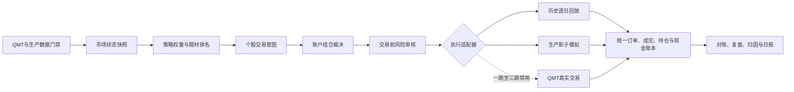

# ProBigA 动态策略与模拟交易分期需求文档

> 文档版本：V1.0  
> 编制日期：2026-07-25  
> 适用账户：A股个人投资者，基准资金 20 万元  
> 当前范围：动态策略、历史回放、生产影子模拟、模拟账户与验收  
> 明确边界：一期至三期不发送任何真实交易委托

## 1. 文档目的

本需求用于把当前分散的候选推荐、策略中心、模拟交易和数据质量能力，改造成一条可运行、可复盘、可验收的动态交易链路。

目标不是寻找永远有效的固定策略，也不是让系统每天无约束地修改规则，而是：

1. 每日识别市场环境和题材强弱。
2. 在已经验证的策略库中动态选择策略和权重。
3. 对每只持仓每日决定买入、加仓、持有、减仓、退出或重新买回。
4. 使用统一的 20 万元模拟账户和最多四个持仓位置。
5. 让历史回放、生产影子模拟和未来真实交易共用决策、风控、订单与账本逻辑。
6. 通过数据门禁、风险总闸门、版本冻结、对账和回滚保证系统可用。

## 2. 当前系统总结

### 2.1 已有可复用能力

现有系统并非从零开始，以下能力应保留并升级：

- `server/engine/strategy_center.py`
  - 已有十类策略目录。
  - 已有市场状态、状态权重、策略启停、冲突裁决和全局门禁。
  - 已有运行批次、信号、冲突、指标和审计表。
- `server/engine/sim_trade_engine.py`
  - 已有推荐转信号、订单、持仓、事件、风险预算和交易流水。
  - 已处理 T+1、交易时段、整手、涨跌停、价格过期、部分成交和费用。
- `server/api/routers/sim_trade.py`
  - 已有模拟看板、候选、持仓、订单、事件、前向模拟和回测接口。
- `server/static/js/app.js`
  - 已有策略中心和模拟交易页面。
  - 页面明确显示当前不进行真实自动买卖。
- QMT 与质量系统
  - 已有QMT健康、能力、数据覆盖、缺口、历史库和实时行情链路。
  - 已有数据质量、调度和数据源健康接口。

### 2.2 当前主要缺陷

| 类别 | 当前问题 | 直接影响 |
|---|---|---|
| 策略与交易 | 策略中心和模拟交易仍是两套口径 | 上游动态选择后，下游可能继续按旧固定策略交易 |
| 持仓退出 | 超短、短线、波段、主升浪仍以固定止盈、止损和最长持有日为主 | 主升趋势容易过早退出，破位时又可能机械等待 |
| 账户口径 | 模拟账户默认 100 万元 | 与用户 20 万元、整手约束和实际可买股票不一致 |
| 仓位竞争 | 以策略预算为主，缺少所有题材统一争夺四个仓位的最终裁决 | 多策略可能各自看起来合理，但组合层不可执行 |
| 交易意图 | 缺少独立、版本化的目标仓位意图 | 无法清楚表达“从10%加到20%”或“减到半仓” |
| 成交账本 | 订单保存聚合成交字段，缺少逐次成交明细表 | 部分成交、撤单和真实价差难以完整审计 |
| T+1账本 | 持仓有T+1判断，但缺少独立持仓批次/可卖数量账本 | 多次加仓后的可卖数量容易变得不透明 |
| 模式命名 | 模拟环境使用 `live` 表示实时模拟 | 容易与未来真实交易混淆 |
| 数据溯源 | 旧日K存在行级来源标签缺失 | 无法把“结构正确”直接等同于“QMT逐行验证” |
| 证券过滤 | 当前全局排除 `688` | 规则过于粗糙，应改为价格、流动性、风险和可负担性过滤 |
| 数据库治理 | 模拟交易引擎存在运行时建表/补列 | 生产可能出现元数据锁和环境结构漂移 |
| 复现实验 | 推荐、策略、参数、行情快照缺少统一引用 | 难以严格重放“当时为什么买、后来为何卖” |
| 自学习 | 缺少受约束的周期性更新机制 | 如果直接做每日参数学习，容易追涨杀跌和过拟合 |

## 3. 产品原则

### 3.1 动态不等于每天发明新策略

每日允许变化的内容：

- 市场状态。
- 启用策略及其权重。
- 题材优先级。
- 总仓位、单票仓位和最多持仓数。
- 个股目标仓位。
- 动态保护位、加减仓条件和失效条件。

每日不允许自动变化的内容：

- 费用、T+1、整手等市场规则。
- 账户级最大损失和总回撤红线。
- 未经样本外验证的全新公式。
- 已冻结的历史决策和成交结果。
- 真实交易启停权限。

### 3.2 同一决策链，多种执行模式

历史回放、影子模拟和未来真实交易只能替换执行适配器，不得分别维护三套买卖逻辑。

### 3.3 失败时默认不交易

出现以下情况时，新买入必须关闭：

- 日K、实时行情、交易日历或复权信息未通过门禁。
- QMT实时源失联且没有满足时效要求的可靠快照。
- 市场状态无法判断或状态数据过期。
- 策略运行批次、参数版本或输入快照不完整。
- 订单、持仓、现金对账失败。
- 账户风险总闸门已触发。

持仓风险退出不能因推荐模块失败而失效。即使上游当天无法生成新推荐，已有持仓仍必须继续检查止损、破位和风险事件。

## 4. 目标用户与核心场景

### 4.1 目标用户

- 20万元左右的A股个人投资者。
- 不使用融资融券和杠杆。
- 主要使用国金QMT行情。
- 当前只运行模拟交易，真实交易暂缓。

### 4.2 核心场景

1. 盘前查看当天市场状态、总仓位、启用策略和候选计划。
2. 盘中观察模拟订单是否成交及未成交原因。
3. 查看每只持仓为何继续拿、加仓、减仓或退出。
4. 盘后查看盈亏、滑点、费用、风险和错失机会。
5. 按任意历史日期重放当时的策略、数据和交易。
6. 比较动态策略与固定策略基线。
7. 连续运行生产影子模拟，不触碰真实资金。

## 5. 统一业务对象

### 5.1 决策快照

每个交易日生成唯一决策快照，至少包含：

- `decision_run_uid`
- 决策日期、数据截止时间和生成时间
- 市场状态、置信度和证据
- 启用策略、有效权重和版本
- 题材强度、宽度、持续性和退潮标记
- 账户权益、现金、总仓位上限和持仓上限
- 数据质量状态和QMT状态
- 输入数据哈希

快照生成后只允许追加新版本，不允许原地修改。

### 5.2 交易意图

策略层输出交易意图，不直接创建成交：

- 股票代码和名称
- 来源策略和题材
- 动作：`OPEN`、`ADD`、`HOLD`、`REDUCE`、`EXIT`、`REENTER`
- 当前仓位和目标仓位
- 目标股数、价格上限/下限和有效时段
- 优先级和仓位竞争分
- 初始风险、动态保护位和失效条件
- 原因、证据和替代方案
- 决策版本及有效期

新意图可以替代尚未执行的旧意图，但必须保存替代关系和原因。

### 5.3 风险裁决

每个交易意图必须经过账户级风险审核：

- 是否允许交易
- 允许股数和允许金额
- 拒绝或降仓原因
- 单笔风险
- 交易后总仓位、题材暴露和现金缓冲
- 当日、当周和账户回撤状态

### 5.4 订单与成交

订单和成交必须分开：

- 一个订单可以有零笔、一笔或多笔成交。
- 每笔成交独立记录价格、股数、费用、行情时间和价格来源。
- 部分成交后剩余数量可继续等待、撤单或过期。
- 不允许直接修改已成交记录。

### 5.5 持仓批次

每次买入形成独立持仓批次：

- 买入日期和可卖日期
- 买入股数、剩余股数和成本
- 当日可卖数量
- 来源订单和成交
- 已实现和未实现盈亏

该对象用于正确处理多次加仓后的A股T+1。

## 6. 分期规划总览

| 阶段 | 核心目标 | 用户得到什么 | 真实交易 |
|---|---|---|---|
| 一期 | 把模拟交易做正确、做清楚 | 可信的20万元统一模拟账户和历史回放 | 禁用 |
| 二期 | 接入动态策略和动态持仓 | 每日自动换挡、题材抢仓、灵活加减仓 | 禁用 |
| 三期 | 生产影子运行与验收 | 连续20—40个交易日的真实时间模拟结果 | 禁用 |
| 四期预留 | 为未来QMT实盘做接口和安全准备 | 只读账户核对、人工确认设计 | 默认禁用，另行立项 |

## 7. 一期：统一模拟交易底座

### 7.1 一期目标

先解决“模拟结果本身是否可信”，暂不引入复杂自学习。

一期完成后应做到：

- 使用20万元统一模拟账户。
- 所有策略共享最多四个持仓位置。
- 历史回放、实时模拟共用订单和账本。
- 每笔模拟成交都可以核对。
- 服务重启、重复运行不会重复买卖或丢失状态。

### 7.2 一期功能范围

#### A. 模式重新命名

将当前容易混淆的模式调整为：

- `historical_replay`：历史逐日回放
- `forward_replay`：指定起点前向回放
- `realtime_paper`：生产实时模拟
- `shadow`：冻结计划的生产影子模式
- `broker_live`：未来真实交易，保持禁用

保留旧 `live/backtest/forward` 的只读兼容映射，不继续作为新记录的标准值。

#### B. 统一模拟账户

默认账户：

- 初始资金：200,000元
- 最大总仓位：80%
- 常态现金缓冲：20%
- 最大同时持仓：4只
- 单票最高仓位：22%
- 单笔初始风险：账户权益的0.5%—0.6%
- 买入按100股整手
- 不允许负现金和融资

账户参数必须可版本化，不允许散落在API和引擎常量中。

#### C. 账本重构

保留并迁移现有表：

- `st_sim_signal`
- `st_sim_order`
- `st_sim_position`
- `st_sim_event`
- `st_sim_risk_budget`
- `st_trade_flow`

新增或正式拆分：

- `st_sim_account`：模拟账户主表
- `st_sim_decision_snapshot`：每日决策快照
- `st_sim_trade_intent`：目标仓位和交易意图
- `st_sim_risk_decision`：交易前风险裁决
- `st_sim_fill`：逐笔成交
- `st_sim_position_lot`：持仓批次与T+1可卖数量
- `st_sim_cash_ledger`：现金变化流水
- `st_sim_reconciliation`：每日对账结果

所有结构变更使用正式migration，不在请求和扫描流程中执行运行时DDL。

#### D. 历史回放引擎

要求：

- 严格按交易日推进。
- 信号日收盘后生成意图，最早下一交易日成交。
- 支持停牌、涨跌停、跳空、整手、费用、滑点和部分成交。
- 日线回放使用保守成交规则。
- 有分钟数据时可以切换分钟级撮合。
- 输入日期、参数、数据哈希和代码版本可复现。
- 回放结果不可覆盖生产影子账户。

#### E. 数据准入门禁

生成新买入前检查：

- 交易日历。
- 日K日期和覆盖率。
- 复权及昨收完整性。
- QMT或批准数据源。
- 实时价格新鲜度。
- 数据业务键重复和OHLC合法性。

门禁结果必须进入决策快照和页面，不允许只写日志。

#### F. 模拟交易页面一期改造

页面按以下顺序展示：

1. 数据与系统可信度。
2. 模拟账户资金、仓位和回撤。
3. 今日交易计划。
4. 风控拒绝和降仓记录。
5. 订单与逐笔成交。
6. 持仓及可卖数量。
7. 现金流水和每日对账。
8. 历史回放和版本信息。

页面不得继续把 `live` 文案用于真实交易含义。

### 7.3 一期验收标准

工程硬门槛：

- 未来数据使用：0。
- T+1违规：0。
- 非100股整手买入：0。
- 负现金：0。
- 无有效行情却成交：0。
- 涨跌停错误成交：0。
- 订单、成交、持仓和现金对账差异：0。
- 重复任务导致重复订单：0。
- 服务重启后状态丢失：0。
- 所有表结构通过正式migration建立。

测试要求：

- 订单状态机单元测试。
- T+1多批次测试。
- 部分成交、撤单和过期测试。
- 涨跌停、停牌和跳空测试。
- 费用、滑点和整手测试。
- 幂等和服务恢复测试。
- API契约和数据库约束测试。

### 7.4 一期不做

- 不做策略每日自学习。
- 不做真实QMT下单。
- 不承诺收益指标。
- 不做高频交易和盘口队列仿真。

## 8. 二期：动态策略与动态持仓

### 8.1 二期目标

将策略中心、题材识别和统一模拟账户连接起来，使系统能够根据不同市场环境换挡，并对持仓进行动态处理。

### 8.2 市场状态升级

基于现有四状态扩展为可执行状态：

| 市场状态 | 新买入 | 总仓位参考 | 优先策略 |
|---|---|---:|---|
| 趋势主升 | 允许 | 60%—85% | 趋势突破、板块轮动、主升持有 |
| 题材轮动 | 有选择允许 | 35%—60% | 轮动、回踩、短周期确认 |
| 区间震荡 | 限制 | 20%—40% | 低吸、均值回归、低波动 |
| 弱市下跌 | 严格限制 | 0%—15% | 防守、ETF、现金 |
| 恐慌修复 | 小仓试错 | 10%—30% | 超跌修复、止跌确认 |
| 极端事件 | 禁止 | 0%—10% | 退出、风险处置 |

状态必须包含：

- 置信度。
- 证据。
- 数据日期和新鲜度。
- 与上一交易日的变化。
- 允许总仓位和允许策略。
- 状态失效条件。

### 8.3 题材识别与排名

每日对行业、概念和主线进行统一排名：

- 相对强度。
- 市场宽度。
- 成交额变化。
- 前排股持续性。
- 涨跌停结构。
- 连续性和退潮风险。
- QMT板块成分可信度。

输出：

- 主线题材。
- 次主线题材。
- 观察题材。
- 退潮题材。
- 禁止追高题材。

题材成员必须使用当时可得快照；没有历史成分快照时，回测报告必须标记幸存者偏差。

### 8.4 策略动态调度

系统在现有策略库内调整权重：

- 趋势强时提高趋势突破和板块轮动权重。
- 高位震荡时降低追涨，提高回踩和低波动。
- 弱市时关闭大部分新增买入。
- 恐慌修复时仅允许小仓确认。
- 极端事件时只允许风险退出和防守动作。

策略权重每日有最大变化限制，防止短期业绩导致频繁翻转。

### 8.5 统一四仓竞争

所有候选统一计算仓位竞争分：

- 市场状态适配。
- 题材排名。
- 个股强度和流动性。
- 风险收益比。
- 与已有持仓相关性。
- 当前题材暴露。
- 整手可负担性。

最多四只股票。某个题材或策略没有独立的额外四个位置。

### 8.6 动态持仓动作

每只持仓每日可产生：

- `HOLD`：趋势和题材未破坏。
- `ADD`：已有浮盈且趋势确认。
- `REDUCE`：强度下降、板块退潮或利润保护。
- `EXIT`：保护位、趋势、事件或账户风险触发。
- `REENTER`：减仓/退出后重新满足确认条件。

退出逻辑不再以固定持有天数为主，改为：

- 初始风险止损。
- 1R、2R、3R利润保护。
- ATR或波动率跟踪保护。
- 趋势和均线结构。
- 题材退潮。
- 资金效率。
- 账户总回撤。

固定持有天数仅作为资金效率提醒，不能单独强制卖出主升趋势。

### 8.7 小账户适配

- 取消对科创板的全局代码排除。
- 改为检查100股最低金额、价格、流动性、风险和用户权限。
- 价格过高导致一手超过单票风险预算时自动不可执行。
- 最低订单金额不得机械设为8000元，应由费用占比和整手可执行性决定。

### 8.8 二期页面

新增“今日交易驾驶舱”：

- 今日市场状态及与昨日变化。
- 今日启用/暂停策略。
- 总仓位和四个仓位分配。
- 题材排名及退潮提示。
- 每只候选的目标仓位、有效期和失效条件。
- 每只持仓的加、持、减、退判断。
- 被风控否决的机会及原因。
- 当前账户最坏损失估计。

### 8.9 二期回测与验收

必须采用滚动样本外验证：

- 参数训练期、验证期和测试期分离。
- 禁止使用测试期结果反向修改同一版本。
- 与固定短线、固定主升和空仓基线比较。
- 分市场状态统计收益、回撤、胜率、盈亏比和试错次数。

建议研究门槛：

- 样本外组合PF不低于1.3。
- 样本外盈亏比不低于1.8。
- 最大回撤不高于10%。
- 弱市总仓位和亏损符合风险上限。
- 最佳三笔交易剔除后不出现不可接受的大幅亏损。
- 单一股票贡献不超过总利润的35%。
- 动态策略至少在“风险调整后收益”上优于固定基线。

研究门槛不等于未来收益承诺；不满足时不得进入三期。

## 9. 三期：生产影子模拟与持续验收

### 9.1 三期目标

在生产环境按真实时间连续运行，不发送真实委托，验证系统能否面对真实数据延迟、停牌、涨跌停、调度中断和服务重启。

### 9.2 影子运行规则

- 盘前生成当日决策快照和初始交易计划。
- 盘中根据QMT实时行情模拟订单。
- 允许根据已发生的新信息生成新版本意图。
- 禁止收盘后改写当天原始计划。
- 未成交订单必须保存未成交原因。
- 所有模拟成交必须保存当时行情时间、来源和快照引用。
- 每日收盘自动对账和生成日报。
- 运行周期不少于20个交易日，建议40个交易日。

### 9.3 日内时间流程

| 时间阶段 | 系统动作 |
|---|---|
| 盘前 | 数据门禁、市场状态、策略权重、题材排名、账户风险 |
| 09:15后 | QMT健康、交易日和行情准备度 |
| 开盘后 | 检查跳空、涨跌停、有效价格和订单条件 |
| 盘中 | 模拟撮合、风险检查、持仓动态动作 |
| 午间 | 状态变化检查，不追溯改写上午决策 |
| 尾盘 | 未成交订单处理、隔夜风险和持仓计划 |
| 盘后 | 对账、收益归因、错失成交、日报和异常清单 |

### 9.4 影子模拟日报

日报必须包含：

- 数据与QMT状态。
- 市场状态和变化。
- 启用策略及权重。
- 题材排名。
- 原始交易计划。
- 最终订单和逐笔成交。
- 未成交和风控拒绝。
- 持仓动作及原因。
- 当日、累计和分策略盈亏。
- 费用、滑点和流动性影响。
- 最大回撤和风险总闸门。
- 系统异常及恢复。
- 如果是真实账户，当天理论上会发生什么。

### 9.5 三期验收标准

工程门槛：

- 影子运行期间真实委托数：0。
- 陈旧行情成交：0。
- 无来源行情成交：0。
- T+1、整手和现金违规：0。
- 日终对账差异：0。
- 决策被追溯篡改：0。
- 重复调度产生重复订单：0。
- 关键服务中断后可恢复。
- 每个交易日均生成完整验收日报。

运行质量：

- 关键任务成功率不低于99%。
- 页面和日报能够解释全部成交与拒绝。
- 模拟成交价与真实可成交区间偏差可量化。
- 弱市和极端事件总闸门至少完成真实场景或受控演练。
- 完成QMT断线、数据库短暂失败、服务重启和重复任务故障演练。

策略观察：

- 实际时间运行结果与历史样本外预期没有结构性偏离。
- 回撤、仓位和连续亏损在批准范围内。
- 结果不依赖少数无法实际成交的股票。
- 动态换挡没有发生高频来回切换。

## 10. 四期预留：未来真实交易准备

四期不属于当前交付，只定义边界。

### 10.1 可以提前准备

- `BrokerAdapter`统一接口。
- QMT账户、持仓和委托的只读同步。
- 模拟账本与QMT账户的字段映射。
- 人工确认流程设计。
- 委托幂等键和客户端订单号。
- 实盘总暂停、撤单、限额和回滚设计。

### 10.2 当前必须保持关闭

- 真实买入。
- 真实卖出。
- 自动撤单。
- 自动修改真实委托。
- 账户密码或交易凭据落库。
- 页面直接开启自动交易。

代码级要求：

- `broker_live_enabled=false` 为默认且不可由普通页面修改。
- 没有独立部署配置、管理员授权和实盘验收报告时，真实适配器不得加载。
- 模拟模式不得复用真实账户ID。

### 10.3 未来启用顺序

1. 只读账户和持仓核对。
2. 系统生成订单，用户人工在QMT确认。
3. 小资金、单笔限额、每单人工确认。
4. 另行评审是否启用有限自动化。

## 11. 风险总闸门

建议初始规则：

| 风险项目 | 触发条件 | 动作 |
|---|---:|---|
| 单笔风险 | 超过账户权益0.6% | 降低股数或拒绝 |
| 单日亏损 | 达到1.5% | 当日停止新增买入 |
| 单周亏损 | 达到3% | 下一交易周降仓 |
| 账户回撤 | 达到8% | 进入防守模式 |
| 账户回撤 | 达到10% | 停止新增买入并进入人工复核 |
| 连续失败 | 弱市连续2笔亏损 | 暂停弱市试错 |
| 数据失败 | 核心门禁FAIL | 停止新增买入 |
| 对账失败 | 任一资金/持仓差异 | 冻结账户模拟执行 |

风险总闸门优先级高于任何策略信号。

## 12. API需求

一期至三期建议新增版本化接口，不直接破坏现有页面：

### 12.1 决策与计划

- `GET /api/trading-plan/v1/today`
- `GET /api/trading-plan/v1/{trade_date}`
- `POST /api/trading-plan/v1/generate`
- `GET /api/trading-plan/v1/intents`
- `GET /api/trading-plan/v1/risk-decisions`

### 12.2 模拟账户

- `GET /api/paper-trading/v1/accounts`
- `GET /api/paper-trading/v1/accounts/{account_id}`
- `GET /api/paper-trading/v1/positions`
- `GET /api/paper-trading/v1/position-lots`
- `GET /api/paper-trading/v1/orders`
- `GET /api/paper-trading/v1/fills`
- `GET /api/paper-trading/v1/cash-ledger`

### 12.3 执行与对账

- `POST /api/paper-trading/v1/run`
- `POST /api/paper-trading/v1/replay`
- `POST /api/paper-trading/v1/orders/{id}/cancel`
- `GET /api/paper-trading/v1/reconciliation`
- `POST /api/paper-trading/v1/reconciliation/run`

### 12.4 日报与验收

- `GET /api/paper-trading/v1/daily-report`
- `GET /api/paper-trading/v1/readiness`
- `GET /api/paper-trading/v1/acceptance`

所有写接口必须包含：

- 运行模式。
- 账户ID。
- `run_uid`。
- 幂等键。
- 操作者。
- 决策版本。

## 13. 非功能需求

### 13.1 可复现

同一数据哈希、策略版本、参数版本和账户初始状态必须生成相同结果。

### 13.2 可解释

每个动作必须回答：

- 为什么做。
- 使用了哪些数据。
- 哪条规则生效。
- 为什么没有采用其他候选。
- 什么条件会改变当前动作。

### 13.3 可恢复

服务重启后从数据库恢复：

- 未完成订单。
- 持仓批次。
- 可卖数量。
- 现金。
- 当日风险状态。

### 13.4 幂等

同一运行批次重复执行，不得重复生成订单、成交或现金流水。

### 13.5 性能

- 盘前决策不得阻塞生产API。
- 盘中模拟扫描使用批量行情和批量数据库操作。
- 页面普通查询目标响应时间不高于3秒。
- 重计算和历史回放走异步任务并显示进度。

### 13.6 安全

- 策略启停、账户重置和手工平仓需要管理员权限和审计。
- 真实交易配置与模拟交易配置完全隔离。
- 日志不保存QMT登录凭据和交易密码。

## 14. 数据迁移与兼容

1. 现有模拟交易数据先冻结并标记为 `legacy_sim_v1`。
2. 不直接删除原有订单、持仓和流水。
3. 新账户使用新的账户ID和模式值。
4. 现有 `/api/sim-trade/*` 页面先保持只读兼容。
5. 新页面稳定后，再逐步将旧扫描入口切到新引擎。
6. 旧 `live` 模式在页面标记为“旧实时模拟”，不得显示为真实交易。
7. 运行时DDL迁移到正式migration后，旧建表逻辑改为启动检查，不再在线改表。

## 15. 测试矩阵

### 15.1 数据测试

- QMT断线。
- 日K缺日。
- 实时行情过期。
- 复权异常。
- 重复业务键。
- 股票停牌或退市。

### 15.2 交易测试

- 当天买入后尝试卖出。
- 多次加仓后的T+1批次。
- 开盘涨停无法买入。
- 跌停无法卖出。
- 部分成交后撤单。
- 高开超过限制。
- 最低整手买不起。
- 费用导致现金不足。

### 15.3 策略测试

- 主升行情继续持有。
- 趋势破坏及时退出。
- 减仓后重新走强再买回。
- 题材退潮时统一降仓。
- 弱市连续两次失败后暂停。
- 多策略抢同一股票。
- 四个仓位已满时更强候选替换。

### 15.4 系统测试

- 扫描任务重复执行。
- 服务执行中重启。
- 数据库短暂断开。
- 同一订单重复回调。
- 页面重复点击。
- 账户对账失败后的冻结和恢复。

## 16. 交付物

### 一期交付

- 统一模拟账户和账本。
- 正式数据库migration。
- 历史逐日回放。
- 订单/成交/持仓/现金对账。
- 模拟交易页面一期。
- 一期自动化测试和验收报告。

### 二期交付

- 动态市场状态。
- 题材排名。
- 策略动态调度。
- 四仓统一竞争。
- 动态加减仓、退出和重新买回。
- 样本外回测报告。
- 今日交易驾驶舱。

### 三期交付

- 生产影子模拟任务。
- 每日冻结计划。
- 实时模拟撮合。
- 自动日报和异常清单。
- 20—40个交易日持续验收报告。
- 断线、重启、重复任务和风险闸门故障演练。

### 四期预留交付

- QMT只读账户映射。
- BrokerAdapter接口定义。
- 人工确认方案。
- 真实交易安全评审清单。
- 默认关闭的实盘配置。

## 17. 最终验收结论定义

### 不通过

出现任一情况即不通过：

- 使用未来数据。
- 账本对不上。
- 数据失败仍新增买入。
- 模拟模式触发真实委托。
- T+1、整手或现金违规。
- 决策结果可以被事后无痕修改。

### 条件通过

- 工程规则全部正确。
- 但样本外策略指标、QMT行级溯源或影子运行天数尚未满足。

### 通过

- 一期和二期工程门槛全部通过。
- 样本外研究门槛通过。
- 三期影子运行达到要求。
- 所有交易可解释、可重放、可对账。
- 真实交易仍保持禁用。

## 18. 最后复核

本项目正确的建设顺序是：

1. 一期先保证模拟交易“算得对、账对得上、不会误成交”。
2. 二期再让策略“会根据市场换挡、会灵活处理持仓”。
3. 三期在生产真实时间中验证“系统长期跑得住、结果不能事后修改”。
4. 真实交易只留接口，等待模拟和影子验收完成后另行决定。

当前最需要避免的错误，是先追求高回测收益，再用不可靠的模拟账本证明它能赚钱。只有模拟底座、动态决策和生产影子三层都通过，系统才算真正可用。
