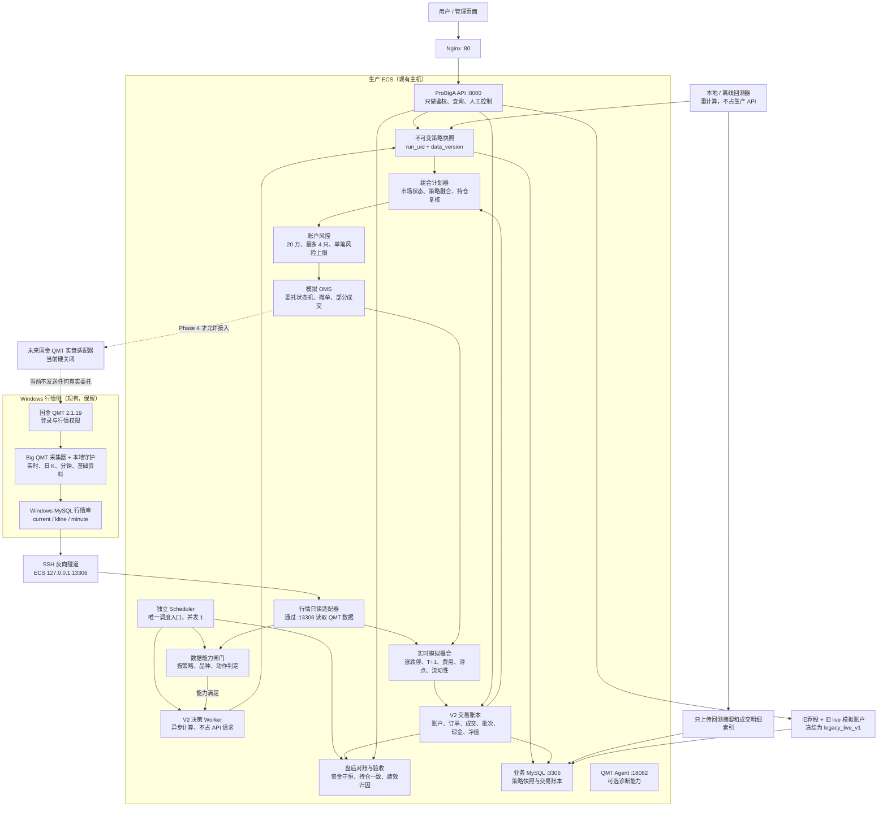

# 动态策略与模拟交易生产兼容架构

> 版本：V1.0（待确认）  
> 日期：2026-07-25  
> 范围：选股、动态持仓、模拟交易、生产兼容、未来实盘接口预留  
> 原则：先把模拟交易跑真、跑稳、跑得可解释；真实交易保持关闭

## 1. 结论

不建议推翻现有生产系统重做，也不建议直接在当前 `live` 模拟账户和旧表里继续堆逻辑。

推荐采用“旧链路冻结兼容 + 新 V2 链路并行”的方案：

1. 现有 API、页面、历史模拟持仓继续保留，标记为 `legacy_live_v1`，不清仓、不迁仓、不改历史收益。
2. 新建独立的 20 万元 V2 模拟账户，单独记账、单独下单、单独统计。
3. 国金 QMT 继续负责 Windows 侧行情采集，生产 Linux 通过现有 SSH 反向隧道读取；短期不把 QMT 直连能力放到核心依赖上。
4. 策略计算从生产 API 请求中移出去，改成调度器触发的异步决策快照；页面和模拟交易只读取已经完成的快照。
5. 数据质量由“一个总开关”改成“能力矩阵”：哪个数据坏，只限制依赖它的策略和动作，不让整个系统一起瘫痪。
6. 模拟交易使用独立 OMS、风控、成交撮合和资金流水；未来实盘只替换执行适配器，策略和风控不重写。
7. 真实交易保持硬关闭，至少完成 20～40 个交易日生产影子验证后再单独立项。

这套架构保留了现有成果，又把最混乱、风险最高的模拟交易部分隔离出来，适合当前生产资源和个人账户规模。

## 2. 当前生产环境实况

以下结论来自 2026-07-25 对实际生产环境的只读检查，不是按本地代码猜测。

| 项目 | 当前实际状态 | 架构影响 |
|---|---|---|
| Web 入口 | Nginx `:80`，反向代理到 API `127.0.0.1:8000` | 保持不变 |
| 主 API | `probiga.service`，Uvicorn 单体服务，运行正常 | API 只做轻查询，不再同步跑重策略 |
| 调度器 | `probiga-scheduler.service` 独立运行，并发数 1 | 继续作为唯一生产调度入口 |
| AI 推荐 Worker | `probiga-ai-recommendation-worker.service` 当前未运行 | 可改造成 V2 决策 Worker，避免再加一套常驻服务 |
| 业务库 | ECS 本机 MySQL `127.0.0.1:3306/probiga` | 策略快照、账户、订单、成交、流水写这里 |
| 行情库 | `127.0.0.1:13306/probiga` | 实际通过 SSH 反向隧道读取 Windows 侧 QMT 数据 |
| QMT Agent | `127.0.0.1:18082`，进程存活 | 作为可选诊断/未来执行能力，不作为当前行情必经链路 |
| QMT 模式 | `external_windows_collector` | Linux 无本地 QMT SDK 属于预期，不应因此判整套系统失败 |
| 实盘交易 | `real_trading_enabled=false` | 必须继续保持关闭 |
| 服务器内存 | 约 3.4 GiB，API 已占约 0.5 GiB | 回测和重计算不能塞进 API 进程 |
| 服务器磁盘 | 约 40 GiB，已使用约 91% | 不在业务库重复存整份分钟行情；重回测尽量放本地 |

## 3. 当前生产上的关键问题

### 3.1 策略中心 GET 请求承担了重计算

当前 `/api/strategy-center/overview`、`/strategies` 等接口会直接调用
`build_strategy_center_snapshot()`。生产检查中这些接口超过 20 秒仍未返回。

这会造成：

- 页面打开慢或超时；
- API 进程被重计算占住；
- 盘中每次刷新都有可能重复查大表；
- 模拟交易如果依赖该接口，会被页面性能拖垮。

V2 必须改为：

`调度器 -> 决策 Worker 计算 -> 保存不可变快照 -> API/交易引擎只读快照`

### 3.2 当前模拟交易只有 `trade_mode`，没有独立账户边界

现有 `st_sim_position`、`st_sim_order`、`st_sim_signal` 等表主要依赖
`live/backtest/forward` 区分数据，没有真正的 `account_id` 账户隔离。

如果直接把新规则写进旧链路，会出现：

- 新旧初始资金、仓位和收益口径混在一起；
- 回测、实时模拟可能互相覆盖；
- 无法安全比较 V1 与 V2；
- 将来接实盘时没有清晰账户边界。

所以 V2 不直接复用旧模拟账户写入路径。

### 3.3 数据质量总闸过于粗糙

生产当前存在以下真实情况：

- 日 K 覆盖可以通过；
- 个股当前行情表有约 5,580 条记录；
- 部分日期分钟覆盖为 0；
- 概念资金流最新日期落后；
- `hot_rank_sina` 调度任务缺失；
- 闭市时“今天实时行数为 0”本身不应算故障；
- Linux 没有 QMT SDK，但当前正式模式本来就是 Windows 外部采集。

如果仍用一个总的 `PASS/FAIL` 决定所有策略是否工作，就会出现“一个非核心数据源异常，整个荐股和模拟交易都不能用”。

### 3.4 旧模拟交易参数不适合新 20 万账户

当前生产模拟参数包括每次买入约 10 万元、总仓位上限 80%、单笔风险 1.2% 等。
这些参数可以用于旧账户的历史延续，但不适合新规划的 20 万元、最多 4 只持仓账户。

### 3.5 固定持有天数和固定止盈止损不够灵活

旧规则更接近：

- 超短固定 3 天；
- 短线固定 10 天；
- 波段固定 30 天；
- 主升浪固定 60 天；
- 到点或到固定百分比后机械卖出。

V2 应把“最长持有天数”降为兜底规则，主要根据交易逻辑是否仍成立决定：

- 趋势破坏，提前退出；
- 逻辑减弱，先减仓；
- 趋势延续，允许继续持有；
- 盈利后使用移动保护，不因到达固定天数强制砍掉强势股。

## 4. 目标架构图

## 5. 各层职责

### 5.1 行情数据层

继续沿用当前已经跑通的正式路径：

`国金 QMT -> Windows 采集器 -> Windows MySQL -> SSH 反向隧道 :13306 -> 生产只读`

生产业务库和行情库严格分工：

| 数据类型 | 存储位置 | 读写规则 |
|---|---|---|
| 日 K、分钟、实时快照、指数行情 | Windows QMT 行情库，经 `:13306` 暴露 | 生产只读 |
| 策略运行记录、候选、冲突 | ECS 业务库 `:3306` | V2 Worker 写，API 读 |
| 模拟账户、订单、成交、资金流水 | ECS 业务库 `:3306` | OMS/撮合写，API 读 |
| 完整历史回测中间数据 | 本地或离线目录 | 不长期堆在生产 |

QMT Agent 是否直连成功，不再决定行情能否使用。它的状态单独表示：

- `market_data_ready`：当前策略所需行情是否完整、新鲜；
- `qmt_direct_capable`：QMT Agent 或 SDK 是否可直接调用；
- `execution_ready`：未来真实委托链路是否通过全部检查。

当前只要求第一项；第三项必须是 `false`。

### 5.2 数据能力闸门

不再返回一个笼统的“数据正常/不正常”，而是给每项能力单独判定。

| 能力 | 依赖 | 异常时处理 |
|---|---|---|
| 生成日级选股 | 日 K、复权、交易日、股票状态 | 缺失则禁止新生成，不伪造结果 |
| 概念/题材策略 | 日 K + 概念映射 + 概念资金流 | 只阻断或降权题材策略 |
| 趋势持仓复核 | 日 K + 最新有效价格 | 可以继续执行减仓/退出判断 |
| 盘中新增买入 | 新鲜当前价 + 个股可交易状态 | 数据旧则暂停该股票买入 |
| 盘中模拟成交 | 当前价或该股票分钟数据 | 没有可验证价格就保持 `WAIT_NO_QUOTE` |
| 盘后绩效 | 成交账本 + 收盘价 | 延迟计算，不影响当天已有成交记账 |
| 风险退出 | 持仓 + 最新可用价格 + 风险规则 | 优先保障；不能被非核心热榜故障阻断 |

这里的核心原则是：

“新买入从严，已有持仓退出优先；局部数据坏，局部降级。”

### 5.3 异步策略决策

生产 API 不再现场计算策略。

建议调度：

1. 收盘后：生成基础市场状态和策略候选快照；
2. 盘前：用最新隔夜信息做一次复核，生成当日计划；
3. 盘中：只对持仓、待成交委托和少量候选做增量复核；
4. 盘后：冻结当天快照，计算归因和复盘。

每个快照必须记录：

- `run_uid`；
- `trade_date`；
- `generated_at`；
- `data_version` 和各数据源日期；
- `strategy_version`；
- 市场状态；
- 候选、冲突和最终决策；
- 为什么买、什么情况下不买；
- 失效条件、止损条件、移动保护条件。

已有 `st_strategy_center_run/signal/conflict/metric/config/audit` 可以继续使用。
需要补一张组合计划表，把“候选信号”与“准备下单”彻底分开。

### 5.4 动态组合计划器

计划器每天和盘中都重新判断每个持仓的交易逻辑状态：

| 状态 | 含义 | 默认动作 |
|---|---|---|
| `VALID_STRONG` | 趋势和原始逻辑都增强 | 继续持有，可上移保护位 |
| `VALID` | 逻辑仍成立 | 持有 |
| `WEAKENED` | 逻辑减弱但未破坏 | 减仓或收紧保护 |
| `BROKEN` | 趋势、量价或题材逻辑失效 | 退出，不等固定天数 |
| `RISK_EXIT` | 硬止损、组合风险或极端事件 | 最高优先级退出 |

卖出优先级建议固定为：

`硬风控 > 交易逻辑失效 > 移动保护 > 组合换仓 > 最长持有天数兜底`

这样既能让主升浪破位时及时跑，也能让仍然强势的超短/短线继续拿。

### 5.5 新模拟交易核心

V2 不直接向旧 `st_sim_*` 表写入。建议新建以下最小账本：

| 表 | 用途 |
|---|---|
| `st_trade_account_v2` | 模拟账户、初始资金、状态 |
| `st_trade_plan_v2` | 当日组合计划与目标仓位 |
| `st_trade_intent_v2` | 计划生成的买卖意图 |
| `st_trade_order_v2` | 委托状态机 |
| `st_trade_fill_v2` | 每笔成交，包括部分成交 |
| `st_position_lot_v2` | 持仓批次和 T+1 可卖数量 |
| `st_cash_ledger_v2` | 现金流水，禁止只靠反推 |
| `st_equity_daily_v2` | 每日净值、回撤、暴露 |
| `st_reconciliation_v2` | 盘后对账结果 |

订单状态至少包括：

`CREATED -> RISK_PASSED -> QUEUED -> PARTIAL/FILLED`

以及：

`REJECTED / CANCELLED / EXPIRED / WAIT_NO_QUOTE / WAIT_LIMIT`

模拟成交必须考虑：

- A 股 100 股整数手；
- T+1；
- 涨跌停和停牌；
- 买卖佣金、最低佣金、印花税和过户费；
- 买卖双边滑点；
- 成交量占比；
- 部分成交；
- 无新鲜行情不得假成交。

### 5.6 新账户默认风控

新建账户建议固定为：

| 参数 | 建议值 |
|---|---|
| 初始资金 | 200,000 元 |
| 最大持仓数量 | 4 |
| 单只初始仓位 | 15%～22% |
| 单只绝对上限 | 25% |
| 单笔账户风险 | 0.5%，高置信度最多 0.6% |
| 正常总仓位 | 40%～70%，由市场状态决定 |
| 极端风险状态 | 禁止新买，优先降仓 |
| 单日新开仓数量 | 默认 1～2 只 |
| 科创板/高价品种 | 不一刀切排除，按权限、价格、流动性和可买手数判断 |

仓位应由风险倒推：

`可买金额 = min(账户净值 × 单笔风险 / 止损距离, 单只仓位上限, 可用现金)`

不是继续固定每只买 10 万元。

## 6. 兼容方案

### 6.1 旧系统如何保留

- 旧 `trade_mode=live` 在展示层映射为 `legacy_live_v1`；
- 旧页面和 API 暂时保留，只读其原有数据；
- 旧账户不清仓、不把持仓迁入 V2；
- 旧收益曲线保持原口径；
- V2 通过新路由或 `account_id` 访问；
- 在 V2 完成生产影子验收前，旧链路不删除。

### 6.2 新旧如何并行比较

同一天生成两份独立结果：

- V1：继续按旧逻辑记录；
- V2：按动态组合、账户风控和真实撮合记录；
- 每日对比候选重合度、实际成交差异、收益、回撤、换手、拒单原因；
- 不允许双方写同一账户或修改对方持仓。

### 6.3 API 兼容

旧接口保持：

- `/api/strategy-center/*`
- `/api/sim-trade/*`

新增：

- `/api/v2/decision-snapshots/*`
- `/api/v2/trade-accounts/*`
- `/api/v2/paper-orders/*`
- `/api/v2/reconciliation/*`

待 V2 稳定后，再把默认页面切到 V2；旧接口继续保留一个观察周期。

### 6.4 服务兼容

不新增第二套调度器。

建议服务关系：

- `probiga.service`：API 查询和控制；
- `probiga-scheduler.service`：唯一时钟和任务触发；
- 复用并改造 `probiga-ai-recommendation-worker.service`：策略快照、计划和异步任务；
- `qmt-agent.service`：保留，可选诊断；
- Windows 本地守护：QMT 终端、采集器、MySQL 隧道健康检查。

Worker 并发保持 1，并设置内存和任务超时，避免挤占 API。

## 7. 资源约束下的落地方式

当前生产磁盘只有约 9% 空余，因此必须遵守：

1. 不把 Windows 行情库的分钟数据复制一份到 ECS 业务库；
2. V2 订单只保存成交所用行情摘要、行情时间和数据指纹；
3. 回测原始中间文件默认放本地，不长期上传生产；
4. 生产只保留回测摘要、成交清单和可追溯索引；
5. 细粒度运行日志按天轮转，建议保留 30 天；
6. 先清理生产历史验收临时文件和过期日志，再上线 V2 表。

API 性能目标：

- 普通查询接口 P95 小于 1 秒；
- 决策快照查询最迟 2 秒返回；
- 所有重计算走 Worker；
- API 内不运行整月回测；
- 同一交易日同一版本通过幂等键防止重复生成。

## 8. 故障和降级规则

| 故障 | 系统行为 |
|---|---|
| Windows QMT 终端掉线 | 暂停新增买入和模拟成交，保留已有账本，报警 |
| SSH 隧道断开 | 行情能力标记不可用；不使用公网替代源悄悄成交 |
| 分钟全市场覆盖不足 | 不阻断日级选股；只限制需要分钟数据的回放和对应股票成交 |
| 概念资金流过期 | 题材策略降权或暂停，趋势/风险退出不受影响 |
| 热榜任务缺失 | 热点策略降权，不阻断组合风险退出 |
| 策略 Worker 超时 | 继续使用最近一个有效快照，但禁止把过期快照当成新买入依据 |
| API 重启 | 订单和账户状态从账本恢复，不能依赖内存状态 |
| 撮合中途崩溃 | 根据幂等键和订单状态恢复，不重复成交 |
| 对账不平 | 冻结该账户新开仓，允许风险退出，等待人工检查 |

## 9. 分期落地

### 一期：账户和交易底座

- 建 V2 独立账户和账本；
- 实现订单状态机、成交、费用、T+1、涨跌停、部分成交；
- 实现资金与持仓对账；
- 把一个月历史回放跑通；
- 旧账户保持不变。

验收重点：账算得对、同一输入可复现、不会和旧数据串账。

### 二期：动态策略和组合计划

- 把策略计算移到异步 Worker；
- 保存不可变决策快照；
- 接入市场状态、策略融合、动态仓位；
- 实现 `VALID/WEAKENED/BROKEN` 持仓状态；
- 支持趋势延续继续持有、趋势破坏提前退出。

验收重点：每笔操作都能解释，策略页不再因重计算超时。

### 三期：生产影子模拟

- 盘前生成计划；
- 盘中按真实行情模拟撮合；
- 盘后对账、归因和日报；
- 与旧 V1 并行 20～40 个交易日；
- 达标后默认页面切换到 V2，旧账户冻结归档。

验收重点：生产稳定、无假成交、无重复成交、数据异常时能正确降级。

### 四期：未来实盘

当前不实施，只保留适配器。

必须同时满足以下条件才能另行开启：

- V2 生产影子验收通过；
- 风控和对账连续稳定；
- 明确的实盘账户白名单；
- 独立人工开关和二次确认；
- 小资金灰度；
- 可一键撤单、停机和回退；
- QMT 交易权限和回报链路专项验收。

## 10. 需要确认的架构决定

建议按以下默认项确认：

1. 旧模拟账户不迁移，冻结为 `legacy_live_v1`；
2. 新建 20 万元 `paper_v2` 独立账户；
3. QMT 外部采集数据库继续作为行情主路径；
4. QMT Agent/SDK 直连暂不作为选股和模拟交易的必需条件；
5. 策略计算改为异步快照，API 禁止同步重算；
6. V2 使用独立交易账本，不直接改写旧 `st_sim_*` 历史数据；
7. 真实交易继续关闭，三期只做生产实时模拟；
8. 生产不保存重复分钟行情，重回测放本地或离线执行。

以上 8 项确认后，可直接据此拆一期数据库、接口、引擎和验收任务。

